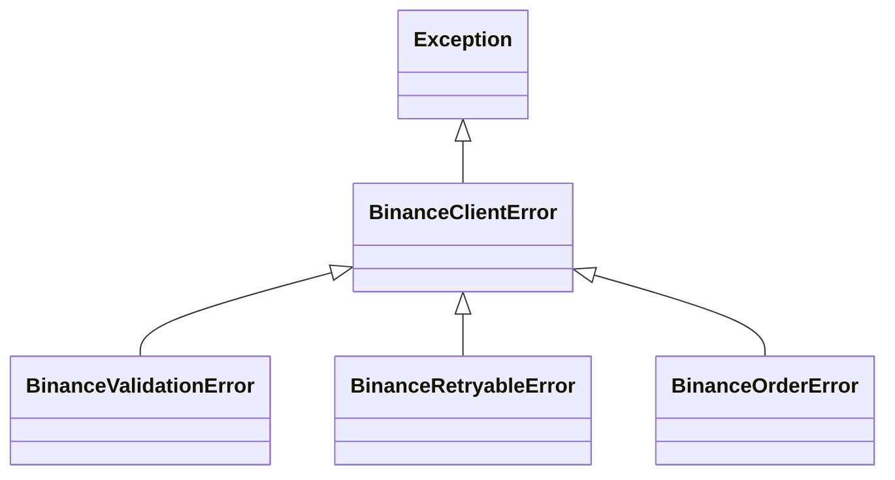
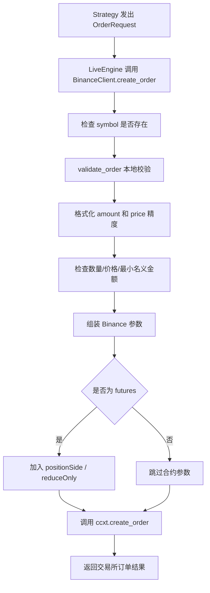

# `crypto_quant/exchange/binance_client.py` Binance 交易所客户端说明文档

本文档详细解释 `crypto_quant/exchange/binance_client.py` 文件的设计目的、核心类、主要方法、交易前校验、异常处理、订单查询能力，以及它和实盘引擎、行情获取模块之间的关系。

`binance_client.py` 是当前框架的 Binance 交易所客户端封装。它基于 `ccxt` 创建 Binance 实例，并在 `ccxt` 原始接口外面增加一层更适合本框架使用的校验、异常封装和订单管理方法。

---

## 1. 文件整体定位

文件位置：

```text
crypto_quant/exchange/binance_client.py
```

它位于交易所适配层，主要负责：

```text
1. 根据 BinanceConfig 创建 ccxt Binance 客户端；
2. 加载并缓存 Binance 市场规则；
3. 在下单前校验 symbol、数量、价格、最小名义金额等规则；
4. 封装现货和合约下单、撤单、查单、查成交；
5. 把 ccxt 异常转换成框架自己的异常类型；
6. 对读请求做有限重试，对真实下单不自动重试。
```

在整个框架中的位置可以理解为：

```text
BinanceConfig
      ↓
BinanceClient
      ↓
ccxt.binance
      ↓
Binance API
```

如果放到实盘流程里，它的位置是：

```text
StrategyBase
      ↓
LiveEngine
      ↓
BinanceClient
      ↓
ccxt / Binance
```

---

## 2. 为什么需要 BinanceClient？

理论上，策略或实盘引擎可以直接调用 `ccxt.binance`。

但直接使用 `ccxt` 会有几个问题：

```text
1. ccxt 返回值比较接近交易所原始结构，框架其他模块使用起来不够统一；
2. 下单前如果不做本地校验，很多错误会等到交易所返回才发现；
3. 不同 ccxt 异常需要在上层重复处理；
4. 网络错误、限频错误、交易所不可用等问题需要统一包装；
5. 下单接口不能盲目自动重试，否则可能导致重复订单。
```

所以当前框架使用 `BinanceClient` 做一层适配。

它不是为了替代 `ccxt`，而是为了让框架内部更安全、更统一地使用 Binance。

---

## 3. 文件导入说明

源码：

```python
import time
from typing import Any, Callable, TypeVar

import ccxt

from crypto_quant.config import BinanceConfig
from crypto_quant.enums import MarginMode, OrderSide, OrderType, PositionSide, TradingMode
```

含义：

| 导入项 | 作用 |
|---|---|
| `time` | 读请求失败后等待重试 |
| `Any` | 兼容 ccxt 返回的不同字段结构 |
| `Callable` | 给统一调用包装函数标注类型 |
| `TypeVar` | 保留被包装函数的返回类型 |
| `ccxt` | Binance API 的底层封装库 |
| `BinanceConfig` | Binance API key、secret、sandbox、交易模式配置 |
| `MarginMode` | 合约保证金模式：cross / isolated |
| `OrderSide` | 买卖方向：buy / sell |
| `OrderType` | 订单类型：market / limit 等 |
| `PositionSide` | 合约持仓方向：LONG / SHORT / BOTH |
| `TradingMode` | 现货或合约模式 |

---

## 4. 异常类型设计

文件中定义了 4 个异常类：

```python
class BinanceClientError(Exception):
    pass

class BinanceValidationError(BinanceClientError):
    pass

class BinanceRetryableError(BinanceClientError):
    pass

class BinanceOrderError(BinanceClientError):
    pass
```

它们的关系是：



含义：

| 异常 | 含义 |
|---|---|
| `BinanceClientError` | Binance 客户端相关错误的基类 |
| `BinanceValidationError` | 下单前本地校验失败，例如 symbol 不存在、数量太小 |
| `BinanceRetryableError` | 读请求或普通写请求遇到可重试错误并最终失败 |
| `BinanceOrderError` | 真实下单失败，订单状态可能未知 |

这样上层模块可以只捕获 `BinanceClientError`，也可以按具体异常做更细分的处理。

---

## 5. 核心类 `BinanceClient`

源码结构：

```python
class BinanceClient:
    def __init__(self, config: BinanceConfig):
        self.config = config
        self.exchange = ccxt.binance(config.ccxt_options())
        self.markets: dict[str, Any] = {}
        self.max_read_retries = 3
        self.retry_delay_seconds = 1.0
        if config.sandbox:
            self.exchange.set_sandbox_mode(True)
```

### 5.1 初始化做了什么？

初始化时会：

```text
1. 保存 BinanceConfig；
2. 用 config.ccxt_options() 创建 ccxt.binance 实例；
3. 初始化 markets 缓存；
4. 设置读请求最大重试次数；
5. 设置重试间隔；
6. 如果 sandbox=True，则启用 Binance sandbox/testnet 模式。
```

### 5.2 trading_mode 属性

```python
@property
def trading_mode(self) -> TradingMode:
    return self.config.trading_mode
```

它用来判断当前客户端是：

```text
spot 现货模式
future 合约模式
```

后续很多方法都会根据 `trading_mode` 决定是否允许某些操作。

---

## 6. 市场规则加载与 symbol 校验

### 6.1 `load_markets()`

```python
def load_markets(self, reload: bool = False) -> dict[str, Any]:
```

它调用：

```python
self.exchange.load_markets(reload=reload)
```

并把结果缓存到：

```python
self.markets
```

`markets` 里面包含 Binance 对每个交易对的规则，例如：

```text
最小下单数量
最大下单数量
价格精度
数量精度
最小名义金额
```

### 6.2 `market(symbol)`

```python
def market(self, symbol: str) -> dict[str, Any]:
```

它会：

```text
1. 如果还没有加载 markets，则先调用 load_markets()；
2. 从 markets 中查找指定 symbol；
3. 如果不存在，抛出 BinanceValidationError。
```

例如：

```python
client.market("BTC/USDT")
```

如果传入不存在的交易对：

```python
client.market("UNKNOWN/USDT")
```

会抛出：

```text
BinanceValidationError: unknown Binance symbol: UNKNOWN/USDT
```

---

## 7. 账户和持仓查询

### 7.1 `fetch_balance()`

```python
def fetch_balance(self, params: dict[str, Any] | None = None) -> dict[str, Any]:
```

它用于查询账户余额。

在 `LiveEngine` 真实实盘同步中，会通过这个方法读取交易所账户状态，再映射成本框架的：

```text
Account.cash
Account.equity
Account.available
Account.margin
Account.maintenance_margin
Account.unrealized_pnl
```

### 7.2 `fetch_positions()`

```python
def fetch_positions(
    self,
    symbols: list[str] | None = None,
    params: dict[str, Any] | None = None,
) -> list[dict[str, Any]]:
```

它用于查询合约持仓。

如果当前是现货模式：

```python
if self.trading_mode == TradingMode.SPOT:
    return []
```

因为现货没有合约意义上的 `LONG` / `SHORT` 持仓，所以直接返回空列表。

如果是合约模式，则调用 ccxt 的 `fetch_positions()`。

---

## 8. 合约设置：杠杆和保证金模式

### 8.1 `set_leverage()`

```python
def set_leverage(self, symbol: str, leverage: int, params: dict[str, Any] | None = None) -> dict[str, Any]:
```

作用：设置合约杠杆。

它会先检查：

```text
1. symbol 是否存在；
2. 当前是否为 futures 模式；
3. leverage 是否大于 0。
```

如果在现货模式调用，会抛出：

```text
BinanceValidationError: set_leverage is only available in futures mode
```

### 8.2 `set_margin_mode()`

```python
def set_margin_mode(self, symbol: str, margin_mode: MarginMode, params: dict[str, Any] | None = None) -> dict[str, Any]:
```

作用：设置合约保证金模式。

支持：

```text
cross     全仓
isolated  逐仓
```

同样只允许在合约模式下使用。

---

## 9. 下单方法 `create_order()`

核心方法：

```python
def create_order(
    self,
    symbol: str,
    side: OrderSide,
    order_type: OrderType,
    amount: float,
    price: float | None = None,
    position_side: PositionSide | None = None,
    reduce_only: bool = False,
    time_in_force: str | None = None,
    params: dict[str, Any] | None = None,
) -> dict[str, Any]:
```

它的执行流程是：



下单前会先做本地校验，减少明显错误订单进入交易所。

---

## 10. 下单前校验 `validate_order()`

```python
def validate_order(
    self,
    market: dict[str, Any],
    symbol: str,
    order_type: OrderType,
    amount: float,
    price: float | None = None,
    position_side: PositionSide | None = None,
    reduce_only: bool = False,
) -> tuple[float, float | None]:
```

它主要检查：

```text
1. 下单数量必须大于 0；
2. 限价单必须提供 price；
3. 如果提供 price，则 price 必须大于 0；
4. 现货订单不支持 position_side；
5. 现货订单不支持 reduce_only；
6. amount 要按交易所精度格式化；
7. price 要按交易所精度格式化；
8. amount 不能低于最小数量或高于最大数量；
9. price 不能低于最小价格或高于最大价格；
10. 限价单名义金额不能低于最小名义金额。
```

### 10.1 精度格式化

数量格式化：

```python
self.exchange.amount_to_precision(symbol, amount)
```

价格格式化：

```python
self.exchange.price_to_precision(symbol, price)
```

这样可以避免传入 Binance 不接受的小数位数。

### 10.2 数量限制

```python
_validate_amount_limit(market, formatted_amount)
```

检查：

```text
market["limits"]["amount"]["min"]
market["limits"]["amount"]["max"]
```

如果数量太小或太大，会抛出 `BinanceValidationError`。

### 10.3 价格限制

```python
_validate_price_limit(market, formatted_price)
```

检查：

```text
market["limits"]["price"]["min"]
market["limits"]["price"]["max"]
```

### 10.4 最小名义金额

```python
_validate_min_notional(market, formatted_amount, formatted_price)
```

名义金额计算方式：

```text
notional = amount * price
```

如果小于交易所要求的最小金额，会抛出 `BinanceValidationError`。

注意：

```text
当前只有 price 不为空时才检查最小名义金额。
也就是说，限价单可以在本地检查 notional，市价单因为没有明确 price，当前版本不在本地检查 notional。
```

---

## 11. 为什么真实下单不自动重试？

文件中有三个统一调用包装方法：

```python
_call_read()
_call_write()
_call_order()
```

其中最重要的是 `create_order()` 使用的：

```python
_call_order()
```

它遇到网络超时、限频、交易所不可用等可重试错误时，会抛出：

```text
BinanceOrderError
```

但不会自动重试。

原因是：

```text
真实下单请求可能已经到达交易所，只是本地没有收到响应。
如果这时自动重试，可能会产生重复订单。
```

例如：

```text
1. 本地发送买入 1 BTC 的请求；
2. Binance 已经收到并创建订单；
3. 本地网络超时，没有收到订单 ID；
4. 如果程序自动重试，可能又创建一个新的买入订单。
```

所以当前策略是：

```text
读请求可以有限重试；
真实下单不自动重试；
下单异常交给上层 LiveEngine 标记为本地 REJECTED 或后续人工/同步处理。
```

这是实盘交易里更保守的设计。

---

## 12. 读请求重试 `_call_read()`

```python
def _call_read(self, name: str, func: Callable[..., T], *args: Any, **kwargs: Any) -> T:
```

用于包装读请求，例如：

```text
load_markets
fetch_balance
fetch_positions
fetch_order
fetch_open_orders
fetch_orders
fetch_closed_orders
fetch_canceled_orders
fetch_my_trades
```

默认配置：

```python
self.max_read_retries = 3
self.retry_delay_seconds = 1.0
```

如果遇到可重试错误，会等待后再试。

可重试错误包括：

```python
ccxt.NetworkError
ccxt.RequestTimeout
ccxt.DDoSProtection
ccxt.RateLimitExceeded
ccxt.ExchangeNotAvailable
```

如果最终仍然失败，会抛出：

```text
BinanceRetryableError
```

---

## 13. 普通写请求 `_call_write()`

```python
def _call_write(self, name: str, func: Callable[..., T], *args: Any, **kwargs: Any) -> T:
```

当前主要用于：

```text
set_leverage
set_margin_mode
```

这些不是普通读请求，但也不是直接创建订单。

如果遇到可重试错误，会抛出 `BinanceRetryableError`。

---

## 14. 撤单和订单查询

### 14.1 `cancel_order()`

```python
def cancel_order(self, order_id: str, symbol: str, params: dict[str, Any] | None = None) -> dict[str, Any]:
```

作用：撤销指定订单。

它会先检查 symbol 是否存在，然后调用：

```python
self.exchange.cancel_order(order_id, symbol, params or {})
```

当前通过 `_call_read()` 包装，所以会对部分可重试错误做有限重试。

### 14.2 `fetch_order()`

```python
def fetch_order(self, order_id: str, symbol: str, params: dict[str, Any] | None = None) -> dict[str, Any]:
```

查询单个订单。

### 14.3 `fetch_open_orders()`

```python
def fetch_open_orders(self, symbol: str | None = None, params: dict[str, Any] | None = None) -> list[dict[str, Any]]:
```

查询未成交订单。

`LiveEngine` 真实实盘同步未成交订单时，会使用这个方法。

### 14.4 历史订单查询

包括：

```python
fetch_orders()
fetch_closed_orders()
fetch_canceled_orders()
```

用途：

```text
1. 查询所有历史订单；
2. 查询已完成订单；
3. 查询已取消订单；
4. 后续做实盘复盘、订单对账、异常恢复。
```

### 14.5 成交查询

```python
fetch_my_trades()
fetch_order_trades()
```

`fetch_my_trades()` 查询账户成交记录。

`fetch_order_trades()` 会把 `orderId` 放进参数里，用来查询指定订单对应的成交。

---

## 15. 平仓辅助方法 `close_position()`

```python
def close_position(
    self,
    symbol: str,
    amount: float,
    position_side: PositionSide = PositionSide.BOTH,
    params: dict[str, Any] | None = None,
) -> dict[str, Any]:
```

它根据持仓方向自动决定买卖方向。

逻辑是：

```text
如果 position_side 不是 SHORT，则用 SELL 平仓；
如果 position_side 是 SHORT，则用 BUY 平仓。
```

合约模式下会自动传入：

```text
positionSide
reduceOnly=True
```

也就是说，合约平仓默认是只减仓，不主动反向开仓。

---

## 16. 和 LiveEngine 的关系

`LiveEngine` 在真实实盘模式下会使用 `BinanceClient` 做三类事情。

### 16.1 真实下单

```text
StrategyBase.buy/sell/short/cover
      ↓
StrategyBase.submit_order
      ↓
LiveEngine.submit_order
      ↓
BinanceClient.create_order
```

如果 `BinanceClient.create_order()` 成功，`LiveEngine` 会把交易所返回结果转换成本地 `LocalOrder`。

如果失败，当前 `LiveEngine` 会生成一个本地：

```text
OrderStatus.REJECTED
```

并触发：

```python
strategy.on_order(order)
```

这样策略可以知道订单没有被本地接受，而不是实盘循环直接崩掉。

### 16.2 账户同步

```python
LiveEngine._sync_account()
```

内部调用：

```python
BinanceClient.fetch_balance()
```

### 16.3 持仓同步

```python
LiveEngine._sync_positions()
```

内部调用：

```python
BinanceClient.fetch_positions()
```

### 16.4 未成交订单同步

```python
LiveEngine._sync_open_orders()
```

内部调用：

```python
BinanceClient.fetch_open_orders()
```

---

## 17. 和 MarketDataFetcher 的关系

当前行情获取模块是：

```text
crypto_quant/data/fetcher.py
```

它使用：

```python
client.exchange
```

直接调用 ccxt 的行情接口，例如：

```text
fetch_ohlcv
fetch_ticker
fetch_order_book
fetch_trades
fetch_funding_rate
```

也就是说：

```text
BinanceClient 当前主要增强的是账户、下单、订单、成交这些交易相关接口；
行情获取仍然主要由 MarketDataFetcher 直接使用 ccxt exchange 完成。
```

后续如果需要，也可以把行情读取的异常处理和重试逻辑继续统一进 `BinanceClient`。

---

## 18. 常见使用方式

### 18.1 创建现货客户端

```python
from crypto_quant.config import BinanceConfig
from crypto_quant.enums import TradingMode
from crypto_quant.exchange import BinanceClient

config = BinanceConfig(
    trading_mode=TradingMode.SPOT,
    sandbox=True,
)
client = BinanceClient(config)
```

### 18.2 创建合约客户端

```python
from crypto_quant.config import BinanceConfig
from crypto_quant.enums import TradingMode
from crypto_quant.exchange import BinanceClient

config = BinanceConfig(
    trading_mode=TradingMode.FUTURE,
    sandbox=True,
)
client = BinanceClient(config)
```

### 18.3 查询余额

```python
balance = client.fetch_balance()
```

### 18.4 下限价单

```python
from crypto_quant.enums import OrderSide, OrderType

order = client.create_order(
    symbol="BTC/USDT",
    side=OrderSide.BUY,
    order_type=OrderType.LIMIT,
    amount=0.001,
    price=50000,
    time_in_force="GTC",
)
```

### 18.5 查询未成交订单

```python
open_orders = client.fetch_open_orders("BTC/USDT")
```

### 18.6 查询指定订单成交

```python
trades = client.fetch_order_trades(order_id="123456", symbol="BTC/USDT")
```

---

## 19. 当前版本的安全边界

当前 `BinanceClient` 已经比最初版本更完整，但仍然不是完整的生产级交易系统。

已经具备：

```text
1. symbol 校验；
2. 数量和价格精度格式化；
3. 最小/最大数量校验；
4. 价格限制校验；
5. 限价单最小名义金额校验；
6. 现货/合约参数约束；
7. ccxt 异常封装；
8. 读请求有限重试；
9. 下单不自动重试，避免重复订单；
10. 常用订单和成交查询方法。
```

仍然需要注意：

```text
1. 市价单因为没有明确 price，当前本地不检查最小名义金额；
2. 没有做账户余额是否足够的完整本地预检查；
3. 没有做最大仓位、最大亏损、单日亏损等风控限制；
4. 没有做 clientOrderId 幂等下单；
5. 下单超时后仍需要依赖后续订单查询或人工对账确认真实状态；
6. 没有完整处理 Binance 所有特殊订单类型参数；
7. 没有实现日志审计、告警、密钥轮换等生产系统能力。
```

---

## 20. 后续可以继续增强的方向

后续如果要继续完善交易所客户端，可以按下面顺序扩展：

```text
1. 增加 clientOrderId，支持幂等下单和异常恢复；
2. 增加账户余额和可用保证金预检查；
3. 增加最大单笔订单金额、最大持仓、最大杠杆等风控；
4. 增加下单结果日志和错误日志；
5. 增加订单状态对账任务；
6. 增加成交回报同步，自动把真实成交写入 Trade；
7. 增加行情接口的统一重试和异常包装；
8. 增加更完整的 Binance 条件单参数支持；
9. 增加测试网和真实盘配置隔离；
10. 增加 API key 权限检查和启动前安全检查。
```

---

## 21. 一句话总结

```text
binance_client.py 的作用是：
把 ccxt 的 Binance 原始接口，封装成更适合当前量化框架使用的交易所客户端。
```

它主要帮助你解决：

```text
下单前先做基本校验；
交易所错误统一包装；
读请求可以安全重试；
真实下单不盲目重试；
LiveEngine 可以通过它同步账户、持仓和订单状态。
```
