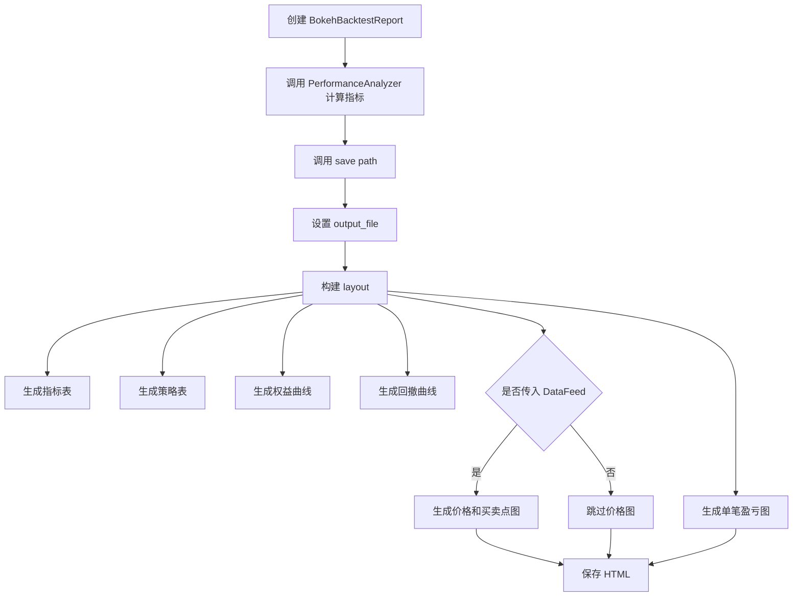

# `crypto_quant/analysis/bokeh_report.py` Bokeh 报告和图表说明文档

本文档详细解释 `crypto_quant/analysis/bokeh_report.py` 文件的设计目的、核心类、图表结构、运行方式，以及它和回测引擎、绩效分析模块之间的关系。

`bokeh_report.py` 是当前框架的交互式回测报告模块。它基于 Bokeh 生成 HTML 报告，用来更直观地查看回测结果。

---

## 1. 文件整体定位

文件位置：

```text
crypto_quant/analysis/bokeh_report.py
```

示例入口：

```text
examples/run_bokeh_report.py
```

它位于分析层，主要负责：

```text
1. 调用 PerformanceAnalyzer 计算绩效指标；
2. 把绩效指标整理成表格；
3. 把权益曲线、回撤曲线、价格和交易点画成图；
4. 把所有内容保存成一个可交互的 HTML 报告。
```

在整个框架中的位置可以理解为：

```text
BacktestEngine / PortfolioBacktestEngine
        ↓
BacktestResult / PortfolioBacktestResult
        ↓
PerformanceAnalyzer
        ↓
BokehBacktestReport
        ↓
backtest_report.html
```

---

## 2. 为什么使用 Bokeh？

最初绩效结果只能通过命令行打印出来，例如：

```text
PerformanceReport(total_return=..., max_drawdown=..., sharpe_ratio=...)
```

这种方式能看数字，但不够直观。

Bokeh 的好处是：

```text
1. 可以生成交互式图表；
2. 鼠标移动到曲线上可以查看具体时间和数值；
3. 可以缩放、拖动、保存图表；
4. 可以把多个表格和图表组合成一个报告；
5. 不需要启动额外服务，保存成 HTML 后直接用浏览器打开。
```

所以当前第一版报告选择用 Bokeh 实现。

---

## 3. 文件导入说明

源码：

```python
from decimal import Decimal
from pathlib import Path
from typing import Any

from bokeh.io import output_file, save
from bokeh.layouts import column, gridplot
from bokeh.models import ColumnDataSource, DataTable, HoverTool, NumeralTickFormatter, TableColumn
from bokeh.plotting import figure

from crypto_quant.analysis.performance import PerformanceAnalyzer, PerformanceReport
from crypto_quant.data.feed import DataFeed
from crypto_quant.enums import OrderSide
from crypto_quant.strategy.base import Trade
```

含义：

| 导入项 | 作用 |
|---|---|
| `Decimal` | 格式化资金和收益率 |
| `Path` | 处理报告保存路径 |
| `Any` | 兼容单策略和多策略回测结果对象 |
| `output_file` | 指定 Bokeh 输出 HTML 文件 |
| `save` | 保存 Bokeh 报告 |
| `column` | 纵向排列多个表格和图表 |
| `gridplot` | 组合多个图表 |
| `ColumnDataSource` | Bokeh 图表和表格的数据源 |
| `DataTable` | 表格组件 |
| `HoverTool` | 鼠标悬停提示工具 |
| `NumeralTickFormatter` | 坐标轴数字格式化 |
| `TableColumn` | 表格列定义 |
| `figure` | 创建图表 |
| `PerformanceAnalyzer` | 计算绩效指标 |
| `DataFeed` | 可选行情数据，用于画价格和交易点 |
| `OrderSide` | 区分买入和卖出成交 |
| `Trade` | 成交记录对象 |

---

## 4. 核心类 `BokehBacktestReport`

源码结构：

```python
class BokehBacktestReport:
    def __init__(
        self,
        result: Any,
        data: DataFeed | None = None,
        title: str = "Backtest Report",
        analyzer: PerformanceAnalyzer | None = None,
    ):
        self.result = result
        self.data = data
        self.title = title
        self.analyzer = analyzer or PerformanceAnalyzer()
        self.metrics = self.analyzer.analyze(result.equity_curve, result.trades)
```

### 4.1 参数说明

| 参数 | 类型 | 含义 |
|---|---|---|
| `result` | `Any` | 回测结果，可以是 `BacktestResult` 或 `PortfolioBacktestResult` |
| `data` | `DataFeed | None` | 行情数据，传入后可以画价格和买卖点 |
| `title` | `str` | 报告标题 |
| `analyzer` | `PerformanceAnalyzer | None` | 绩效分析器，默认自动创建 |

### 4.2 为什么 `result` 使用 `Any`？

因为当前报告希望同时兼容：

```text
单策略回测结果 BacktestResult
多策略组合回测结果 PortfolioBacktestResult
```

它们都具备：

```python
result.equity_curve
result.trades
```

所以报告模块不需要关心它具体是哪一种结果对象。

---

## 5. 报告生成流程

核心方法：

```python
def save(self, path: str | Path) -> None:
    path = Path(path)
    if path.parent != Path("."):
        path.parent.mkdir(parents=True, exist_ok=True)
    output_file(path, title=self.title)
    save(self._layout())
```

整体流程：



---

## 6. 报告包含哪些内容？

当前第一版报告包含 6 个部分：

```text
1. 绩效指标表；
2. 策略交易数量表；
3. 权益曲线；
4. 回撤曲线；
5. 价格走势和买卖点标记；
6. 单笔平仓盈亏图。
```

下面分别说明。

---

## 7. 绩效指标表 `_metrics_table()`

这个表格展示 `PerformanceReport` 中的核心指标。

包含：

```text
Initial Equity
Final Equity
Total Return
Annual Return
Volatility
Max Drawdown
Sharpe Ratio
Sortino Ratio
Calmar Ratio
Trade Count
Closed Trade Count
Win Rate
Profit Factor
Gross Profit
Gross Loss
Average Win
Average Loss
Max Win
Max Loss
```

它回答的问题是：

```text
这次回测整体表现怎么样？
最终赚了多少？
最大回撤是多少？
收益是否稳定？
交易胜率和盈亏比怎么样？
```

---

## 8. 策略交易数量表 `_strategy_table()`

如果是普通单策略回测，表格会显示：

```text
strategy = total
trade_count = 总成交数量
```

如果是多策略组合回测，`PortfolioBacktestResult` 中会有：

```python
strategy_trades
```

报告会按策略分别展示每个策略的成交数量。

这样可以快速看出：

```text
哪些策略交易更频繁；
哪些策略几乎没有触发信号；
组合回测中交易主要来自哪个策略。
```

---

## 9. 权益曲线 `_equity_curve()`

权益曲线使用：

```python
result.equity_curve
```

每个点是：

```python
(timestamp, equity)
```

图表展示账户权益随时间变化的过程。

它回答的问题是：

```text
策略是平稳上涨，还是大起大落？
盈利集中在哪一段？
亏损集中在哪一段？
最终收益是否依赖少数时间点？
```

鼠标移动到曲线上，可以看到：

```text
Time
Equity
Return
```

---

## 10. 回撤曲线 `_drawdown_curve()`

回撤曲线来自：

```python
self.analyzer.drawdowns(self.result.equity_curve)
```

回撤表示：

```text
当前权益相对于历史最高权益跌了多少。
```

例如：

```text
历史最高权益：10000
当前权益：9000
回撤：-10%
```

回撤曲线非常重要，因为很多策略最终赚钱，但中间可能经历很深的亏损。

它回答的问题是：

```text
策略最难熬的时候有多难熬？
最大回撤发生在哪段时间？
回撤恢复速度快不快？
```

---

## 11. 价格和买卖点图 `_price_with_trades()`

这个图需要传入 `DataFeed`。

如果创建报告时传入：

```python
BokehBacktestReport(result, data)
```

就会生成价格和交易点图。

图上包含：

```text
灰色线：收盘价 close
绿色三角形：买入成交
红色倒三角形：卖出成交
```

它回答的问题是：

```text
策略是在上涨前买入，还是追高？
策略是在下跌前卖出，还是割肉？
交易点和价格走势是否符合策略逻辑？
```

如果没有传入 `data`：

```python
BokehBacktestReport(result)
```

报告会跳过这张价格图，只显示绩效和权益相关图表。

---

## 12. 单笔平仓盈亏图 `_trade_pnl_chart()`

这个图来自：

```python
self.analyzer.realized_pnls(self.result.trades)
```

每一根柱子表示一笔已经闭合交易的盈亏。

颜色含义：

```text
绿色：盈利交易
红色：亏损交易
```

它回答的问题是：

```text
盈利是否来自少数几笔大赚？
亏损是否经常出现？
单笔亏损有没有明显过大？
盈亏分布是否健康？
```

---

## 13. 示例：生成第一份 Bokeh 报告

示例文件：

```text
examples/run_bokeh_report.py
```

核心代码：

```python
from crypto_quant.analysis.bokeh_report import BokehBacktestReport
from crypto_quant.config import BacktestConfig
from crypto_quant.engine.backtest import BacktestEngine
from examples.basic_strategy import MomentumMovingAverageFuturesStrategy, build_demo_data


data = build_demo_data()
strategy = MomentumMovingAverageFuturesStrategy(...)
engine = BacktestEngine(BacktestConfig(...))
result = engine.run(strategy, data)

BokehBacktestReport(
    result,
    data,
    title="Demo Backtest Report",
).save("backtest_report.html")
```

运行：

```bash
PYTHONPATH=. python3 examples/run_bokeh_report.py
```

运行成功后会生成：

```text
backtest_report.html
```

用浏览器打开这个文件即可查看交互式报告。

---

## 14. 常见使用方式

### 14.1 只生成绩效和权益报告

```python
BokehBacktestReport(result).save("report.html")
```

这种方式不会画价格和买卖点，因为没有传入行情数据。

### 14.2 生成带价格和交易点的报告

```python
BokehBacktestReport(result, data).save("report.html")
```

这种方式更适合复盘策略交易逻辑。

### 14.3 自定义标题

```python
BokehBacktestReport(
    result,
    data,
    title="BTC Trend Strategy Report",
).save("btc_trend_report.html")
```

---

## 15. 当前简化假设

当前 Bokeh 报告是第一版，已经可以用于基本回测复盘，但仍然有一些简化：

```text
1. 价格图目前主要展示 close 线，没有画 K 线蜡烛图；
2. 买卖点按成交方向区分，没有进一步区分开仓、平仓、加仓、减仓；
3. 多策略报告目前只展示每个策略的交易数量，没有单独画每个策略的权益曲线；
4. 单笔盈亏图基于简化的 realized_pnls 计算；
5. 报告输出为 HTML 文件，不是图片或 PDF。
```

后续可以继续扩展：

```text
K 线蜡烛图
多策略权益分解图
多品种收益分解图
持仓变化图
保证金占用曲线
月度收益热力图
手续费和滑点成本图
订单明细表
成交明细表
```

---

## 16. 一句话总结

```text
bokeh_report.py 的作用是：
把回测结果从“命令行数字”变成“可以交互查看的图表报告”。
```

它主要帮助你回答：

```text
策略表现是否稳定？
最大回撤发生在哪里？
交易点是否合理？
盈亏是否集中在少数交易？
组合回测里哪些策略贡献了交易？
```
