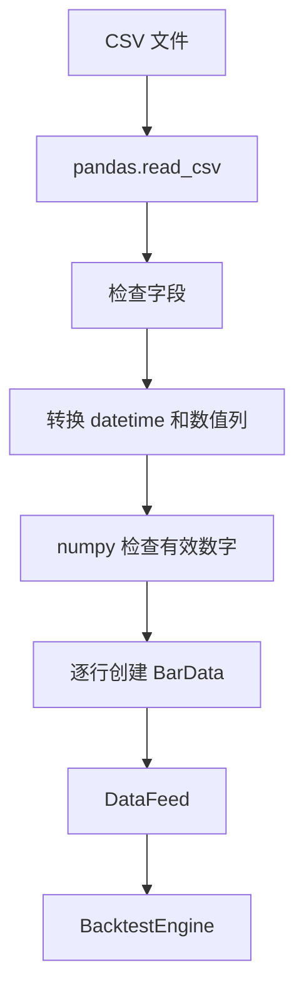

# `crypto_quant/data/feed.py` 说明文档

本文档详细解释 `crypto_quant/data/feed.py` 文件的设计目的、核心类、字段含义、运行流程，以及它和策略、回测引擎之间的关系。

`feed.py` 是当前框架的数据输入基础。它负责把一组 K 线数据包装成一个可以被回测引擎逐根推进的数据源。

---

## 1. 文件整体定位

文件位置：

```text
crypto_quant/data/feed.py
```

它位于数据层，主要负责三件事：

```text
1. 用 BarData 表示单根 K 线；
2. 用 DataLine 表示某个字段的时间序列，例如 close 线；
3. 用 DataFeed 管理多根 K 线，并在回测过程中逐根推进。
```

在整个框架中的位置：

```text
OKX / CSV / MySQL 等数据来源
        ↓
    list[BarData]
        ↓
      DataFeed
        ↓
  BacktestEngine 遍历
        ↓
 StrategyBase.on_bar(bar)
```

---

## 2. 核心设计思想

`feed.py` 可以从两个角度理解：

```text
1. backtrader 式的数据线思想；
2. 机器学习里的时间序列特征矩阵思想。
```

如果用机器学习的特征矩阵类比：

```text
n 根 K 线 = n 个时间序列样本
open / high / low / close / volume = 主要数值特征列
DataFeed = 带时间游标 cursor 的 K 线特征矩阵
```

也就是说，一组 K 线既可以按行看：

```text
一根 K 线
一根 K 线
一根 K 线
```

也可以按列拆成：

```text
open 线
high 线
low 线
close 线
volume 线
datetime 线
```

用矩阵语言来说：

```text
BarData  = 特征矩阵中的一行，也就是一根完整 K 线
DataLine = 特征矩阵中的一列，例如 close 这一列
DataFeed = 保存所有行和常用列，并带有当前 cursor 的数据容器
```

例如有三根 K 线：

```text
第 0 根：open=100, high=110, low=90, close=105
第 1 根：open=105, high=115, low=100, close=112
第 2 根：open=112, high=120, low=108, close=118
```

按矩阵看就是：

```text
        open   high   low    close
bar0    100    110    90     105
bar1    105    115    100    112
bar2    112    120    108    118
```

按列拆出来就是：

```text
open 线:  [100, 105, 112]
high 线:  [110, 115, 120]
low 线:   [90, 100, 108]
close 线: [105, 112, 118]
```

`symbol` 和 `timeframe` 不属于常规数值特征，它们更像这批样本的元信息：

```text
symbol    = 这批 K 线属于哪个交易对，例如 BTC/USDT
timeframe = 这批 K 线的采样周期，例如 5m
datetime  = 时间索引
```

回测过程中，框架使用 `_cursor` 表示当前走到哪一行。

如果当前 `_cursor = 1`，表示当前走到第 1 根 K 线，也就是矩阵中的 `bar1`。

此时：

```python
data.close[0]
```

表示当前 close，也就是：

```text
112
```

而：

```python
data.close[-1]
```

表示上一根 close，也就是：

```text
105
```

注意这里的 `0` 和 `-1` 是相对当前 `_cursor` 的位置，不是直接对完整列表做绝对索引。

这就是 `feed.py` 最核心的机制：

```text
DataFeed 像一张按时间排序的特征矩阵；
cursor 控制当前能看到哪一行；
DataLine 让策略方便取某一列的当前值、历史值和窗口值。
```

---

## 3. 文件导入说明

源码：

```python
from dataclasses import dataclass
from datetime import datetime
from decimal import Decimal
from typing import Iterable, Iterator
```

含义：

| 导入项 | 作用 |
|---|---|
| `dataclass` | 快速定义只保存数据的类 |
| `datetime` | 表示 K 线时间 |
| `Decimal` | 表示价格和成交量，避免浮点误差 |
| `Iterable` | 类型标注，表示可迭代对象 |
| `Iterator` | 类型标注，表示迭代器 |

---

## 4. `BarData`：单根 K 线对象

源码：

```python
@dataclass(frozen=True, slots=True)
class BarData:
    symbol: str
    timeframe: str
    datetime: datetime
    open: Decimal
    high: Decimal
    low: Decimal
    close: Decimal
    volume: Decimal
```

### 4.1 作用

`BarData` 表示一根 K 线。

它包含一根 K 线最常用的字段：

```text
交易对
周期
时间
开盘价
最高价
最低价
收盘价
成交量
```

### 4.2 字段说明

从“时间序列特征矩阵”的视角看，`BarData` 中的字段可以分成两类：

```text
元信息 / 索引：symbol、timeframe、datetime
数值特征列：open、high、low、close、volume
```

| 字段 | 类型 | 矩阵视角 | 含义 | 示例 |
|---|---|---|---|---|
| `symbol` | `str` | 元信息 | 交易对，标记这批 K 线属于哪个资产 | `BTC/USDT` |
| `timeframe` | `str` | 元信息 | K 线周期，标记这批 K 线的采样频率 | `1m`、`5m`、`1h` |
| `datetime` | `datetime` | 时间索引 | K 线时间，用来保证时间顺序 | `2026-01-01 00:00:00` |
| `open` | `Decimal` | 数值特征 | 开盘价 | `Decimal("100000")` |
| `high` | `Decimal` | 数值特征 | 最高价 | `Decimal("101000")` |
| `low` | `Decimal` | 数值特征 | 最低价 | `Decimal("99000")` |
| `close` | `Decimal` | 数值特征 | 收盘价 | `Decimal("100500")` |
| `volume` | `Decimal` | 数值特征 | 成交量 | `Decimal("12.5")` |

因此，`open/high/low/close/volume` 更像机器学习里的 `X` 特征列；`symbol/timeframe/datetime` 更像样本标签、分组字段或时间索引。

### 4.3 示例

```python
from datetime import datetime, timezone
from decimal import Decimal

bar = BarData(
    symbol="BTC/USDT",
    timeframe="1m",
    datetime=datetime(2026, 1, 1, 0, 0, tzinfo=timezone.utc),
    open=Decimal("100000"),
    high=Decimal("100500"),
    low=Decimal("99500"),
    close=Decimal("100200"),
    volume=Decimal("15.3"),
)
```

这表示：

```text
BTC/USDT 在 2026-01-01 00:00 UTC 这一分钟：
开盘 100000
最高 100500
最低 99500
收盘 100200
成交量 15.3
```

### 4.4 为什么使用 `frozen=True`？

`BarData` 使用：

```python
@dataclass(frozen=True, slots=True)
```

其中 `frozen=True` 表示创建后不允许修改。

因为历史 K 线应该被看成事实数据，策略运行过程中不应该修改它。

例如下面这种操作会报错：

```python
bar.close = Decimal("999999")
```

### 4.5 为什么使用 `slots=True`？

`slots=True` 表示对象只能拥有类中声明过的字段。

好处：

```text
1. 减少内存占用；
2. 防止误添加不存在的字段；
3. 保持数据结构稳定。
```

---

## 5. `DataLine`：单条数据线

源码：

```python
class DataLine:
    def __init__(self, values: list[Decimal | datetime | str] | None = None):
        self._values = values or []
        self._cursor = -1
```

### 5.1 作用

`DataLine` 表示某一个字段随时间排列形成的序列。

如果把 `DataFeed` 理解成一张 K 线特征矩阵，那么 `DataLine` 就是这张矩阵里的某一列。

例如：

```text
所有 close 组成 close 线；
所有 open 组成 open 线；
所有 volume 组成 volume 线。
```

如果有三根 K 线：

```text
bar0.close = 105
bar1.close = 112
bar2.close = 118
```

那么 close 线就是：

```python
DataLine([Decimal("105"), Decimal("112"), Decimal("118")])
```

它不是单纯的普通列表，而是：

```text
DataLine = 某一列数据 + 当前 cursor + 便捷访问方法
```

因此策略可以直接写：

```python
data.close[0]          # 当前行的 close
data.close[-1]         # 上一行的 close
data.close.window(20)  # close 列最近 20 行
```

不用自己手动维护当前索引和切片范围。

### 5.2 `_values`

```python
self._values = values or []
```

`_values` 保存整条数据线的所有值。

例如 close 线：

```python
self._values = [Decimal("105"), Decimal("112"), Decimal("118")]
```

### 5.3 `_cursor`

```python
self._cursor = -1
```

`_cursor` 表示当前回测推进到哪一个位置。

取值含义：

| `_cursor` | 含义 |
|---:|---|
| `-1` | 还没开始 |
| `0` | 第 0 根 K 线 |
| `1` | 第 1 根 K 线 |
| `2` | 第 2 根 K 线 |

初始为 `-1`，表示数据还没有开始被回测引擎推进。

---

## 6. `DataLine.append`

源码：

```python
def append(self, value: Decimal | datetime | str) -> None:
    self._values.append(value)
```

### 6.1 作用

向数据线末尾追加一个新值。

例如：

```python
line = DataLine([Decimal("105"), Decimal("112")])
line.append(Decimal("118"))
```

此时内部数据变成：

```python
[Decimal("105"), Decimal("112"), Decimal("118")]
```

### 6.2 当前版本用途

当前版本中，`DataFeed.__init__` 会一次性把所有 K 线拆成数据线，所以 `append()` 暂时不是主流程使用方法。

但后续做实时行情时，它会很有用：

```text
每来一根新 K 线，就 append 到对应数据线。
```

---

## 7. `DataLine.advance`

源码：

```python
def advance(self, cursor: int) -> None:
    self._cursor = cursor
```

### 7.1 作用

推进数据线的当前游标。

比如：

```python
line.advance(2)
```

表示这条数据线当前走到第 2 个值。

### 7.2 为什么需要 advance？

因为 `data.close[0]` 不是永远取第 0 个值。

它表示：

```text
当前 K 线的 close。
```

所以当回测从第 0 根走到第 1 根、第 2 根时，`DataLine` 必须知道当前走到了哪里。

这个位置就是 `_cursor`。

`advance(cursor)` 就是更新 `_cursor`。

---

## 8. `DataLine.__getitem__`

源码：

```python
def __getitem__(self, offset: int) -> Decimal | datetime | str:
    index = self._cursor + offset
    if index < 0 or index >= len(self._values):
        raise IndexError("data line offset out of range")
    return self._values[index]
```

### 8.1 作用

让 `DataLine` 支持中括号访问。

例如：

```python
data.close[0]
data.close[-1]
data.close[-2]
```

### 8.2 `offset` 的含义

这里的中括号不是绝对索引，而是相对当前 K 线的偏移量。

| 写法 | 含义 |
|---|---|
| `data.close[0]` | 当前 K 线的 close |
| `data.close[-1]` | 上一根 K 线的 close |
| `data.close[-2]` | 上两根 K 线的 close |

### 8.3 为什么要 `self._cursor + offset`？

源码：

```python
index = self._cursor + offset
```

因为真实列表索引需要通过当前游标加偏移量得到。

例如：

```python
_values = [105, 112, 118]
_cursor = 2
```

那么：

```python
data.close[0]
```

计算：

```text
index = 2 + 0 = 2
```

返回：

```text
118
```

而：

```python
data.close[-1]
```

计算：

```text
index = 2 + (-1) = 1
```

返回：

```text
112
```

### 8.4 越界检查

源码：

```python
if index < 0 or index >= len(self._values):
    raise IndexError("data line offset out of range")
```

如果访问了不存在的位置，就抛出错误。

例如当前是第一根 K 线：

```python
_cursor = 0
```

此时访问：

```python
data.close[-1]
```

计算：

```text
index = 0 + (-1) = -1
```

小于 0，所以报错。

因此策略里使用历史数据前，需要先保证历史数据足够。

---

## 9. `DataLine.__len__`

源码：

```python
def __len__(self) -> int:
    return len(self._values)
```

### 9.1 作用

让 `DataLine` 支持：

```python
len(data.close)
```

返回这条数据线的总长度。

例如有 500 根 K 线：

```python
len(data.close)
```

返回：

```text
500
```

注意：这里返回的是整条数据线总长度，不是当前已经走过的数量。

---

## 10. `DataFeed`：完整数据源

源码：

```python
class DataFeed:
    def __init__(self, bars: Iterable[BarData]):
        self.bars = list(bars)
        self.datetime = DataLine([bar.datetime for bar in self.bars])
        self.open = DataLine([bar.open for bar in self.bars])
        self.high = DataLine([bar.high for bar in self.bars])
        self.low = DataLine([bar.low for bar in self.bars])
        self.close = DataLine([bar.close for bar in self.bars])
        self.volume = DataLine([bar.volume for bar in self.bars])
        self._cursor = -1
```

### 10.1 作用

`DataFeed` 是完整的数据源对象。

它接收一批 `BarData`，然后生成：

```python
self.bars
self.datetime
self.open
self.high
self.low
self.close
self.volume
```

其中：

```python
self.bars
```

保存原始 K 线列表。

其他字段是对应的数据线。

### 10.2 `bars: Iterable[BarData]`

`Iterable[BarData]` 表示传入的对象只要可以遍历即可。

可以是：

```text
list[BarData]
tuple[BarData]
generator
```

源码中会转成列表：

```python
self.bars = list(bars)
```

这样后续可以通过索引访问：

```python
self.bars[self._cursor]
```

### 10.3 拆分数据线

例如：

```python
self.close = DataLine([bar.close for bar in self.bars])
```

表示：

```text
从所有 K 线中取出 close 字段，组成 close 数据线。
```

如果 `self.bars` 是：

```text
bar0.close = 105
bar1.close = 112
bar2.close = 118
```

那么：

```python
self.close
```

内部就是：

```python
DataLine([105, 112, 118])
```

其他数据线同理：

```python
self.open
self.high
self.low
self.volume
self.datetime
```

### 10.4 `DataFeed._cursor`

```python
self._cursor = -1
```

表示整个数据源当前推进到哪一根 K 线。

初始为 `-1`，表示还没开始。

---

## 11. `DataFeed.current`

源码：

```python
@property
def current(self) -> BarData:
    if self._cursor < 0:
        raise RuntimeError("data feed has not started")
    return self.bars[self._cursor]
```

### 11.1 作用

返回当前 K 线。

例如当前：

```python
self._cursor = 2
```

那么：

```python
data.current
```

返回：

```python
self.bars[2]
```

### 11.2 为什么开始前会报错？

如果 `_cursor < 0`，说明数据源还没有开始遍历。

此时没有当前 K 线。

所以访问：

```python
data.current
```

会抛出：

```python
RuntimeError("data feed has not started")
```

这是为了避免策略在数据尚未开始时误用当前 K 线。

---

## 12. `DataFeed.__iter__`

源码：

```python
def __iter__(self) -> Iterator[BarData]:
    for cursor, bar in enumerate(self.bars):
        self._cursor = cursor
        for line in [self.datetime, self.open, self.high, self.low, self.close, self.volume]:
            line.advance(cursor)
        yield bar
```

这是 `DataFeed` 最关键的方法。

### 12.1 为什么要实现 `__iter__`？

实现 `__iter__` 后，`DataFeed` 就可以被这样遍历：

```python
for bar in data:
    ...
```

回测引擎正是通过这种方式逐根读取 K 线。

### 12.2 `enumerate(self.bars)`

```python
for cursor, bar in enumerate(self.bars):
```

`enumerate` 会同时返回索引和当前元素。

例如：

```text
cursor=0, bar=第0根K线
cursor=1, bar=第1根K线
cursor=2, bar=第2根K线
```

### 12.3 更新 DataFeed 游标

```python
self._cursor = cursor
```

表示整个数据源当前走到了第几根 K 线。

### 12.4 同步推进所有 DataLine

```python
for line in [self.datetime, self.open, self.high, self.low, self.close, self.volume]:
    line.advance(cursor)
```

这一步非常重要。

它会把所有数据线的 `_cursor` 都设置为当前值。

例如当前 `cursor=2`，就执行：

```python
self.datetime.advance(2)
self.open.advance(2)
self.high.advance(2)
self.low.advance(2)
self.close.advance(2)
self.volume.advance(2)
```

这样之后：

```python
data.close[0]
```

才会返回第 2 根 K 线的 close。

### 12.5 `yield bar`

```python
yield bar
```

把当前 K 线交给外部调用者。

例如回测引擎里：

```python
for bar in data:
    strategy.on_bar(bar)
```

每次循环，`bar` 就是当前 K 线。

---

## 13. `DataFeed.__len__`

源码：

```python
def __len__(self) -> int:
    return len(self.bars)
```

### 13.1 作用

让 `DataFeed` 支持：

```python
len(data)
```

返回 K 线总数量。

---

## 14. 一个完整运行例子

假设有三根 K 线：

```python
bars = [
    BarData(..., close=Decimal("105"), ...),
    BarData(..., close=Decimal("112"), ...),
    BarData(..., close=Decimal("118"), ...),
]
```

创建数据源：

```python
data = DataFeed(bars)
```

初始化后：

```text
data.bars = [bar0, bar1, bar2]
data.close._values = [105, 112, 118]
data._cursor = -1
data.close._cursor = -1
```

### 14.1 第一轮循环

```python
for bar in data:
```

第一轮：

```text
cursor = 0
bar = bar0
```

此时：

```text
data._cursor = 0
data.close._cursor = 0
```

所以：

```python
data.close[0]
```

返回：

```text
105
```

但：

```python
data.close[-1]
```

会报错，因为没有上一根 K 线。

### 14.2 第二轮循环

第二轮：

```text
cursor = 1
bar = bar1
```

此时：

```text
data._cursor = 1
data.close._cursor = 1
```

所以：

```python
data.close[0]
```

返回：

```text
112
```

```python
data.close[-1]
```

返回：

```text
105
```

### 14.3 第三轮循环

第三轮：

```text
cursor = 2
bar = bar2
```

此时：

```text
data._cursor = 2
data.close._cursor = 2
```

所以：

```python
data.close[0]
```

返回：

```text
118
```

```python
data.close[-1]
```

返回：

```text
112
```

```python
data.close[-2]
```

返回：

```text
105
```

---

## 15. 从 CSV 加载 DataFeed

现在框架除了可以手动构造 `BarData`，也可以通过 `csv_loader.py` 从本地 CSV 文件加载历史 K 线。

文件位置：

```text
crypto_quant/data/csv_loader.py
```

对外使用函数：

```python
from crypto_quant.data import load_bars_from_csv
```

### 15.1 CSV 需要哪些字段？

默认情况下，CSV 至少需要包含：

```text
datetime, open, high, low, close
```

可选字段：

```text
volume
```

如果没有 `volume` 列，框架会自动把成交量填成 0。

### 15.2 为什么 symbol 和 timeframe 不从 CSV 自动读取？

很多本地历史数据文件只有 OHLCV，例如：

```text
datetime,open,high,low,close,volume
2024-01-01 00:00:00,100,101,99,100.5,1234
```

文件内部不一定写了：

```text
ETH/USDT
15m
```

所以加载时需要你手动告诉框架：

```python
symbol="ETH/USDT"
timeframe="15m"
```

### 15.3 使用示例

```python
from crypto_quant.data import load_bars_from_csv


data = load_bars_from_csv(
    path="data/ETH_USDT_USDT_15m.csv",
    symbol="ETH/USDT",
    timeframe="15m",
)
```

返回的 `data` 就是一个 `DataFeed`，可以直接交给回测引擎：

```python
result = engine.run(strategy, data)
```

### 15.4 内部处理流程

`load_bars_from_csv()` 内部大致做了这些事：

```text
1. pandas.read_csv(path) 读取 CSV；
2. 检查 datetime/open/high/low/close 是否存在；
3. 用 pandas.to_datetime() 转换时间列；
4. 用 pandas.to_numeric() 转换价格和成交量；
5. 用 numpy.isfinite() 检查是否有 NaN 或 inf；
6. 按 datetime 排序；
7. 每一行转换成 BarData；
8. 用 BarData 列表创建 DataFeed。
```

流程图：



### 15.5 自定义列名

如果你的 CSV 列名不是默认值，也可以手动指定：

```python
data = load_bars_from_csv(
    path="data/my_data.csv",
    symbol="ETH/USDT",
    timeframe="15m",
    datetime_column="open_time",
    open_column="Open",
    high_column="High",
    low_column="Low",
    close_column="Close",
    volume_column="Volume",
)
```

---

## 16. 和策略的关系

策略中的 `on_bar` 会接收当前 K 线：

```python
def on_bar(self, bar: BarData) -> None:
    ...
```

所以你可以直接用：

```python
bar.close
```

读取当前 K 线收盘价。

但如果你想读历史数据，就需要用：

```python
self.data.close[-1]
self.data.close[-2]
```

因此：

| 写法 | 含义 |
|---|---|
| `bar.close` | 当前 K 线 close |
| `self.data.close[0]` | 当前 K 线 close |
| `self.data.close[-1]` | 上一根 K 线 close |
| `self.data.close[-2]` | 上两根 K 线 close |

---

## 17. 和回测引擎的关系

回测引擎中大致有这样的代码：

```python
for bar in data:
    self.current_bar = bar
    self._mark_to_market(strategy, bar)
    strategy.on_bar(bar)
    self.equity_curve.append((bar.datetime, strategy.account.equity))
```

这说明：

```text
DataFeed 负责逐根提供 bar；
BacktestEngine 负责处理每根 bar；
StrategyBase.on_bar 负责根据 bar 产生交易逻辑。
```

流程如下：

```mermaid
flowchart TD
    A[list[BarData]] --> B[DataFeed]
    B --> C[DataLine: open/high/low/close/volume]
    B --> D[BacktestEngine for bar in data]
    D --> E[DataFeed.__iter__ 推进 cursor]
    E --> F[yield 当前 BarData]
    F --> G[StrategyBase.on_bar bar]
    G --> H[策略读取 bar.close 或 self.data.close[-1]]
```

---

## 18. 为什么需要 DataLine，而不是只用 list[BarData]？

如果只用 `list[BarData]`，策略当然也能运行。

例如：

```python
def on_bar(self, bar):
    print(bar.close)
```

但如果要访问历史 close，就不方便。

`DataLine` 提供了更自然的写法：

```python
self.data.close[0]
self.data.close[-1]
self.data.close[-2]
```

这对技术指标很重要。

例如：

```python
ma5 = sum(self.data.close[-i] for i in range(5)) / Decimal("5")
```

表示用当前 K 线和过去 4 根 K 线计算 5 周期均线。

注意：这要求当前至少已经走到第 4 根 K 线，否则会越界。

---

## 19. 使用历史数据时的注意事项

由于 `DataLine.__getitem__` 会检查越界，所以策略中读取历史数据前要确保数据足够。

例如你想读取上一根 K 线：

```python
self.data.close[-1]
```

必须确保当前不是第一根 K 线。

当前框架还没有提供 `current_index` 这样的公开属性，所以常见做法是自己在策略里维护计数器：

```python
class MyStrategy(StrategyBase):
    def on_init(self):
        self.bar_count = 0

    def on_bar(self, bar):
        self.bar_count += 1
        if self.bar_count < 2:
            return

        previous_close = self.data.close[-1]
```

或者用自己的缓存：

```python
from collections import deque

self.closes = deque(maxlen=20)
```

---

## 20. 当前版本的局限

当前 `feed.py` 是初始版本，设计简洁，但也有一些后续可以改进的地方。

### 20.1 `__len__` 返回总长度，不返回已推进长度

```python
len(data.close)
```

返回的是整条数据线的长度，不是当前已经走到的位置。

所以不能用它判断当前是否已经有足够历史数据。

### 20.2 没有公开 current index

现在 `_cursor` 是内部变量。

后续可以增加：

```python
@property
def cursor(self) -> int:
    return self._cursor
```

这样策略里可以判断：

```python
if self.data.cursor < 20:
    return
```

### 20.3 `DataLine` 类型还比较简单

当前支持：

```python
Decimal | datetime | str
```

后续如果扩展指标线，可能会支持更多类型。

### 20.4 暂不支持多标的数据对齐

当前 `DataFeed` 管理的是一组 K 线。

如果后续做多交易对回测，需要考虑：

```text
多个 symbol 的时间对齐
缺失 K 线处理
多周期数据同步
```

### 20.5 暂不支持实时增量自动推进

虽然 `DataLine.append()` 已经存在，但 `DataFeed` 当前主要用于一次性加载历史 K 线。

实盘中如果实时追加 K 线，还需要进一步设计。

---

## 21. 后续可扩展方向

围绕 `feed.py`，后续可以扩展：

### 21.1 增加公开 cursor 属性

```python
@property
def cursor(self) -> int:
    return self._cursor
```

便于策略判断当前走到第几根 K 线。

### 21.2 增加可用历史长度

```python
@property
def available_bars(self) -> int:
    return self._cursor + 1
```

这样策略可以写：

```python
if self.data.available_bars < 20:
    return
```

### 21.3 增加指标线

未来可以加入：

```python
self.ma20 = DataLine(...)
self.rsi14 = DataLine(...)
```

或者单独设计指标模块。

### 21.4 支持 pandas 转换

后续可以新增：

```text
crypto_quant/data/converter.py
```

支持：

```text
list[BarData] -> pandas.DataFrame
pandas.DataFrame -> list[BarData]
```

### 21.5 支持多标的 DataFeed

例如：

```text
MultiDataFeed
```

用于同时管理：

```text
BTC/USDT
ETH/USDT
SOL/USDT
```

---

## 22. 一句话总结

`feed.py` 的核心作用是：

```text
把多根 K 线 BarData 包装成 DataFeed，
并拆出 open/high/low/close/volume 等 DataLine，
在回测循环中通过 cursor 同步推进，
让策略既能拿到当前 bar，也能通过 self.data.close[-1] 访问历史数据。
```

最需要记住的是：

```python
data.close[0]    # 当前 close
data.close[-1]   # 上一根 close
data.close[-2]   # 上两根 close
```

以及：

```text
_cursor 是整个数据线机制的核心。
```
