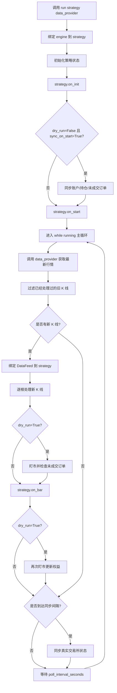

# `crypto_quant/engine/live.py` 实盘引擎说明文档

本文档详细解释 `crypto_quant/engine/live.py` 文件的设计目的、核心类、运行流程、`dry_run` 模拟实盘逻辑、真实实盘状态同步逻辑，以及当前版本仍然需要注意的风险。

`live.py` 是当前框架的实盘引擎模块。它负责用实时或准实时行情驱动策略运行，并根据配置决定是本地模拟交易，还是通过 `BinanceClient` 连接交易所执行真实下单。

---

## 1. 文件整体定位

文件位置：

```text
crypto_quant/engine/live.py
```

示例入口：

```text
examples/run_live.py
```

它位于引擎层，连接了：

```text
实时行情数据
        ↓
LiveEngine 实盘引擎
        ↓
StrategyBase.on_bar(bar)
        ↓
策略发出 OrderRequest
        ↓
LiveEngine 模拟成交 或 BinanceClient 真实下单
        ↓
更新 LocalOrder / Trade / Position / Account
```

你可以把 `LiveEngine` 理解为：

```text
实时行情轮询器 + 策略驱动器 + 模拟实盘撮合器 + 真实交易所接口协调器
```

---

## 2. 实盘引擎的两种模式

`LiveEngine` 最重要的配置是：

```python
dry_run: bool = True
```

它决定当前运行模式。

| 模式 | 含义 | 是否真实下单 | 适用场景 |
|---|---|---|---|
| `dry_run=True` | 模拟实盘 | 否 | 策略上线前观察实时表现 |
| `dry_run=False` | 真实实盘 | 是 | 测试网或小规模真实交易验证 |

建议顺序是：

```text
历史回测
    ↓
多策略组合回测
    ↓
dry_run 模拟实盘
    ↓
Binance testnet / sandbox 验证
    ↓
小资金真实实盘
```

不建议跳过前面的步骤直接真实下单。

---

## 3. 文件导入说明

源码：

```python
import time
from decimal import Decimal
from typing import TYPE_CHECKING, Any
from uuid import uuid4

from crypto_quant.config import LiveConfig
from crypto_quant.data.feed import BarData, DataFeed
from crypto_quant.enums import OrderSide, OrderStatus, OrderType, PositionSide, TimeInForce, TradingMode
from crypto_quant.strategy.base import Account, LocalOrder, OrderRequest, Position, StrategyBase, Trade
```

含义：

| 导入项 | 作用 |
|---|---|
| `time` | 控制轮询间隔和真实状态同步间隔 |
| `Decimal` | 处理价格、数量、资金、手续费 |
| `TYPE_CHECKING` | 只在类型检查时导入 `BinanceClient`，避免 dry-run 场景强依赖 ccxt |
| `Any` | 兼容不同形式的数据提供函数和交易所返回值 |
| `uuid4` | 生成本地成交 ID 或兜底订单 ID |
| `LiveConfig` | 实盘配置 |
| `BarData` | 单根 K 线 |
| `DataFeed` | 行情数据集合 |
| `OrderSide` | 买卖方向 |
| `OrderStatus` | 订单状态 |
| `OrderType` | 订单类型 |
| `PositionSide` | 持仓方向 |
| `TimeInForce` | 订单有效方式 |
| `TradingMode` | 现货/合约模式 |
| `Account` | 账户对象 |
| `LocalOrder` | 本地订单对象 |
| `OrderRequest` | 策略发出的订单请求 |
| `Position` | 持仓对象 |
| `StrategyBase` | 策略基类 |
| `Trade` | 成交记录 |

---

## 4. `LiveConfig`：实盘配置

位置：

```text
crypto_quant/config.py
```

当前字段：

```python
@dataclass(slots=True)
class LiveConfig:
    dry_run: bool = True
    poll_interval_seconds: float = 3.0
    max_order_retries: int = 3
    initial_cash: Decimal = Decimal("10000")
    commission_rate: Decimal = Decimal("0.0004")
    slippage_rate: Decimal = Decimal("0")
    leverage: Decimal = Decimal("1")
    maintenance_margin_rate: Decimal = Decimal("0.005")
    sync_on_start: bool = True
    sync_interval_seconds: float = 30.0
    sync_symbols: list[str] = field(default_factory=list)
    account_quote_asset: str = "USDT"
```

字段说明：

| 字段 | 默认值 | 含义 |
|---|---:|---|
| `dry_run` | `True` | 是否使用模拟实盘模式 |
| `poll_interval_seconds` | `3.0` | 每次轮询行情之间等待多少秒 |
| `max_order_retries` | `3` | 最大下单重试次数，目前主要作为预留配置 |
| `initial_cash` | `10000` | dry-run 模拟账户初始资金 |
| `commission_rate` | `0.0004` | dry-run 模拟手续费率 |
| `slippage_rate` | `0` | dry-run 模拟滑点率 |
| `leverage` | `1` | dry-run 合约模拟杠杆 |
| `maintenance_margin_rate` | `0.005` | dry-run 合约维持保证金率 |
| `sync_on_start` | `True` | 真实实盘启动时是否同步交易所状态 |
| `sync_interval_seconds` | `30.0` | 真实实盘运行中每隔多少秒同步一次交易所状态 |
| `sync_symbols` | `[]` | 限定同步哪些交易对，空列表表示使用客户端默认同步范围 |
| `account_quote_asset` | `USDT` | 同步账户时使用哪个计价资产作为现金和权益参考 |

---

## 5. `LiveEngine.__init__`

源码结构：

```python
class LiveEngine:
    def __init__(self, client: "BinanceClient", config: LiveConfig | None = None):
        self.client = client
        self.config = config or LiveConfig()
        self.running = False
        self.current_bar: BarData | None = None
        self.orders: dict[str, LocalOrder] = {}
        self.trades: list[Trade] = []
        self._last_bar_datetime: dict[tuple[str, str], object] = {}
        self._last_sync_at = 0.0
```

字段说明：

| 字段 | 含义 |
|---|---|
| `client` | Binance 客户端封装，负责真正访问交易所 |
| `config` | 实盘配置对象 |
| `running` | 引擎是否正在运行 |
| `current_bar` | 当前处理的 K 线 |
| `orders` | 引擎层本地订单字典 |
| `trades` | 引擎层成交记录列表，主要用于 dry-run |
| `_last_bar_datetime` | 记录每个交易对和周期最后处理过的 K 线时间，避免重复处理旧 K 线 |
| `_last_sync_at` | 上一次同步真实交易所状态的时间 |

---

## 6. `run()`：实盘主循环

核心方法：

```python
def run(self, strategy: StrategyBase, data_provider: Any) -> None:
```

其中：

| 参数 | 含义 |
|---|---|
| `strategy` | 要运行的策略对象 |
| `data_provider` | 行情数据提供函数，每次调用返回最新 K 线或 `DataFeed` |

整体流程：



---

## 7. 行情提供函数 `data_provider`

`LiveEngine` 不直接规定行情从哪里来。

你可以传入一个函数：

```python
def latest_bars() -> DataFeed:
    return DataFeed(fetcher.fetch_ohlcv("BTC/USDT", KlineInterval.M1, limit=100))
```

然后：

```python
engine.run(strategy, latest_bars)
```

这样设计的好处是：

```text
1. 行情可以来自 Binance；
2. 行情可以来自本地文件；
3. 行情可以来自数据库；
4. 后续也可以替换成 WebSocket 缓存数据。
```

---

## 8. 新 K 线过滤 `_new_bars()`

实盘轮询时，每次可能都会拿到最近 100 根 K 线。

如果不做过滤，策略会重复处理旧 K 线。

`_new_bars()` 的作用是：

```text
只保留还没处理过的新 K 线。
```

它使用的 key 是：

```python
(symbol, timeframe)
```

例如：

```text
("BTC/USDT", "1m")
```

这样不同交易对、不同周期之间不会互相影响。

---

## 9. `dry_run=True`：模拟实盘逻辑

当 `dry_run=True` 时，策略发出的订单不会发到 Binance。

流程是：

```text
策略调用 buy/sell/short/cover
        ↓
生成 OrderRequest
        ↓
LiveEngine._submit_dry_run_order
        ↓
生成本地 LocalOrder
        ↓
尝试按当前 K 线模拟成交
        ↓
生成 Trade
        ↓
更新 Account / Position
        ↓
回调 strategy.on_trade 和 strategy.on_order
```

### 9.1 dry-run 订单 ID

模拟订单 ID 形如：

```text
dry-run-1
dry-run-2
dry-run-3
```

### 9.2 dry-run 成交价格

市价单：

```text
按当前 K 线 close 成交
```

限价单：

```text
买单价格低于当前 bar.low 时，不成交；
卖单价格高于当前 bar.high 时，不成交；
否则按限价成交。
```

之后会根据配置加入滑点：

```text
买入：成交价 = 成交价 + 成交价 * slippage_rate
卖出：成交价 = 成交价 - 成交价 * slippage_rate
```

### 9.3 dry-run 手续费

手续费计算：

```text
fee = price * amount * commission_rate
```

### 9.4 dry-run 账户更新

现货模式下：

```text
买入：cash 减少
卖出：cash 增加
权益：cash + 当前持仓市值
```

合约模式下：

```text
开仓：占用保证金
平仓：释放保证金并确认已实现盈亏
权益：cash + unrealized_pnl
可用资金：equity - margin
```

---

## 10. `dry_run=False`：真实实盘下单

当 `dry_run=False` 时，策略下单会走真实交易所路径。

核心代码流程：

```text
StrategyBase.submit_order
        ↓
LiveEngine.submit_order
        ↓
BinanceClient.create_order
        ↓
交易所返回订单结果
        ↓
LiveEngine 转成本地 LocalOrder
        ↓
保存到 self.orders 和 strategy.orders
        ↓
调用 strategy.on_order(order)
```

真实下单使用：

```python
self.client.create_order(
    symbol=request.symbol,
    side=request.side,
    order_type=request.order_type,
    amount=float(request.amount),
    price=float(request.price) if request.price is not None else None,
    position_side=request.position_side,
    reduce_only=request.reduce_only,
    time_in_force=request.time_in_force.value if request.time_in_force else None,
    params=request.params,
)
```

注意：

```text
真实实盘下单是有风险的。
dry_run=False 前必须确认 API key、交易对、数量、杠杆、保证金模式、风控限制都正确。
```

---

## 11. 真实实盘撤单

策略调用：

```python
strategy.cancel_order(order_id)
```

实盘引擎会调用：

```python
self.client.cancel_order(order_id, order.request.symbol)
```

然后根据交易所返回的状态更新本地订单。

如果交易所没有返回明确状态，框架会把本地订单状态设为：

```python
OrderStatus.CANCELED
```

---

## 12. 真实状态同步 `sync_state()`

这是当前实盘引擎新增强的重要能力。

方法：

```python
def sync_state(self, strategy: StrategyBase) -> None:
    if self.config.dry_run:
        return
    self._sync_account(strategy)
    self._sync_positions(strategy)
    self._sync_open_orders(strategy)
    self._last_sync_at = time.monotonic()
```

它只在：

```text
dry_run=False
```

时工作。

它做三件事：

```text
1. 同步真实账户；
2. 同步真实持仓；
3. 同步真实未成交订单。
```

它不会下单，也不会撤单。

---

## 13. 账户同步 `_sync_account()`

账户同步使用：

```python
self.client.fetch_balance()
```

同步到：

```python
strategy.account
```

主要字段包括：

| 字段 | 来源含义 |
|---|---|
| `cash` | 钱包余额或账户总余额 |
| `equity` | 账户权益，合约里通常包含未实现盈亏 |
| `available` | 可用余额 |
| `margin` | 当前初始保证金占用 |
| `maintenance_margin` | 维持保证金 |
| `unrealized_pnl` | 未实现盈亏 |
| `margin_ratio` | 维持保证金 / 权益 |

现货模式下，主要读取：

```text
balance["free"][account_quote_asset]
balance["total"][account_quote_asset]
```

合约模式下，会兼容 Binance 返回的 `info` 字段，例如：

```text
totalWalletBalance
totalMarginBalance
availableBalance
totalInitialMargin
totalMaintMargin
totalUnrealizedProfit
```

---

## 14. 持仓同步 `_sync_positions()`

持仓同步使用：

```python
self.client.fetch_positions(self.config.sync_symbols or None)
```

同步到：

```python
strategy.positions
```

每个交易所持仓会转换成框架内部的：

```python
Position
```

主要字段包括：

| 字段 | 含义 |
|---|---|
| `symbol` | 交易对 |
| `side` | 持仓方向，`LONG` / `SHORT` / `BOTH` |
| `amount` | 持仓数量 |
| `entry_price` | 开仓均价 |
| `mark_price` | 标记价格 |
| `margin` | 仓位占用保证金 |
| `liquidation_price` | 强平价格 |
| `unrealized_pnl` | 未实现盈亏 |

持仓 key 使用：

```python
f"{symbol}:{side.value}"
```

例如：

```text
BTC/USDT:USDT:LONG
ETH/USDT:USDT:SHORT
```

为了避免半同步状态，当前实现会先构造一个新的 `positions` 字典，然后整体替换：

```python
strategy.positions = positions
```

---

## 15. 未成交订单同步 `_sync_open_orders()`

未成交订单同步使用：

```python
self.client.fetch_open_orders()
```

如果设置了：

```python
sync_symbols=["BTC/USDT"]
```

则会按交易对逐个同步：

```python
self.client.fetch_open_orders("BTC/USDT")
```

同步结果会转换成框架内部的：

```python
LocalOrder
```

因为 `LocalOrder` 需要包含原始下单请求，所以同步时会从交易所订单里重建：

```python
OrderRequest
```

主要解析字段包括：

```text
symbol
side
type
amount
price
positionSide
reduceOnly
timeInForce
status
filled
average
```

同步完成后会更新：

```python
self.orders
strategy.orders
```

注意：

```text
同步交易所已有订单时，默认不会逐个触发 strategy.on_order()。
```

原因是这些订单不是当前这一刻由策略新创建的，如果启动时大量触发 `on_order()`，可能让策略误以为刚刚发生了很多新订单事件。

---

## 16. 同步时机

真实状态同步有两个时机。

### 16.1 启动时同步

配置：

```python
sync_on_start=True
```

流程：

```text
strategy.on_init()
        ↓
sync_state(strategy)
        ↓
strategy.on_start()
```

这样策略在 `on_start()` 里就能看到真实账户、持仓和未成交订单。

### 16.2 运行中周期同步

配置：

```python
sync_interval_seconds=30.0
```

表示每隔 30 秒左右同步一次交易所状态。

如果你不想周期同步，可以设置：

```python
sync_interval_seconds=0
```

---

## 17. 示例：运行 dry-run 实盘

示例文件：

```text
examples/run_live.py
```

核心代码：

```python
from crypto_quant.config import BinanceConfig, LiveConfig
from crypto_quant.engine import LiveEngine
from crypto_quant.enums import KlineInterval, TradingMode
from crypto_quant.exchange import BinanceClient
from crypto_quant.data import DataFeed, MarketDataFetcher
from examples.simple_moving_average_strategy import SimpleMovingAverageStrategy


config = BinanceConfig(trading_mode=TradingMode.SPOT, sandbox=True)
client = BinanceClient(config)
fetcher = MarketDataFetcher(client)
strategy = SimpleMovingAverageStrategy(trading_mode=TradingMode.SPOT)
engine = LiveEngine(client, LiveConfig(dry_run=True, poll_interval_seconds=10))


def latest_bars() -> DataFeed:
    return DataFeed(fetcher.fetch_ohlcv("BTC/USDT", KlineInterval.M1, limit=100))


engine.run(strategy, latest_bars)
```

运行：

```bash
PYTHONPATH=. python3 examples/run_live.py
```

这个示例使用：

```python
dry_run=True
```

所以不会真实下单。

---

## 18. 示例：真实实盘状态同步配置

如果要连接真实实盘或测试网，可以这样配置：

```python
from decimal import Decimal

from crypto_quant.config import BinanceConfig, LiveConfig
from crypto_quant.enums import TradingMode
from crypto_quant.exchange import BinanceClient
from crypto_quant.engine import LiveEngine


client = BinanceClient(
    BinanceConfig(
        api_key="从环境变量读取",
        secret="从环境变量读取",
        trading_mode=TradingMode.FUTURE,
        sandbox=True,
    )
)

engine = LiveEngine(
    client,
    LiveConfig(
        dry_run=False,
        poll_interval_seconds=10,
        sync_on_start=True,
        sync_interval_seconds=30,
        sync_symbols=["BTC/USDT:USDT"],
        account_quote_asset="USDT",
        leverage=Decimal("3"),
    ),
)
```

注意：

```text
只要 dry_run=False，策略发出的订单就可能真实到达交易所。
```

所以真实运行前必须先确认策略逻辑和风控。

---

## 19. 当前实盘引擎已经支持什么？

当前版本支持：

```text
1. 轮询实时 K 线；
2. 过滤重复 K 线；
3. 调用策略 on_init / on_start / on_bar / on_stop；
4. dry-run 本地模拟下单；
5. dry-run 本地模拟成交；
6. dry-run 账户和持仓更新；
7. dry-run 现货和合约模拟；
8. dry-run 手续费、滑点、杠杆、维持保证金；
9. dry-run 盯市更新权益；
10. dry_run=False 时通过 BinanceClient 真实下单；
11. dry_run=False 时通过 BinanceClient 真实撤单；
12. dry_run=False 时同步真实账户；
13. dry_run=False 时同步真实持仓；
14. dry_run=False 时同步真实未成交订单；
15. 对交易所返回值做基础解析和本地对象转换。
```

---

## 20. 当前还不适合什么？

虽然当前实盘能力比最初版本更完整，但它仍然不是生产级自动交易系统。

目前还不适合：

```text
1. 大资金无人值守实盘；
2. 高频交易；
3. 高频做市；
4. 多账户资金调度；
5. 复杂组合级风控；
6. 多交易所套利；
7. 对网络异常要求极高的交易场景。
```

---

## 21. 真实交易前必须补充的能力

真实交易前建议继续补充：

```text
1. API key 从环境变量读取，不能写死在代码里；
2. 单笔最大下单金额限制；
3. 单品种最大仓位限制；
4. 总账户最大杠杆限制；
5. 每日最大亏损限制；
6. 连续亏损暂停机制；
7. 异常行情熔断；
8. 网络异常重试和降级；
9. 订单状态持久化；
10. 成交记录持久化；
11. 实盘日志系统；
12. Telegram / 邮件 / 企业微信告警；
13. 测试网长时间稳定性验证。
```

---

## 22. 一句话总结

```text
live.py 的作用是：
让同一套策略代码可以从历史回测过渡到实时行情运行，并在 dry-run 中模拟交易，在 dry_run=False 中连接真实交易所。
```

当前它最适合的使用方向是：

```text
回测后的模拟实盘观察；
Binance sandbox/testnet 流程验证；
小规模、低频、有人看守的实盘试运行。
```

不建议把它直接用于大资金、无人值守、生产级自动交易。
