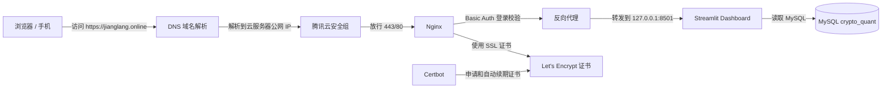

# Crypto Quant Framework

`crypto_quant_framework` 是一个基于 Python、`ccxt`、OKX、SQLAlchemy、MySQL、pandas 和 Bokeh 的加密货币量化交易框架。

我对这个项目的定位是这样的，它的目标不是直接提供“可盈利策略”，而是提供一套清晰、可扩展、便于学习和二次开发的量化交易工程骨架，以此学习量化交易的工程思想。你可以用它完成从数据准备、策略开发、单策略回测、多策略组合回测、绩效分析、交互式图表报告、数据库存储，到模拟实盘和真实交易接入的完整开发流程。

🧠感兴趣的朋友可以下载到本地环境研究透再上云服务器实操，不必一开始就想着借助这个框架大赚特赚，这是不现实的。

🙈对市场微观结构或高频交易感兴趣的朋友可以看我的另一个研究仓库，这也是我目前正在研究的方向之一，`orderbook_research`原本是当前这个项目的一部分，但随着研究的深入，我觉得有必要为其单开一个项目：

https://github.com/jianglang740/orderbook_research.git

当前框架已经支持：

- OKX 现货交易模式：`spot`
- OKX 永续合约交易模式：`future`（底层 `defaultType` 为 `swap`）
- 基于 `ccxt` 的 OKX 行情和交易接口封装
- 交易所规则校验：交易对、数量精度、价格精度、最小下单量、最小名义价值等
- 交易异常封装：校验异常、可重试异常、订单异常
- 数据结构：`BarData`、`DataLine`、`DataFeed`
- 本地 CSV 数据加载
- OKX 历史 K 线拉取
- OKX 批量分页拉取历史 K 线
- 北京时间、UTC、毫秒时间戳之间的统一转换
- K 线清洗、去重、排序、合法性校验和缺失区间检查
- CSV / OKX / MySQL 统一转换为 `DataFeed`
- 数据闭环管道：OKX 拉取 -> 清洗校验 -> MySQL 入库 -> MySQL 读回 `DataFeed`
- 策略基类：账户、持仓、下单、撤单、平仓、生命周期钩子
- 单策略回测引擎
- 多策略组合回测引擎：多个策略共用同一个账户和持仓
- 现货回测：买入、卖出、手续费、滑点、权益计算
- 合约回测：多空、杠杆、保证金、维持保证金、保证金率、强平价格和强平触发
- 绩效分析：收益率、年化收益率、波动率、最大回撤、夏普、Sortino、Calmar、胜率、盈亏比等
- Bokeh 交互式报告：指标表、权益曲线、回撤曲线、价格买卖点、单笔平仓盈亏图
- MySQL 数据库层：K 线、运行批次、订单、成交、权益曲线、账户快照、持仓快照
- 回测结果保存和查询
- 实盘数据库记录器：独立记录实盘账户、持仓、订单状态和成交记录
- OKX Demo Trading 验证脚本：余额、账户快照、订单状态、持仓快照、成交记录、周期性实盘记录
- `examples/` 下每个示例 Python 文件都有同名 Markdown 说明文档
- 实盘引擎：支持 `dry_run` 模拟实盘，也支持真实账户、持仓、未成交订单同步

> 注意：这是一个量化交易框架骨架，不是投资建议，也不是成熟的生产级交易系统。真实交易前必须充分回测、长时间模拟盘验证，并补充风控、日志、异常告警、密钥管理、资金限制和人工兜底机制。

---

## 仪表盘如下图所示：

- 这是我的仪表盘网址：https://jianglang.online/
- 账号：quant，密码：Jl.2018036661,仅供同样对量化感兴趣的“好人”访问学习，创作不易，请勿破坏我的成果💔


## 0. 推荐先读的文档

如果你是第一次接触这个项目，建议先读 README，再按下面文档深入理解各模块：

- [项目依赖库说明文档](./项目依赖库说明文档.md)
- [StrategyBase说明文档](./StrategyBase说明文档.md)
- [DataFeed说明文档](./DataFeed说明文档.md)
- [数据模块说明文档](./数据模块说明文档.md)
- [BackTest说明文档](./BackTest说明文档.md)
- [绩效分析说明文档](./绩效分析说明文档.md)
- [Bokeh报告和图表说明文档](./Bokeh报告和图表说明文档.md)
- [ExchangeClient交易所客户端说明文档](./ExchangeClient交易所客户端说明文档.md)
- [LiveEngine实盘引擎说明文档](./LiveEngine实盘引擎说明文档.md)
- [Database数据库模块说明文档](./Database数据库模块说明文档.md)
- [Real实盘和测试网脚本说明文档](./Real实盘和测试网脚本说明文档.md)
- [数据库验证过程总结](./crypto_quant/database/数据库验证过程总结.md)
- `examples/*.md`：每个示例脚本的独立说明文档

---

## 1. 项目定位

这个项目适合用来做：

```text
1. 学习量化交易框架的基本结构；
2. 编写自己的加密货币策略；
3. 用本地 CSV 或 OKX 历史 K 线做回测；
4. 对策略结果做绩效分析和图表展示；
5. 把 K 线、回测结果、实盘快照保存到 MySQL；
6. 在 dry_run 模式下验证实盘逻辑；
7. 在充分验证后，作为真实实盘系统的基础骨架继续扩展。
```

它不适合直接拿来做：

```text
1. 没有风控的真实大资金交易；
2. 高频交易；
3. 完整生产级资产管理系统；
4. 多交易所统一路由；
5. 自动参数优化平台；
6. 完整的 Web 管理后台。
```

目前的设计更偏“清晰、可读、可扩展”，不是为了追求极限性能或复杂架构。

---

## 2. 项目结构

```text
crypto_quant_framework/
├── crypto_quant/
│   ├── __init__.py
│   ├── config.py                    # 配置对象：OKX、MySQL、回测、实盘
│   ├── enums.py                     # 枚举：交易模式、订单方向、订单类型、K线周期等
│   ├── analysis/
│   │   ├── __init__.py
│   │   ├── performance.py           # 绩效分析
│   │   └── bokeh_report.py          # Bokeh 交互式回测报告
│   ├── data/
│   │   ├── __init__.py
│   │   ├── feed.py                  # BarData、DataLine、DataFeed
│   │   ├── csv_loader.py            # CSV 数据加载
│   │   ├── fetcher.py               # OKX/ccxt 行情获取
│   │   ├── cleaner.py               # K线清洗、去重、质量校验
│   │   ├── time_utils.py            # 时间戳、UTC、北京时间转换
│   │   ├── source.py                # CSV/OKX/MySQL 统一 DataFeed 入口
│   │   └── pipeline.py              # OKX 拉取、清洗、入库、读回闭环
│   ├── database/
│   │   ├── __init__.py
│   │   ├── models.py                # SQLAlchemy ORM 模型
│   │   ├── repository.py            # 数据写入、读取、查询封装
│   │   ├── recorder.py              # 实盘数据库记录器
│   │   └── session.py               # MySQL engine/session 创建
│   ├── engine/
│   │   ├── __init__.py
│   │   ├── backtest.py              # 单策略回测引擎
│   │   ├── portfolio_backtest.py    # 多策略组合回测引擎
│   │   └── live.py                  # 实盘引擎
│   ├── exchange/
│   │   ├── __init__.py
│   │   └── exchange_client.py        # OKX ccxt 客户端封装
│   └── strategy/
│       ├── __init__.py
│       └── base.py                  # 策略基类和交易状态对象
├── dashboard/
│   ├── app.py                                    # Streamlit 只读仪表盘入口
│   ├── import_dashboard_klines.py                # 仪表盘行情图 CSV K线入库脚本
│   ├── run_recursive_cusum_backtest_to_db.py     # 递归 CUSUM 策略回测并入库
│   ├── seed_dashboard_demo_data.py               # 仪表盘演示数据构造脚本
│   └── style.css                                 # 仪表盘页面样式
├── real/
│   ├── init_mysql_tables.py                      # 只初始化 MySQL 表结构
│   └── run_testnet_smoke_strategy.py             # OKX Demo Trading 长跑验证脚本
├── examples/
│   ├── basic_strategy.py                         # 动量 + 均线合约策略示例
│   ├── simple_moving_average_strategy.py         # 简单均线策略示例
│   ├── run_backtest.py                           # 单策略回测示例
│   ├── run_csv_backtest.py                       # CSV 回测示例
│   ├── run_database_backtest.py                  # 数据库读写和回测结果保存示例
│   ├── run_bokeh_report.py                       # Bokeh 报告示例
│   ├── run_live.py                               # dry_run 实盘示例
│   ├── run_live_database_recorder.py             # 实盘数据库记录器示例
│   ├── run_market_data_pipeline.py               # OKX K线拉取、清洗、MySQL入库示例
│   ├── run_okx_testnet_balance.py            # OKX Demo Trading 余额验证
│   ├── run_testnet_account_recorder.py           # 测试网账户快照入库验证
│   ├── run_testnet_order_recorder.py             # 测试网订单状态入库验证
│   ├── run_testnet_position_and_trade_recorder.py # 测试网持仓和成交入库验证
│   ├── run_testnet_periodic_live_recorder.py     # 测试网周期性实盘记录验证
│   └── *.md                                      # 每个示例脚本的同名说明文档
├── requirements.txt
├── pyproject.toml
├── .env.example                                  # 云服务器和本地运行环境变量模板
├── README.md
├── StrategyBase说明文档.md
├── DataFeed说明文档.md
├── 数据模块说明文档.md
├── BackTest说明文档.md
├── 绩效分析说明文档.md
├── Bokeh报告和图表说明文档.md
├── ExchangeClient交易所客户端说明文档.md
├── LiveEngine实盘引擎说明文档.md
└── Database数据库模块说明文档.md
```

---

## 3. 环境准备

建议使用 Python 3.11 或更高版本。

### 3.1 进入项目目录

```bash
cd /path/to/crypto_quant_framework
```

例如：

```bash
cd /Users/clinking/Downloads/crypto_quant_framework
```

### 3.2 安装依赖

如果只是安装依赖，可以执行：

```bash
python3 -m pip install -r requirements.txt
```

如果希望在 VS Code 或终端中直接运行脚本时，不再每次手动加 `PYTHONPATH=.`，建议使用项目根目录下的 `pyproject.toml` 做可编辑安装：

```bash
python3 -m pip install -e .
```

这里最后的 `.` 表示“安装当前目录这个项目”。安装后会生成 `crypto_quant_framework.egg-info/` 目录，这是正常的包元数据目录，已经被 `.gitignore` 中的 `*.egg-info/` 忽略，不需要提交。

当前主要依赖：

```text
ccxt>=4.4.0
SQLAlchemy>=2.0.0
PyMySQL>=1.1.0
pandas>=2.0.0
numpy>=1.24.0
bokeh>=3.0.0
streamlit>=1.30.0
```

各依赖用途：

| 依赖           | 用途                                            |
| -------------- | ----------------------------------------------- |
| `ccxt`       | 连接 OKX，获取行情，提交订单，查询账户和订单    |
| `SQLAlchemy` | ORM 模型、数据库 session、repository 封装       |
| `PyMySQL`    | MySQL 驱动                                      |
| `pandas`     | CSV 读取、DataFrame 转换                        |
| `numpy`      | 辅助处理 CSV 中的数值类型                       |
| `bokeh`      | 生成交互式回测报告                              |
| `streamlit`  | 启动只读 Web 仪表盘，展示回测、实盘和数据库记录 |

### 3.3 运行时导入路径

推荐先在项目根目录执行一次可编辑安装：

```bash
python3 -m pip install -e .
```

安装成功后，Python 就能直接找到 `crypto_quant` 包，后续在项目根目录运行示例或自己的策略脚本时，不需要再手动加 `PYTHONPATH=.`。

可以先用下面命令验证：

```bash
python3 -c "import crypto_quant; print(crypto_quant)"
```

如果没有执行可编辑安装，也可以临时使用：

```bash
PYTHONPATH=. python3 examples/run_backtest.py
```

如果既没有安装项目，也没有设置 `PYTHONPATH`，可能出现：

```text
ModuleNotFoundError: No module named 'crypto_quant'
```

---

## 4. 快速运行第一个回测

如果已经执行过：

```bash
python3 -m pip install -e .
```

则可以在项目根目录直接运行：

```bash
python3 examples/run_backtest.py
```

如果没有做可编辑安装，也可以临时使用：

```bash
PYTHONPATH=. python3 examples/run_backtest.py
```

你会看到类似输出：

```text
Account(cash=Decimal('8999.409924'), equity=Decimal('10000.399924'), ...)
PerformanceReport(total_return=Decimal('0.0000399924'), max_drawdown=Decimal('-0.0000380076'), ...)
```

这说明：

```text
1. 项目可以正常导入；
2. 示例策略可以正常初始化；
3. 回测引擎可以逐根 K 线推进；
4. 策略可以下单；
5. 回测引擎可以模拟成交；
6. 账户、持仓、订单、成交可以更新；
7. 绩效模块可以生成结果。
```

注意：示例策略和示例数据主要用于验证框架闭环，不代表真实可用的交易策略。

---

## 5. 启动只读仪表盘

项目提供了一个基于 Streamlit 的第一版只读仪表盘，用于展示数据库中的运行记录、权益曲线、订单、成交、账户快照和持仓快照。

先确认已经安装依赖：

```bash
python3 -m pip install -e .
```

然后在项目根目录运行：

```bash
streamlit run dashboard/app.py
```

仪表盘默认读取本地 MySQL：

```text
host: 127.0.0.1
port: 3306
username: root
database: crypto_quant
```

如果你的本地数据库配置不同，可以在启动前设置环境变量：

```bash
export CRYPTO_QUANT_MYSQL_HOST=127.0.0.1
export CRYPTO_QUANT_MYSQL_PORT=3306
export CRYPTO_QUANT_MYSQL_USERNAME=root
export CRYPTO_QUANT_MYSQL_PASSWORD=你的密码
export CRYPTO_QUANT_MYSQL_DATABASE=crypto_quant
streamlit run dashboard/app.py
```

也可以复制统一环境变量模板：

```bash
cp .env.example .env
nano .env
source .env
```

`dashboard/app.py` 会读取 `CRYPTO_QUANT_MYSQL_*` 环境变量。真正的 `.env` 文件不要提交到 GitHub。

当前仪表盘定位是偏静态的展示页面，只读数据库，不下单、不撤单、不修改策略参数，也不启动或停止实盘程序。

如果本地数据库里的历史验证数据较乱，可以先构造一组专门用于仪表盘开发和图表调试的演示数据：

```bash
python3 dashboard/seed_dashboard_demo_data.py
```

这个脚本会写入两个 `run_id` 以 `dashboard_demo_` 开头的演示运行记录：

```text
dashboard_demo_momentum_trend_backtest
dashboard_demo_dry_run_live_overview
```

并同步构造：

```text
strategy_runs
equity_curve
account_snapshots
position_snapshots
orders
trades
```

脚本可以重复运行。每次运行前会先清理旧的 `dashboard_demo_` 演示数据，再重新写入，不会清理你已有的真实验证数据。

如果需要给仪表盘行情图准备真实 K 线数据，可以把本地 CSV 写入 `klines` 表：

```bash
python3 dashboard/import_dashboard_klines.py \
  --csv /Users/clinking/开发/quant/data/ETH_USDT_5m_1year.csv \
  --symbol ETH/USDT \
  --timeframe 5m
```

这个脚本复用框架已有的 CSV 加载和 `MarketDataRepository.upsert_klines()` 入库能力。`klines` 表有唯一索引，重复运行会更新同一根 K 线，不会重复插入。

如果需要跑一次真实策略回测并保存到数据库，用于测试仪表盘回测报告展示，可以执行：

```bash
python3 dashboard/run_recursive_cusum_backtest_to_db.py \
  --csv /Users/clinking/开发/quant/data/ETH_USDT_5m_1year.csv \
  --symbol ETH/USDT \
  --timeframe 5m
```

该脚本会复用 `my_strategys/run_recursive_cusum_reversion_strategy.py` 中的 `RecursiveCusumReversionFuturesStrategy`，运行回测后通过 `TradingRepository.save_backtest_result()` 写入：

```text
strategy_runs
orders
trades
equity_curve
```

默认 `run_id` 为：

```text
dashboard_test_recursive_cusum_reversion_backtest
```

这条记录的配置里会标记 `purpose = dashboard_test_backtest_display`，用于区分这是为了仪表盘测试展示生成的回测数据。

---

## 6.云服务器测试

### 6.1云服务器测试脚本

我在`real`目录下放了一些用于在云服务器上长跑测试框架稳健性和链路是否打通的脚本，其中包括一个马丁脚本和一个cusum递归的反转策略脚本，以及导入btck线数据及依据`models`在云服务器的mysql数据库建库和建表的脚本，注意策略脚本都只是简单的买入和卖出逻辑脚本，不能用来做实盘交易，读者在本地研究透这个脚本后可以去云服务器上使用tmux来长跑这两个脚本进行测试和后续开发；

### 6.2云服务器数据库验证

在上云之后建议读者自己配置好mysql数据库，然后更改本框架的`config`相关配置文件的mysql配置部分，然后利用脚本把本框架所用到的数据库和数据表建好，在运行我提供的测试脚本之后检查是否有持续的买入和卖出、持仓快照、账户快照等数据入库；

### 6.3仪表盘测试

在完成6.1和6.2步骤并验证它们能正常工作之后，建议读者新开一个tumx终端用来长跑仪表盘`app.py`以此测试项目的仪表盘能否正常工作，建议读者不要把streamlit仪表盘直接裸露到公网，可以运行：

```
streamlit run dashboard/app.py --server.address 127.0.0.1 --server.port 8501
```

读者可以参照我的云服务器网站配置进行修改



然后打开浏览器输入你自己的网址查看仪表盘能否正常工作

更详细的操作可以参见我的验证过程：[Real实盘和测试网脚本说明文档](Real实盘和测试网脚本说明文档.md)

---

## 7. 推荐阅读顺序

如果你想从代码角度理解项目，建议按下面顺序阅读：

```text
1. examples/run_backtest.py
2. examples/simple_moving_average_strategy.py
3. crypto_quant/strategy/base.py
4. crypto_quant/data/feed.py
5. crypto_quant/engine/backtest.py
6. crypto_quant/config.py
7. crypto_quant/enums.py
8. crypto_quant/analysis/performance.py
9. crypto_quant/analysis/bokeh_report.py
10. crypto_quant/engine/portfolio_backtest.py
11. crypto_quant/data/time_utils.py
12. crypto_quant/data/cleaner.py
13. crypto_quant/data/fetcher.py
14. crypto_quant/data/source.py
15. crypto_quant/data/pipeline.py
16. crypto_quant/database/models.py
17. crypto_quant/database/repository.py
18. crypto_quant/database/recorder.py
19. crypto_quant/exchange/exchange_client.py
20. crypto_quant/engine/live.py
```

最核心的回测主线是：

```text
BarData -> DataFeed -> StrategyBase -> BacktestEngine -> BacktestResult -> PerformanceAnalyzer -> BokehBacktestReport
```

更完整的数据闭环是：

```text
OKX 历史 K线
        ↓
MarketDataFetcher
        ↓
clean_and_validate_bars
        ↓
MarketDataRepository.upsert_klines
        ↓
MarketDataRepository.get_data_feed
        ↓
BacktestEngine / PortfolioBacktestEngine
        ↓
PerformanceAnalyzer / BokehBacktestReport
        ↓
TradingRepository.save_backtest_result
```

实盘记录主线是：

```text
LiveEngine / StrategyBase
        ↓
LiveDatabaseRecorder
        ↓
TradingRepository
        ↓
strategy_runs / account_snapshots / position_snapshots / orders
```

---

## 8. 核心概念

### 8.1 BarData：一根 K 线

位置：`crypto_quant/data/feed.py`

```python
@dataclass(frozen=True, slots=True)
class BarData:
    symbol: str
    timeframe: str
    datetime: datetime
    open: Decimal
    high: Decimal
    low: Decimal
    close: Decimal
    volume: Decimal
```

一根 `BarData` 表示一个交易对在一个周期上的 OHLCV 数据。

字段说明：

| 字段          | 含义                                  |
| ------------- | ------------------------------------- |
| `symbol`    | 交易对，例如`BTC/USDT`              |
| `timeframe` | K 线周期，例如`1m`、`15m`、`1h` |
| `datetime`  | K 线时间                              |
| `open`      | 开盘价                                |
| `high`      | 最高价                                |
| `low`       | 最低价                                |
| `close`     | 收盘价                                |
| `volume`    | 成交量                                |

示例：

```python
from datetime import datetime
from decimal import Decimal

from crypto_quant.data import BarData

bar = BarData(
    symbol="BTC/USDT",
    timeframe="1m",
    datetime=datetime(2024, 6, 1, 8, 0),
    open=Decimal("100000"),
    high=Decimal("100100"),
    low=Decimal("99900"),
    close=Decimal("100050"),
    volume=Decimal("12.5"),
)
```

### 8.2 DataFeed / DataLine：带时间游标的 K 线特征矩阵

位置：`crypto_quant/data/feed.py`

可以从机器学习的特征矩阵角度理解 `DataFeed`：

```text
n 根 K 线 = n 个时间序列样本
open / high / low / close / volume = 主要数值特征列
DataFeed = 带时间游标 cursor 的 K 线特征矩阵
```

其中：

```text
BarData  = 矩阵中的一行，也就是一根完整 K 线
DataLine = 矩阵中的一列，例如 close 这一列
cursor   = 当前回测推进到第几行
```

`symbol` 和 `timeframe` 更像元信息，不是普通数值特征：

```text
symbol    = 这批 K 线属于哪个交易对，例如 BTC/USDT
timeframe = 这批 K 线的采样周期，例如 5m
```

`DataFeed` 同时保留两种视角：

```text
按行视角：data.bars        # list[BarData]
按列视角：data.close       # DataLine，类似特征矩阵中的 close 列
```

它会拆出多条 `DataLine`：

```python
data.open
data.high
data.low
data.close
data.volume
data.datetime
```

策略中常见写法：

```python
self.data.close[0]    # 当前 K 线收盘价
self.data.close[-1]   # 上一根 K 线收盘价
self.data.close[-2]   # 上两根 K 线收盘价
```

这里的 `0`、`-1`、`-2` 是相对当前 `cursor` 的位置，不是直接对完整列表取绝对下标。

`DataFeed` 常用辅助能力：

```python
data.cursor             # 当前游标位置，-1 表示还没开始推进
data.available_bars     # 当前已经可用的 K 线数量
data.reset()            # 重置游标
data.window(20)         # 获取当前向前 20 根 BarData，等于取最近 20 行
data.close.window(20)   # 获取当前向前 20 个 close 值，等于取 close 列最近 20 行
data.slice(100, 200)    # 切出新的 DataFeed，类似切训练集/验证集
data.to_dataframe()     # 转成 pandas DataFrame
```

注意：K 线是时间序列，不能像普通机器学习样本那样随意 shuffle。回测时 `cursor` 只能向前推进，策略只能使用当前和过去的数据，不能看到未来。

示例：

```python
if self.data.available_bars < 20:
    return

ma20 = sum(self.data.close.window(20)) / Decimal("20")
```

### 8.3 StrategyBase：策略基类

位置：`crypto_quant/strategy/base.py`

所有策略通常继承：

```python
from crypto_quant.strategy import StrategyBase
```

生命周期方法：

```python
def on_init(self) -> None:
    pass

def on_start(self) -> None:
    pass

def on_bar(self, bar: BarData) -> None:
    pass

def on_trade(self, trade: Trade) -> None:
    pass

def on_order(self, order: LocalOrder) -> None:
    pass

def on_stop(self) -> None:
    pass
```

最重要的是 `on_bar()`：回测或实盘时，每来一根 K 线，就会调用一次。

### 8.4 Account：账户对象

位置：`crypto_quant/strategy/base.py`

```python
Account(
    cash=Decimal("10000"),
    equity=Decimal("10000"),
    available=Decimal("10000"),
    margin=Decimal("0"),
    maintenance_margin=Decimal("0"),
    margin_ratio=Decimal("0"),
    realized_pnl=Decimal("0"),
    unrealized_pnl=Decimal("0"),
)
```

字段说明：

| 字段                   | 含义             |
| ---------------------- | ---------------- |
| `cash`               | 现金余额         |
| `equity`             | 总权益           |
| `available`          | 可用资金         |
| `margin`             | 合约已占用保证金 |
| `maintenance_margin` | 维持保证金       |
| `margin_ratio`       | 保证金率         |
| `realized_pnl`       | 已实现盈亏       |
| `unrealized_pnl`     | 未实现盈亏       |

### 8.5 Position：持仓对象

```python
Position(
    symbol="BTC/USDT",
    side=PositionSide.BOTH,
    amount=Decimal("0.01"),
    entry_price=Decimal("100000"),
    mark_price=Decimal("100100"),
    margin=Decimal("100"),
    liquidation_price=Decimal("80000"),
    unrealized_pnl=Decimal("1"),
)
```

常用判断：

```python
position = self.get_position("BTC/USDT")

if position.is_flat:
    ...
```

### 8.6 OrderRequest / LocalOrder / Trade

策略发出的下单请求会先表示为 `OrderRequest`，回测或实盘引擎处理后生成本地订单 `LocalOrder`，成交后生成 `Trade`。

常见关系：

```text
StrategyBase.buy/sell/short/cover
        ↓
OrderRequest
        ↓
BacktestEngine / LiveEngine
        ↓
LocalOrder
        ↓
Trade
```

---

## 9. 写一个自己的策略

新建文件：

```text
examples/my_strategy.py
```

示例：连续 3 根阳线买入，连续 2 根阴线平仓。

```python
from collections import deque
from decimal import Decimal

from crypto_quant.data import BarData
from crypto_quant.strategy import StrategyBase


class MyStrategy(StrategyBase):
    name = "my_strategy"

    def __init__(self):
        super().__init__()
        self.last_bars: deque[BarData] = deque(maxlen=3)

    def on_bar(self, bar: BarData) -> None:
        self.last_bars.append(bar)
        if len(self.last_bars) < 3:
            return

        position = self.get_position(bar.symbol)
        bars = list(self.last_bars)

        three_bullish = all(item.close > item.open for item in bars)
        two_bearish = bars[-1].close < bars[-1].open and bars[-2].close < bars[-2].open

        if three_bullish and position.is_flat:
            self.buy(bar.symbol, Decimal("0.01"))
        elif two_bearish and not position.is_flat:
            self.close_position(bar.symbol)
```

然后在回测入口里替换策略：

```python
from examples.my_strategy import MyStrategy

strategy = MyStrategy()
```

运行：

```bash
PYTHONPATH=. python3 examples/run_backtest.py
```

---

## 10. 策略里如何下单

策略基类提供了一组简化方法。

### 10.1 现货常用下单

```python
self.buy("BTC/USDT", Decimal("0.01"))
self.sell("BTC/USDT", Decimal("0.01"))
self.close_position("BTC/USDT")
```

如果不传 `price`，默认是市价单；如果传 `price`，默认是限价单。

```python
self.buy("BTC/USDT", Decimal("0.01"), price=Decimal("95000"))
```

### 10.2 合约做多、做空

```python
self.buy("BTC/USDT", Decimal("0.01"))
self.sell("BTC/USDT", Decimal("0.01"))

self.short("BTC/USDT", Decimal("0.01"))
self.cover("BTC/USDT", Decimal("0.01"))
```

常见理解：

| 方法                 | 常见含义                     |
| -------------------- | ---------------------------- |
| `buy()`            | 买入，现货开多或合约增加多头 |
| `sell()`           | 卖出，现货卖出或合约减少多头 |
| `short()`          | 合约开空                     |
| `cover()`          | 合约平空                     |
| `close_position()` | 平掉当前持仓                 |

---

## 11. 单策略回测引擎

位置：`crypto_quant/engine/backtest.py`

核心用法：

```python
from decimal import Decimal

from crypto_quant.config import BacktestConfig
from crypto_quant.engine import BacktestEngine

engine = BacktestEngine(
    BacktestConfig(
        initial_cash=Decimal("10000"),
        commission_rate=Decimal("0.0004"),
        slippage_rate=Decimal("0"),
        leverage=Decimal("3"),
    )
)

result = engine.run(strategy, data)
```

`BacktestConfig` 常用字段：

| 字段                        |     默认值 | 含义           |
| --------------------------- | ---------: | -------------- |
| `initial_cash`            |  `10000` | 初始资金       |
| `commission_rate`         | `0.0004` | 手续费率       |
| `slippage_rate`           |      `0` | 滑点率         |
| `allow_short`             |   `True` | 是否允许做空   |
| `leverage`                |      `1` | 合约杠杆倍数   |
| `margin_mode`             |  `CROSS` | 保证金模式配置 |
| `maintenance_margin_rate` |  `0.005` | 维持保证金率   |
| `liquidation_fee_rate`    |  `0.001` | 强平手续费率   |

`BacktestResult` 包含：

```python
result.trades          # 成交列表
result.equity_curve    # 权益曲线
result.final_account   # 最终账户
result.orders          # 订单列表
```

当前撮合逻辑是简化版：

```text
1. 策略在当前 bar 收盘后产生的新订单，不在当前 bar 立即成交；
2. 市价单延迟到下一根 bar，并按下一根 bar open 成交；
3. 限价买单延迟到后续 K 线，只有价格触及该 bar low/high 范围才成交；
4. 限价卖单延迟到后续 K 线，只有价格触及该 bar low/high 范围才成交；
5. 手续费按 notional * commission_rate 计算；
6. 滑点按 price * slippage_rate 计算；
7. 回测逐根 K 线推进，不做 tick 级撮合。
```

合约模式下还会处理：

```text
1. 开仓保证金占用；
2. 平仓释放保证金；
3. 多头/空头已实现盈亏；
4. 未实现盈亏；
5. 账户权益 equity；
6. 可用资金 available；
7. 维持保证金 maintenance_margin；
8. 保证金率 margin_ratio；
9. 简化强平触发。
```

---

## 12. 多策略组合回测引擎

位置：`crypto_quant/engine/portfolio_backtest.py`

这个引擎是后续单独新增的，不强行改动原来的 `BacktestEngine`。它的目的，是让多个策略在同一个账户和同一组持仓下运行，更接近真实组合交易。

适用场景：

```text
1. 趋势策略 + 震荡策略共用账户；
2. 多个策略同时交易同一个 symbol；
3. 多个策略同时交易不同 symbol；
4. 观察组合最终权益，而不是单个策略孤立表现。
```

核心结果对象：

```python
PortfolioBacktestResult(
    trades=...,
    equity_curve=...,
    final_account=...,
    orders=...,
    strategy_orders=...,
    strategy_trades=...,
)
```

其中：

| 字段                | 含义                 |
| ------------------- | -------------------- |
| `trades`          | 所有策略合并后的成交 |
| `equity_curve`    | 组合账户权益曲线     |
| `final_account`   | 组合最终账户         |
| `orders`          | 所有策略合并后的订单 |
| `strategy_orders` | 按策略名拆分的订单   |
| `strategy_trades` | 按策略名拆分的成交   |

设计原则：

```text
1. 多个策略共享 account；
2. 多个策略共享 positions；
3. 每个策略仍保留自己的 orders/trades 视角；
4. 按传入 strategies 列表顺序执行策略，便于先做趋势过滤再做其他策略判断；
5. 策略在当前 bar 收盘后产生的新订单不会立即成交；
6. 市价单延迟到下一根 bar，并按下一根 bar open 成交；
7. 不为了组合回测去破坏原来的单策略回测引擎。
```

---

## 13. 本地 CSV 回测

如果你已经有本地历史 K 线 CSV，可以用 `load_bars_from_csv()` 转成 `DataFeed`。

CSV 至少需要包含：

```text
datetime, open, high, low, close
```

`volume` 是可选列；如果没有，框架会自动填 `0`。

示例：

```python
from crypto_quant.data import load_bars_from_csv

data = load_bars_from_csv(
    path="data/BTC_USDT_1m.csv",
    symbol="BTC/USDT",
    timeframe="1m",
)
```

运行 CSV 回测示例：

```bash
PYTHONPATH=. python3 examples/run_csv_backtest.py
```

### 13.1 CSV 时间处理

如果 CSV 里是北京时间字符串：

```text
2024-06-01 08:00:00
```

默认会按北京时间理解。

如果 CSV 里是 OKX 毫秒时间戳：

```text
1717200000000
```

也会自动识别为毫秒时间戳。

这点很重要，因为 OKX 接口返回的 K 线时间通常是 UTC 毫秒时间戳，而日常研究时更常使用北京时间 `datetime`。

---

## 14. 数据模块

位置：`crypto_quant/data/`

数据模块负责把不同来源的数据统一转换成：

```text
BarData -> DataFeed -> 策略 / 回测引擎
```

当前支持的数据来源：

```text
1. 本地 CSV；
2. OKX / ccxt；
3. MySQL 数据库。
```

### 14.1 时间规则

当前默认约定：

```text
1. OKX 时间戳按 UTC 时间戳解析；
2. 无时区 datetime 默认按北京时间理解；
3. fetcher 默认返回北京时间 datetime；
4. 如果需要保留 UTC，可以传 target_timezone=UTC_TIMEZONE；
5. 如果需要无 tzinfo 的 datetime，可以传 drop_timezone=True。
```

常用工具：

```python
from crypto_quant.data import (
    BEIJING_TIMEZONE,
    UTC_TIMEZONE,
    datetime_to_milliseconds,
    timestamp_to_datetime,
    to_milliseconds,
)
```

北京时间转毫秒时间戳：

```python
from datetime import datetime

since = datetime_to_milliseconds(datetime(2024, 6, 1, 8, 0))
```

毫秒时间戳转北京时间：

```python
value = timestamp_to_datetime(1717200000000, target_timezone=BEIJING_TIMEZONE)
```

### 14.2 数据清洗和校验

```python
from crypto_quant.data import clean_and_validate_bars

cleaned_bars, report = clean_and_validate_bars(bars)
```

当前会处理和检查：

```text
1. 时间统一到目标时区；
2. 重复 K 线去重；
3. 按 symbol / timeframe / datetime 排序；
4. open/high/low/close 是否大于 0；
5. volume 是否小于 0；
6. high 是否小于 low；
7. open/close 是否落在 high/low 范围内；
8. 是否存在缺失 K 线间隔。
```

`DataQualityReport` 包含：

| 字段                  | 含义                |
| --------------------- | ------------------- |
| `input_count`       | 输入 K 线数量       |
| `output_count`      | 清洗后 K 线数量     |
| `duplicate_count`   | 去掉的重复 K 线数量 |
| `missing_intervals` | 疑似缺失 K 线区间   |

### 14.3 OKX 批量拉取历史 K 线

```python
from datetime import datetime

from crypto_quant.data import MarketDataFetcher
from crypto_quant.enums import KlineInterval

fetcher = MarketDataFetcher(client)

bars = fetcher.fetch_ohlcv_range(
    symbol="BTC/USDT",
    timeframe=KlineInterval.M1,
    start=datetime(2024, 6, 1, 8, 0),
    end=datetime(2024, 6, 2, 8, 0),
    limit=1000,
    request_interval_seconds=0.2,
)
```

### 14.4 统一数据源入口 DataSource

```python
from crypto_quant.data import DataSource
```

从 CSV 获取：

```python
data = DataSource.from_csv(
    "data/BTC_USDT_1m.csv",
    symbol="BTC/USDT",
    timeframe="1m",
)
```

从 OKX 获取：

```python
data = DataSource.from_exchange(
    fetcher,
    symbol="BTC/USDT",
    timeframe="1m",
    start=datetime(2024, 6, 1, 8, 0),
    end=datetime(2024, 6, 2, 8, 0),
)
```

从 MySQL 获取：

```python
data = DataSource.from_database(
    market_repository,
    symbol="BTC/USDT",
    timeframe="1m",
)
```

### 14.5 MarketDataPipeline 数据闭环

`MarketDataPipeline` 用来把 OKX 历史 K 线准备流程串起来：

```text
OKX 批量拉取
        ↓
清洗和校验
        ↓
写入 MySQL
        ↓
从 MySQL 读取 DataFeed
```

示例：

```python
from datetime import datetime

from crypto_quant.data import MarketDataPipeline

pipeline = MarketDataPipeline(fetcher, market_repository)
result = pipeline.fetch_clean_store(
    symbol="BTC/USDT",
    timeframe="1m",
    start=datetime(2024, 6, 1, 8, 0),
    end=datetime(2024, 6, 1, 9, 0),
)
```

返回结果包含：

| 字段               | 含义                          |
| ------------------ | ----------------------------- |
| `symbol`         | 交易对                        |
| `timeframe`      | K 线周期                      |
| `fetched_count`  | 从 OKX 拉取到的 K 线数量      |
| `stored_count`   | 清洗后写入数据库的 K 线数量   |
| `data_feed`      | 从 MySQL 读回来的`DataFeed` |
| `quality_report` | 数据质量报告                  |

运行示例：

```bash
PYTHONPATH=. python3 examples/run_market_data_pipeline.py
```

注意：这个示例面向真实 MySQL 和 OKX，里面的 MySQL 密码是占位符，运行前需要改成自己的配置。

---

## 15. 绩效分析与 Bokeh 图表报告

位置：

```text
crypto_quant/analysis/performance.py
crypto_quant/analysis/bokeh_report.py
examples/run_bokeh_report.py
```

### 15.1 绩效分析

```python
from crypto_quant.analysis import PerformanceAnalyzer

report = PerformanceAnalyzer().analyze(
    result.equity_curve,
    result.trades,
)

print(report)
```

`PerformanceReport` 字段：

| 字段                   | 含义           |
| ---------------------- | -------------- |
| `initial_equity`     | 初始权益       |
| `final_equity`       | 最终权益       |
| `total_return`       | 总收益率       |
| `annual_return`      | 年化收益率     |
| `volatility`         | 年化波动率     |
| `max_drawdown`       | 最大回撤       |
| `sharpe_ratio`       | 夏普比率       |
| `sortino_ratio`      | Sortino 比率   |
| `calmar_ratio`       | Calmar 比率    |
| `trade_count`        | 总成交数量     |
| `closed_trade_count` | 已闭合交易数量 |
| `win_rate`           | 胜率           |
| `profit_factor`      | 盈亏比         |
| `gross_profit`       | 总盈利         |
| `gross_loss`         | 总亏损         |
| `average_win`        | 平均盈利       |
| `average_loss`       | 平均亏损       |
| `max_win`            | 最大单笔盈利   |
| `max_loss`           | 最大单笔亏损   |

### 15.2 Bokeh 回测报告

```python
from crypto_quant.analysis.bokeh_report import BokehBacktestReport

BokehBacktestReport(
    result,
    data,
    title="Demo Backtest Report",
).save("backtest_report.html")
```

运行示例：

```bash
PYTHONPATH=. python3 examples/run_bokeh_report.py
```

报告包含：

```text
1. 绩效指标表；
2. 策略交易数量表；
3. 权益曲线；
4. 回撤曲线；
5. 价格走势和买卖点标记；
6. 单笔平仓盈亏图。
```

生成的是 HTML 文件，但它是本地交互式报告，不需要部署服务器。

更详细说明见：

- [绩效分析说明文档](./绩效分析说明文档.md)
- [Bokeh报告和图表说明文档](./Bokeh报告和图表说明文档.md)

---

## 16. OKX 行情获取

位置：`crypto_quant/data/fetcher.py`

### 16.1 创建 OKX 客户端

现货：

```python
from crypto_quant.config import ExchangeConfig
from crypto_quant.enums import TradingMode
from crypto_quant.exchange import ExchangeClient

client = ExchangeClient(
    ExchangeConfig(
        trading_mode=TradingMode.SPOT,
        sandbox=False,
    )
)
```

合约：

```python
client = ExchangeClient(
    ExchangeConfig(
        trading_mode=TradingMode.FUTURE,
        sandbox=False,
    )
)
```

### 16.2 获取 K 线

```python
from crypto_quant.data import DataFeed, MarketDataFetcher
from crypto_quant.enums import KlineInterval

fetcher = MarketDataFetcher(client)

bars = fetcher.fetch_ohlcv(
    symbol="BTC/USDT",
    timeframe=KlineInterval.M1,
    limit=500,
)

data = DataFeed(bars)
```

### 16.3 行情方法

```python
fetcher.fetch_ohlcv(...)
fetcher.fetch_ohlcv_range(...)
fetcher.fetch_data_feed(...)
fetcher.fetch_ticker(...)
fetcher.fetch_tickers(...)
fetcher.fetch_order_book(...)
fetcher.fetch_trades(...)
fetcher.fetch_funding_rate(...)
fetcher.fetch_funding_rate_history(...)
```

---

## 17. OKX 交易封装

位置：`crypto_quant/exchange/exchange_client.py`

`ExchangeClient` 是对 `ccxt.okx` 的封装，目标是让策略和引擎不直接依赖散落的 ccxt 参数。

### 17.1 现货模式

```python
from crypto_quant.config import ExchangeConfig
from crypto_quant.enums import TradingMode
from crypto_quant.exchange import ExchangeClient

client = ExchangeClient(
    ExchangeConfig(
        api_key="你的 API KEY",
        secret="你的 SECRET",
        trading_mode=TradingMode.SPOT,
        sandbox=True,
    )
)
```

### 17.2 合约模式

```python
client = ExchangeClient(
    ExchangeConfig(
        api_key="你的 API KEY",
        secret="你的 SECRET",
        trading_mode=TradingMode.FUTURE,
        sandbox=True,
    )
)
```

合约模式对应 OKX perpetual swaps。

### 17.3 常用交易方法

```python
client.load_markets()
client.fetch_balance()
client.fetch_positions(["BTC/USDT"])
client.set_leverage("BTC/USDT", 3)
client.set_margin_mode("BTC/USDT", MarginMode.CROSS)
client.create_order(...)
client.cancel_order(order_id, "BTC/USDT")
client.close_position("BTC/USDT", amount=0.01)
```

### 17.4 订单和成交查询

```python
client.fetch_order(order_id, "BTC/USDT")
client.fetch_open_orders("BTC/USDT")
client.fetch_orders("BTC/USDT")
client.fetch_closed_orders("BTC/USDT")
client.fetch_canceled_orders("BTC/USDT")
client.fetch_my_trades("BTC/USDT")
client.fetch_order_trades(order_id, "BTC/USDT")
```

### 17.5 交易安全校验

当前客户端会尽量在本地做基础校验：

```text
1. 交易对是否存在；
2. 数量是否符合精度；
3. 价格是否符合精度；
4. 数量是否小于最小下单量；
5. 数量是否大于最大下单量；
6. 名义价值是否小于最小 notional；
7. 现货/合约不兼容参数；
8. reduce_only、position_side、time_in_force 等参数转换。
```

注意：本地校验不能代替交易所最终校验，交易所规则、风控限制和账户状态仍然以 OKX 返回为准。

---

## 18. 实盘引擎

位置：`crypto_quant/engine/live.py`

实盘引擎有两种模式：

```python
from crypto_quant.config import LiveConfig
from crypto_quant.engine import LiveEngine

engine = LiveEngine(
    client,
    LiveConfig(
        dry_run=True,
        poll_interval_seconds=10,
    ),
)
```

### 18.1 dry_run=True：模拟实盘

`dry_run=True` 时：

```text
1. 策略可以正常发出订单；
2. 系统会生成本地 dry-run 订单；
3. 不会向 OKX 真实下单；
4. 会模拟成交、手续费、滑点；
5. 会更新账户资金、持仓、权益；
6. 支持现货和合约模拟。
```

适合：

```text
1. 验证策略实盘循环是否能跑通；
2. 检查策略是否会频繁下单；
3. 检查订单、持仓、账户状态更新是否符合预期；
4. 在真实 API key 接入前做安全验证。
```

### 18.2 dry_run=False：真实实盘连接

`dry_run=False` 时：

```text
1. 策略订单会通过 ExchangeClient.create_order() 发到交易所；
2. 撤单会通过 ExchangeClient.cancel_order() 发到交易所；
3. 启动时可以同步真实账户、持仓、未成交订单；
4. 运行过程中可以按固定间隔继续同步交易所状态。
```

相关配置：

| 字段                        |     默认值 | 含义                         |
| --------------------------- | ---------: | ---------------------------- |
| `dry_run`                 |   `True` | 是否模拟实盘                 |
| `poll_interval_seconds`   |     `10` | 实盘轮询间隔                 |
| `max_order_retries`       |      `3` | 最大订单重试次数配置         |
| `initial_cash`            |  `10000` | dry_run 初始资金             |
| `commission_rate`         | `0.0004` | dry_run 手续费率             |
| `slippage_rate`           |      `0` | dry_run 滑点率               |
| `leverage`                |      `1` | dry_run 合约杠杆             |
| `maintenance_margin_rate` |  `0.005` | dry_run 维持保证金率         |
| `sync_on_start`           |   `True` | 启动时是否同步交易所状态     |
| `sync_interval_seconds`   |   `30.0` | 运行中同步交易所状态间隔     |
| `sync_symbols`            |     `[]` | 限定同步的交易对             |
| `account_quote_asset`     |   `USDT` | 同步账户资金时使用的计价资产 |

真实交易前仍然建议补充：

```text
1. 最大单笔下单金额限制；
2. 最大持仓限制；
3. 最大杠杆限制；
4. 每日最大亏损限制；
5. 订单状态更完整的轮询；
6. 用户数据 WebSocket；
7. 实盘日志落库；
8. Telegram/邮件告警；
9. 测试网长期验证。
```

更详细说明见：[LiveEngine实盘引擎说明文档](./LiveEngine实盘引擎说明文档.md)

---

## 19. MySQL 数据库模块

位置：

```text
crypto_quant/database/models.py
crypto_quant/database/session.py
crypto_quant/database/repository.py
crypto_quant/database/recorder.py
```

当前数据库正式目标是 MySQL。SQLite 只用于部分离线示例或 smoke test，不是项目目标数据库。

### 19.1 数据表

当前定义了 7 类主要 ORM 模型：

| 模型                 | 表名                   | 用途         |
| -------------------- | ---------------------- | ------------ |
| `StrategyRun`      | `strategy_runs`      | 策略运行批次 |
| `Kline`            | `klines`             | K 线数据     |
| `OrderRecord`      | `orders`             | 订单记录     |
| `TradeRecord`      | `trades`             | 成交记录     |
| `EquityCurve`      | `equity_curve`       | 回测权益曲线 |
| `AccountSnapshot`  | `account_snapshots`  | 实盘账户快照 |
| `PositionSnapshot` | `position_snapshots` | 实盘持仓快照 |

### 19.2 初始化 MySQL 数据库

先在 MySQL 中创建数据库：

```sql
CREATE DATABASE crypto_quant CHARACTER SET utf8mb4 COLLATE utf8mb4_unicode_ci;
```

然后在 Python 中创建表：

```python
from crypto_quant.config import MySQLConfig
from crypto_quant.database import create_all_tables, create_mysql_engine

engine = create_mysql_engine(
    MySQLConfig(
        host="127.0.0.1",
        port=3306,
        username="root",
        password="你的密码",
        database="crypto_quant",
    )
)

create_all_tables(engine)
```

### 19.3 创建 session

```python
from crypto_quant.database import create_session_factory

Session = create_session_factory(engine)

with Session() as session:
    ...
```

### 19.4 保存 K 线

```python
from crypto_quant.database import MarketDataRepository

with Session() as session:
    repo = MarketDataRepository(session)
    repo.upsert_klines(bars, exchange="okx")
```

`upsert_klines()` 使用 MySQL 的 `ON DUPLICATE KEY UPDATE`，因此适合 MySQL，不能简单当作 SQLite 通用写法。

### 19.5 从数据库读取 DataFeed

```python
with Session() as session:
    repo = MarketDataRepository(session)
    data = repo.get_data_feed(
        symbol="BTC/USDT",
        timeframe="1m",
        exchange="okx",
    )
```

### 19.6 保存回测结果

```python
from crypto_quant.database import TradingRepository
from crypto_quant.enums import TradingMode

with Session() as session:
    repo = TradingRepository(session)
    run = repo.save_backtest_result(
        result,
        strategy_name=strategy.name,
        trading_mode=TradingMode.FUTURE.value,
        run_name="my_backtest",
    )
```

### 19.7 查询回测结果

```python
orders = repo.get_orders(run.run_id)
trades = repo.get_trades(run.run_id)
equity_curve = repo.get_equity_curve(run.run_id)
runs = repo.list_runs(run_type="backtest")
```

### 19.8 实盘数据库记录器

`LiveDatabaseRecorder` 是独立组件，不修改 `LiveEngine.run()` 主流程。

```python
from crypto_quant.database import LiveDatabaseRecorder

recorder = LiveDatabaseRecorder(
    trading_repository,
    run_name="my_live_run",
)

run = recorder.start_run(
    strategy,
    symbols=["BTC/USDT"],
    config={"source": "manual"},
)

recorder.record_snapshot(strategy)
recorder.record_orders(strategy)
recorder.finish_run(strategy)
```

它可以记录：

```text
1. strategy_runs；
2. account_snapshots；
3. position_snapshots；
4. orders；
5. trades。
```

运行示例：

```bash
PYTHONPATH=. python3 examples/run_live_database_recorder.py
```

更详细说明见：[Database数据库模块说明文档](./Database数据库模块说明文档.md)

---

## 20. 枚举与常用字面量

位置：`crypto_quant/enums.py`

### 20.1 交易模式

```python
TradingMode.SPOT    # "spot"
TradingMode.FUTURE  # "future"
```

### 20.2 订单方向

```python
OrderSide.BUY   # "buy"
OrderSide.SELL  # "sell"
```

### 20.3 订单类型

```python
OrderType.MARKET
OrderType.LIMIT
OrderType.STOP
OrderType.STOP_MARKET
OrderType.TAKE_PROFIT
OrderType.TAKE_PROFIT_MARKET
OrderType.TRAILING_STOP_MARKET
```

### 20.4 K 线周期

```python
KlineInterval.M1    # "1m"
KlineInterval.M5    # "5m"
KlineInterval.M15   # "15m"
KlineInterval.H1    # "1h"
KlineInterval.D1    # "1d"
KlineInterval.W1    # "1w"
KlineInterval.MN1   # "1M"
```

### 20.5 保证金和持仓方向

```python
MarginMode.CROSS
MarginMode.ISOLATED

PositionSide.LONG
PositionSide.SHORT
PositionSide.BOTH
```

---

## 21. 常用示例入口

`examples/` 目录中每个 `.py` 示例都有一个同名 `.md` 说明文档。示例越来越多时，建议先读对应说明文档，再运行脚本。

| 文件                                                    | 用途                                     | 说明文档                                                |
| ------------------------------------------------------- | ---------------------------------------- | ------------------------------------------------------- |
| `examples/basic_strategy.py`                          | 动量 + 均线合约策略类示例                | `examples/basic_strategy.md`                          |
| `examples/simple_moving_average_strategy.py`          | 简单均线策略类示例                       | `examples/simple_moving_average_strategy.md`          |
| `examples/run_backtest.py`                            | 运行一个最小单策略回测                   | `examples/run_backtest.md`                            |
| `examples/run_csv_backtest.py`                        | 从本地 CSV 加载数据并回测                | `examples/run_csv_backtest.md`                        |
| `examples/run_database_backtest.py`                   | 演示数据库读写和回测结果保存             | `examples/run_database_backtest.md`                   |
| `examples/run_bokeh_report.py`                        | 运行回测并生成 Bokeh 报告                | `examples/run_bokeh_report.md`                        |
| `examples/run_live.py`                                | 运行 dry_run 实盘示例                    | `examples/run_live.md`                                |
| `examples/run_live_database_recorder.py`              | 演示实盘数据库记录器                     | `examples/run_live_database_recorder.md`              |
| `examples/run_market_data_pipeline.py`                | 演示 OKX K线拉取、清洗、MySQL入库、读回  | `examples/run_market_data_pipeline.md`                |
| `examples/run_okx_testnet_balance.py`                 | 验证 OKX Demo Trading Key 和余额读取     | `examples/run_okx_testnet_balance.md`                 |
| `examples/run_testnet_account_recorder.py`            | 验证测试网账户快照入库                   | `examples/run_testnet_account_recorder.md`            |
| `examples/run_testnet_order_recorder.py`              | 验证测试网订单 open -> canceled 入库     | `examples/run_testnet_order_recorder.md`              |
| `examples/run_testnet_position_and_trade_recorder.py` | 验证测试网持仓快照和买卖成交入库         | `examples/run_testnet_position_and_trade_recorder.md` |
| `examples/run_testnet_periodic_live_recorder.py`      | 验证周期性账户、订单、持仓、成交记录链路 | `examples/run_testnet_periodic_live_recorder.md`      |

推荐日常开发闭环：

```text
1. 在 examples/ 下写策略；
2. 用 CSV、OKX 或 MySQL 准备 DataFeed；
3. 用 BacktestEngine 跑单策略回测；
4. 如果需要多策略共享账户，用 PortfolioBacktestEngine；
5. 用 PerformanceAnalyzer 看指标；
6. 用 BokehBacktestReport 看图表；
7. 把稳定结果保存到 MySQL；
8. 用 dry_run 做模拟实盘；
9. 用 OKX Demo Trading 验证账户、订单、持仓、成交和周期性记录；
10. 长时间验证后，再谨慎考虑真实交易。
```

### 21.1 OKX Demo Trading 验证入口

测试网脚本统一从环境变量读取 Key，不要把 Key 写进代码：

```bash
export OKX_DEMO_API_KEY="你的 Demo API Key"
export OKX_DEMO_SECRET_KEY="你的 Demo Secret Key"
export OKX_DEMO_PASSPHRASE="你的 Demo Passphrase"
```

建议按下面顺序运行：

```bash
PYTHONPATH=. python examples/run_okx_testnet_balance.py
PYTHONPATH=. python examples/run_testnet_account_recorder.py
PYTHONPATH=. python examples/run_testnet_order_recorder.py
PYTHONPATH=. python examples/run_testnet_position_and_trade_recorder.py
PYTHONPATH=. python examples/run_testnet_periodic_live_recorder.py
```

这些脚本默认面向 OKX Demo Trading，不会使用真实主网资金。其中 `run_testnet_order_recorder.py`、`run_testnet_position_and_trade_recorder.py` 和 `run_testnet_periodic_live_recorder.py` 会在测试网上真实下单。

---

## 22. 一个完整研究流程示例

### 22.1 准备数据

本地 CSV：

```python
from crypto_quant.data import DataSource

data = DataSource.from_csv(
    "data/BTC_USDT_1m.csv",
    symbol="BTC/USDT",
    timeframe="1m",
)
```

或者从 OKX 拉取并存入 MySQL：

```python
pipeline = MarketDataPipeline(fetcher, market_repository)
result = pipeline.fetch_clean_store(
    symbol="BTC/USDT",
    timeframe="1m",
    start=datetime(2024, 6, 1, 8, 0),
    end=datetime(2024, 6, 2, 8, 0),
)
data = result.data_feed
```

### 22.2 编写策略

```python
strategy = MyStrategy()
```

### 22.3 运行回测

```python
engine = BacktestEngine(BacktestConfig(initial_cash=Decimal("10000")))
result = engine.run(strategy, data)
```

### 22.4 分析绩效

```python
report = PerformanceAnalyzer().analyze(result.equity_curve, result.trades)
print(report)
```

### 22.5 生成图表

```python
BokehBacktestReport(result, data).save("backtest_report.html")
```

### 22.6 保存到 MySQL

```python
repo.save_backtest_result(
    result,
    strategy_name=strategy.name,
    trading_mode=TradingMode.FUTURE.value,
    run_name="research_001",
)
```

---

## 23. 当前已经做到的程度

### 23.1 数据层

已经具备：

```text
1. CSV 加载；
2. OKX 单次 K 线获取；
3. OKX 按时间范围批量分页获取；
4. 时间戳和北京时间转换；
5. K 线清洗和校验；
6. DataFeed 增强方法；
7. CSV / OKX / MySQL 统一入口；
8. OKX -> 清洗 -> MySQL -> DataFeed 的闭环。
```

### 23.2 回测层

已经具备：

```text
1. 单策略回测；
2. 多策略共享账户组合回测；
3. 现货模拟；
4. 合约多空模拟；
5. 杠杆和保证金；
6. 简化强平逻辑；
7. 订单、成交、权益曲线记录。
```

### 23.3 绩效和报告层

已经具备：

```text
1. 基础收益指标；
2. 风险指标；
3. 交易统计；
4. 权益曲线；
5. 回撤曲线；
6. 买卖点图；
7. 单笔盈亏图。
```

### 23.4 数据库层

已经具备：

```text
1. MySQL ORM 模型；
2. K 线 upsert；
3. K 线读取为 DataFeed；
4. 回测结果保存；
5. 回测结果查询；
6. 订单 upsert 和状态更新；
7. 实盘账户快照；
8. 实盘持仓快照；
9. 实盘订单记录；
10. 独立 LiveDatabaseRecorder；
11. OKX Demo Trading 账户、订单、持仓、成交、周期性记录入库验证。
```

### 23.5 实盘层

已经具备：

```text
1. dry_run 模拟实盘；
2. 真实下单入口；
3. 撤单入口；
4. 启动时同步账户；
5. 启动时同步持仓；
6. 启动时同步未成交订单；
7. 运行中定时同步；
8. 独立数据库记录器；
9. OKX Demo Trading 余额、账户、订单、持仓、成交验证脚本；
10. OKX Demo Trading 周期性实盘记录验证脚本。
```

---

## 24. 风险提示

加密货币交易风险极高，尤其是合约交易。使用本框架进行真实交易前，请务必确认：

```text
1. 你理解策略的每一处下单逻辑；
2. 你理解现货和合约的区别；
3. 你理解杠杆、保证金、强平的风险；
4. 你已经完成足够长周期的历史回测；
5. 你已经完成不同市场环境下的回测；
6. 你已经完成 dry_run 模拟实盘；
7. 你设置了最大亏损、最大仓位、最大杠杆等风控；
8. 你不会把 API key、secret 提交到 GitHub；
9. 你能接受策略失效、网络异常、交易所异常和极端行情带来的损失。
```

再次强调：本项目是量化交易框架代码，不是投资建议。
