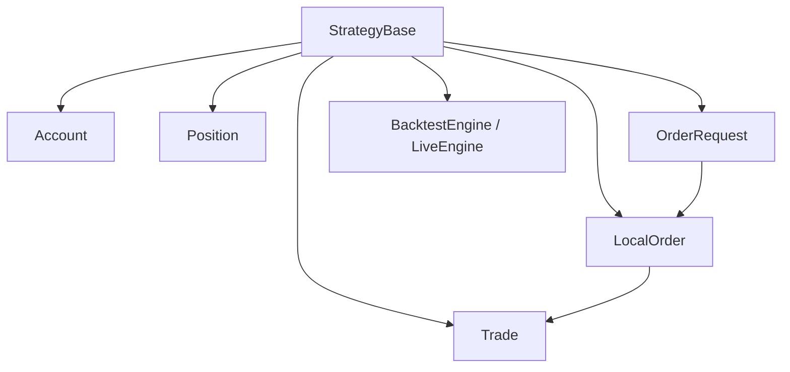
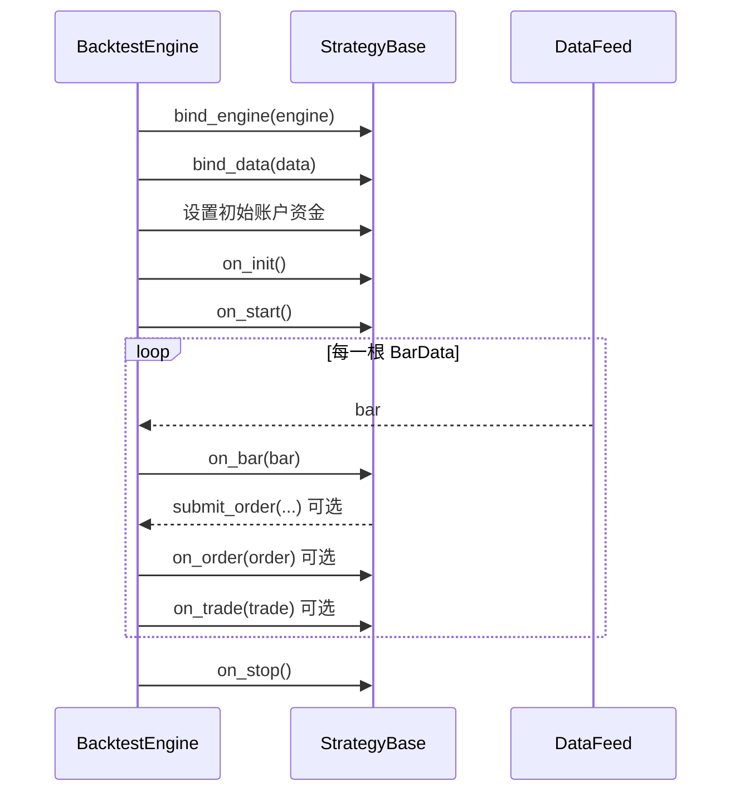
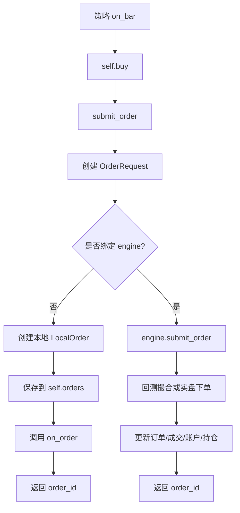
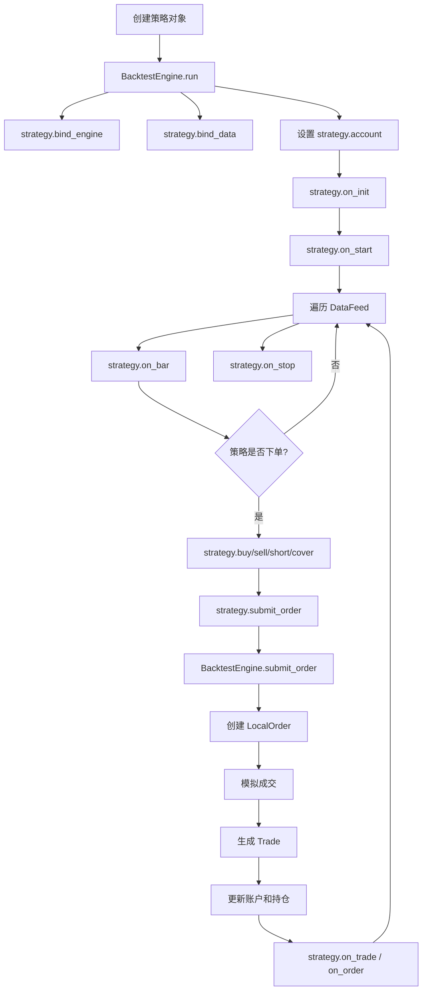

# `crypto_quant/strategy/base.py` 说明文档

本文档详细解释 `crypto_quant/strategy/base.py` 文件的设计目的、核心类、字段含义、方法流程，以及它在整个量化框架中的位置。

`base.py` 是当前项目中非常核心的文件。它定义了策略开发需要使用的基础对象，包括：

- 账户对象：`Account`
- 持仓对象：`Position`
- 下单请求：`OrderRequest`
- 成交记录：`Trade`
- 本地订单：`LocalOrder`
- 策略基类：`StrategyBase`

其中最重要的是：

```python
class StrategyBase:
```

你以后写自己的策略时，通常都会继承它。

---

## 1. 文件整体定位

`base.py` 位于：

```text
crypto_quant/strategy/base.py
```

它处在整个框架的策略层。

在框架中的位置可以理解为：

```text
数据层 DataFeed
    ↓
策略层 StrategyBase
    ↓
引擎层 BacktestEngine / LiveEngine
    ↓
交易执行 / 回测撮合
```

策略层不直接负责真实下单，也不直接负责回测撮合。

它主要负责：

```text
1. 定义策略对象应该具备哪些状态；
2. 定义策略生命周期方法；
3. 提供 buy/sell/short/cover/close_position 等交易接口；
4. 把交易意图包装成 OrderRequest；
5. 把 OrderRequest 交给回测引擎或实盘引擎处理。
```

---

## 2. 导入依赖说明

文件开头：

```python
from dataclasses import dataclass, field
from datetime import datetime
from decimal import Decimal
from typing import Any
from uuid import uuid4

from crypto_quant.data.feed import BarData, DataFeed
from crypto_quant.enums import OrderSide, OrderStatus, OrderType, PositionSide, TimeInForce, TradingMode
```

含义：

| 导入项 | 作用 |
|---|---|
| `dataclass` | 快速定义数据类 |
| `field` | 给 dataclass 字段设置默认工厂，例如新建 dict、新建时间 |
| `datetime` | 表示订单创建时间、成交时间 |
| `Decimal` | 表示价格、数量、资金、手续费，避免 float 精度问题 |
| `Any` | 类型标注，表示任意类型 |
| `uuid4` | 生成本地唯一 ID |
| `BarData` | 一根 K 线数据 |
| `DataFeed` | 数据线对象集合 |
| `OrderSide` | 买卖方向 |
| `OrderStatus` | 订单状态 |
| `OrderType` | 订单类型 |
| `PositionSide` | 持仓方向 |
| `TimeInForce` | 订单有效方式 |
| `TradingMode` | 现货/合约模式 |

---

## 3. 核心对象关系

`base.py` 中几个类的关系如下：



一句话理解：

```text
StrategyBase 管账户、持仓、订单和成交；
策略下单时先生成 OrderRequest；
引擎收到 OrderRequest 后生成 LocalOrder；
订单成交后生成 Trade。
```

---

## 4. `Account`：账户对象

源码：

```python
@dataclass(slots=True)
class Account:
    cash: Decimal
    equity: Decimal
    available: Decimal
    margin: Decimal = Decimal("0")
    realized_pnl: Decimal = Decimal("0")
    unrealized_pnl: Decimal = Decimal("0")
```

### 4.1 作用

`Account` 用来表示策略当前账户状态。

它不是交易所真实账户的完整镜像，而是框架内部用于回测和策略状态管理的账户对象。

### 4.2 字段说明

| 字段 | 类型 | 含义 |
|---|---|---|
| `cash` | `Decimal` | 现金余额 |
| `equity` | `Decimal` | 账户总权益 |
| `available` | `Decimal` | 可用资金 |
| `margin` | `Decimal` | 保证金，主要用于合约 |
| `realized_pnl` | `Decimal` | 已实现盈亏 |
| `unrealized_pnl` | `Decimal` | 未实现盈亏 |

### 4.3 为什么用 Decimal？

交易系统中金额、价格、手续费、盈亏不适合用 `float`。

例如：

```python
0.1 + 0.2
```

可能得到：

```text
0.30000000000000004
```

所以项目使用：

```python
Decimal("0.1") + Decimal("0.2")
```

得到精确的：

```text
Decimal("0.3")
```

---

## 5. `Position`：持仓对象

源码：

```python
@dataclass(slots=True)
class Position:
    symbol: str
    side: PositionSide
    amount: Decimal = Decimal("0")
    entry_price: Decimal = Decimal("0")
    mark_price: Decimal = Decimal("0")
    unrealized_pnl: Decimal = Decimal("0")

    @property
    def is_flat(self) -> bool:
        return self.amount == 0
```

### 5.1 作用

`Position` 表示某个交易对某个方向上的持仓。

例如：

```python
Position(
    symbol="BTC/USDT",
    side=PositionSide.BOTH,
    amount=Decimal("0.01"),
    entry_price=Decimal("100000"),
    mark_price=Decimal("101000"),
    unrealized_pnl=Decimal("10"),
)
```

### 5.2 字段说明

| 字段 | 类型 | 含义 |
|---|---|---|
| `symbol` | `str` | 交易对，例如 `BTC/USDT` |
| `side` | `PositionSide` | 持仓方向：`BOTH`、`LONG`、`SHORT` |
| `amount` | `Decimal` | 持仓数量 |
| `entry_price` | `Decimal` | 持仓均价 |
| `mark_price` | `Decimal` | 当前标记价格或最新价格 |
| `unrealized_pnl` | `Decimal` | 未实现盈亏 |

### 5.3 `is_flat` 属性

源码：

```python
@property
 def is_flat(self) -> bool:
    return self.amount == 0
```

实际源码中缩进是正常的：

```python
@property
def is_flat(self) -> bool:
    return self.amount == 0
```

含义：

```text
如果 amount 等于 0，就认为当前没有持仓，也就是空仓。
```

使用示例：

```python
position = self.get_position("BTC/USDT")

if position.is_flat:
    self.buy("BTC/USDT", Decimal("0.01"))
```

`@property` 的作用是让方法像属性一样访问：

```python
position.is_flat
```

而不是：

```python
position.is_flat()
```

---

## 6. `OrderRequest`：订单请求对象

源码：

```python
@dataclass(frozen=True, slots=True)
class OrderRequest:
    symbol: str
    side: OrderSide
    order_type: OrderType
    amount: Decimal
    price: Decimal | None = None
    position_side: PositionSide | None = None
    reduce_only: bool = False
    time_in_force: TimeInForce | None = None
    params: dict[str, Any] = field(default_factory=dict)
```

### 6.1 作用

`OrderRequest` 表示策略发出的“下单请求”。

它只是描述：

```text
我要下什么单。
```

它还不是订单状态，也不是成交记录。

例如：

```python
OrderRequest(
    symbol="BTC/USDT",
    side=OrderSide.BUY,
    order_type=OrderType.MARKET,
    amount=Decimal("0.01"),
)
```

表示：

```text
我要市价买入 0.01 BTC。
```

### 6.2 字段说明

| 字段 | 类型 | 含义 |
|---|---|---|
| `symbol` | `str` | 交易对 |
| `side` | `OrderSide` | 买入或卖出 |
| `order_type` | `OrderType` | 市价单、限价单等 |
| `amount` | `Decimal` | 下单数量 |
| `price` | `Decimal | None` | 下单价格，市价单通常为 `None` |
| `position_side` | `PositionSide | None` | 合约持仓方向 |
| `reduce_only` | `bool` | 是否只减仓，合约平仓常用 |
| `time_in_force` | `TimeInForce | None` | 订单有效方式 |
| `params` | `dict[str, Any]` | 传给交易所的额外参数 |

### 6.3 为什么 `frozen=True`？

`OrderRequest` 是策略当时发出的原始意图。

创建后不应该被随便修改。

所以设置：

```python
frozen=True
```

这样：

```python
request.amount = Decimal("0.02")
```

会报错。

这有助于保证：

```text
订单请求一旦生成，就保持不变。
```

### 6.4 `Decimal | None` 是什么意思？

这是 Python 3.10 之后的类型写法。

```python
Decimal | None
```

表示：

```text
这个字段可以是 Decimal，也可以是 None。
```

老写法是：

```python
Optional[Decimal]
```

例如：

```python
price: Decimal | None = None
```

意思是：

```text
price 可以传 Decimal，也可以不传；默认是 None。
```

### 6.5 `field(default_factory=dict)` 是什么？

源码：

```python
params: dict[str, Any] = field(default_factory=dict)
```

不能写成：

```python
params: dict[str, Any] = {}
```

因为 `{}` 是可变对象，多个实例可能共享同一个字典。

`field(default_factory=dict)` 表示：

```text
每次创建新的 OrderRequest 时，都生成一个新的空字典。
```

---

## 7. `Trade`：成交记录对象

源码：

```python
@dataclass(slots=True)
class Trade:
    id: str
    symbol: str
    side: OrderSide
    amount: Decimal
    price: Decimal
    fee: Decimal
    traded_at: datetime
```

### 7.1 作用

`Trade` 表示一笔已经成交的交易记录。

区别：

```text
OrderRequest = 想下什么单
LocalOrder   = 订单现在什么状态
Trade        = 最后实际成交了什么
```

### 7.2 字段说明

| 字段 | 类型 | 含义 |
|---|---|---|
| `id` | `str` | 成交 ID |
| `symbol` | `str` | 交易对 |
| `side` | `OrderSide` | 成交方向 |
| `amount` | `Decimal` | 成交数量 |
| `price` | `Decimal` | 成交价格 |
| `fee` | `Decimal` | 手续费 |
| `traded_at` | `datetime` | 成交时间 |

### 7.3 示例

```python
Trade(
    id="trade-001",
    symbol="BTC/USDT",
    side=OrderSide.BUY,
    amount=Decimal("0.01"),
    price=Decimal("100000"),
    fee=Decimal("0.4"),
    traded_at=datetime.utcnow(),
)
```

表示：

```text
以 100000 USDT 买入 0.01 BTC，手续费 0.4 USDT。
```

---

## 8. `LocalOrder`：本地订单对象

源码：

```python
@dataclass(slots=True)
class LocalOrder:
    id: str
    request: OrderRequest
    status: OrderStatus = OrderStatus.OPEN
    filled: Decimal = Decimal("0")
    average: Decimal | None = None
    created_at: datetime = field(default_factory=datetime.utcnow)
```

### 8.1 作用

`LocalOrder` 表示框架内部维护的订单状态。

它和 `OrderRequest` 不同。

```text
OrderRequest 只描述下单请求；
LocalOrder 负责跟踪订单状态。
```

### 8.2 字段说明

| 字段 | 类型 | 含义 |
|---|---|---|
| `id` | `str` | 本地订单 ID 或交易所订单 ID |
| `request` | `OrderRequest` | 原始下单请求 |
| `status` | `OrderStatus` | 订单状态，默认 `OPEN` |
| `filled` | `Decimal` | 已成交数量 |
| `average` | `Decimal | None` | 平均成交价 |
| `created_at` | `datetime` | 本地订单创建时间 |

### 8.3 为什么没有 `frozen=True`？

因为订单状态会变化。

例如：

```python
order.status = OrderStatus.CLOSED
order.filled = request.amount
order.average = fill_price
```

如果 `LocalOrder` 设置成不可变，就无法更新订单状态。

所以：

```text
OrderRequest 不可变；
LocalOrder 可变。
```

### 8.4 `created_at` 为什么用 `default_factory`？

源码：

```python
created_at: datetime = field(default_factory=datetime.utcnow)
```

意思是每次创建新订单时，调用一次：

```python
datetime.utcnow()
```

生成当前 UTC 时间。

如果写成：

```python
created_at: datetime = datetime.utcnow()
```

就会在类定义时执行一次，可能导致多个订单共享同一个默认时间。

---

## 9. `StrategyBase`：策略基类

源码起点：

```python
class StrategyBase:
    name = "strategy_base"
```

### 9.1 作用

`StrategyBase` 是所有策略的父类。

你以后写策略时，一般这样写：

```python
class MyStrategy(StrategyBase):
    name = "my_strategy"

    def on_bar(self, bar: BarData) -> None:
        ...
```

它提供了：

```text
账户管理
持仓管理
订单管理
成交记录
数据绑定
引擎绑定
策略生命周期钩子
下单快捷方法
平仓方法
撤单方法
```

---

## 10. `StrategyBase.__init__`

源码：

```python
def __init__(self, trading_mode: TradingMode = TradingMode.SPOT):
    self.trading_mode = trading_mode
    self.account = Account(cash=Decimal("0"), equity=Decimal("0"), available=Decimal("0"))
    self.positions: dict[str, Position] = {}
    self.orders: dict[str, LocalOrder] = {}
    self.trades: list[Trade] = []
    self.data: DataFeed | None = None
    self.engine: Any = None
```

### 10.1 `trading_mode`

```python
self.trading_mode = trading_mode
```

表示策略运行模式：

```python
TradingMode.SPOT
TradingMode.FUTURE
```

默认是现货：

```python
TradingMode.SPOT
```

### 10.2 `account`

```python
self.account = Account(cash=Decimal("0"), equity=Decimal("0"), available=Decimal("0"))
```

策略刚创建时，账户初始为 0。

回测引擎启动后会重新设置：

```python
strategy.account = Account(
    cash=initial_cash,
    equity=initial_cash,
    available=initial_cash,
)
```

### 10.3 `positions`

```python
self.positions: dict[str, Position] = {}
```

保存所有持仓。

key 格式是：

```text
symbol:position_side
```

例如：

```text
BTC/USDT:BOTH
BTC/USDT:LONG
BTC/USDT:SHORT
```

### 10.4 `orders`

```python
self.orders: dict[str, LocalOrder] = {}
```

保存策略相关订单。

key 是订单 ID，value 是 `LocalOrder`。

### 10.5 `trades`

```python
self.trades: list[Trade] = []
```

保存策略成交记录。

### 10.6 `data`

```python
self.data: DataFeed | None = None
```

策略绑定的数据。

绑定后可以在策略里访问：

```python
self.data.close[0]
self.data.close[-1]
```

### 10.7 `engine`

```python
self.engine: Any = None
```

策略绑定的引擎。

可能是：

```text
BacktestEngine
LiveEngine
```

---

## 11. 绑定方法

### 11.1 `bind_engine`

源码：

```python
def bind_engine(self, engine: Any) -> None:
    self.engine = engine
```

作用：把回测引擎或实盘引擎绑定到策略。

绑定后，策略下单会交给引擎处理：

```python
return self.engine.submit_order(self, request)
```

### 11.2 `bind_data`

源码：

```python
def bind_data(self, data: DataFeed) -> None:
    self.data = data
```

作用：把数据源绑定到策略。

绑定后，策略可以使用：

```python
self.data.close[0]
self.data.volume[-1]
```

---

## 12. 策略生命周期方法

源码：

```python
def on_init(self) -> None:
    pass

def on_start(self) -> None:
    pass

def on_bar(self, bar: BarData) -> None:
    pass

def on_trade(self, trade: Trade) -> None:
    pass

def on_order(self, order: LocalOrder) -> None:
    pass

def on_stop(self) -> None:
    pass
```

这些方法在基类中默认什么都不做，目的是让子类按需重写。

### 12.1 生命周期顺序

在回测中大致顺序是：



### 12.2 `on_init`

策略初始化时调用。

适合：

```text
初始化指标窗口
初始化自定义变量
读取策略参数
```

### 12.3 `on_start`

策略启动时调用。

适合：

```text
打印启动日志
检查初始资金
检查配置
```

### 12.4 `on_bar`

每来一根 K 线调用一次。

这是最重要的方法。

大部分策略逻辑都写在这里。

示例：

```python
def on_bar(self, bar: BarData) -> None:
    position = self.get_position(bar.symbol)

    if bar.close > bar.open and position.is_flat:
        self.buy(bar.symbol, Decimal("0.01"))
```

### 12.5 `on_trade`

成交后调用。

适合：

```text
打印成交日志
记录成交分析
更新策略内部统计
```

### 12.6 `on_order`

订单状态变化时调用。

适合：

```text
打印订单状态
观察订单是否成交或撤销
调试下单逻辑
```

### 12.7 `on_stop`

策略结束时调用。

适合：

```text
输出总结
保存结果
释放资源
```

---

## 13. `get_position`：获取持仓

源码：

```python
def get_position(self, symbol: str, side: PositionSide = PositionSide.BOTH) -> Position:
    key = self._position_key(symbol, side)
    if key not in self.positions:
        self.positions[key] = Position(symbol=symbol, side=side)
    return self.positions[key]
```

### 13.1 作用

获取某个交易对、某个方向的持仓对象。

例如：

```python
position = self.get_position("BTC/USDT")
```

默认方向是：

```python
PositionSide.BOTH
```

适合现货或单向持仓。

### 13.2 不存在就自动创建

如果之前没有这个持仓：

```python
if key not in self.positions:
    self.positions[key] = Position(symbol=symbol, side=side)
```

框架会自动创建一个空仓位。

这让策略代码更简单，不需要先判断：

```python
if "BTC/USDT" in positions:
    ...
```

### 13.3 使用示例

```python
position = self.get_position(bar.symbol)

if position.is_flat:
    self.buy(bar.symbol, Decimal("0.01"))
else:
    self.close_position(bar.symbol)
```

---

## 14. 下单快捷方法

`StrategyBase` 提供了四个常用下单快捷方法：

```python
buy()
sell()
short()
cover()
```

它们最终都会调用：

```python
submit_order()
```

---

## 15. `buy`：买入

源码：

```python
def buy(self, symbol: str, amount: Decimal, price: Decimal | None = None, **params: Any) -> str:
    return self.submit_order(symbol, OrderSide.BUY, amount, price=price, **params)
```

### 15.1 作用

买入某个交易对。

示例：

```python
self.buy("BTC/USDT", Decimal("0.01"))
```

表示：

```text
市价买入 0.01 BTC。
```

如果传入价格：

```python
self.buy("BTC/USDT", Decimal("0.01"), price=Decimal("95000"))
```

表示：

```text
限价 95000 买入 0.01 BTC。
```

---

## 16. `sell`：卖出

源码：

```python
def sell(self, symbol: str, amount: Decimal, price: Decimal | None = None, **params: Any) -> str:
    return self.submit_order(symbol, OrderSide.SELL, amount, price=price, **params)
```

### 16.1 作用

卖出某个交易对。

示例：

```python
self.sell("BTC/USDT", Decimal("0.01"))
```

表示：

```text
市价卖出 0.01 BTC。
```

---

## 17. `short`：合约开空

源码：

```python
def short(self, symbol: str, amount: Decimal, price: Decimal | None = None, **params: Any) -> str:
    return self.submit_order(
        symbol,
        OrderSide.SELL,
        amount,
        price=price,
        position_side=PositionSide.SHORT,
        **params,
    )
```

### 17.1 作用

用于合约做空。

本质是：

```text
卖出 + position_side=SHORT
```

示例：

```python
self.short("BTC/USDT", Decimal("0.01"))
```

表示：

```text
合约市价开空 0.01 BTC。
```

### 17.2 注意

现货没有真正的做空逻辑，所以 `short()` 主要用于合约模式。

---

## 18. `cover`：合约平空

源码：

```python
def cover(self, symbol: str, amount: Decimal, price: Decimal | None = None, **params: Any) -> str:
    return self.submit_order(
        symbol,
        OrderSide.BUY,
        amount,
        price=price,
        position_side=PositionSide.SHORT,
        reduce_only=True,
        **params,
    )
```

### 18.1 作用

用于合约平空。

本质是：

```text
买入 + position_side=SHORT + reduce_only=True
```

示例：

```python
self.cover("BTC/USDT", Decimal("0.01"))
```

表示：

```text
买入 0.01 BTC，用来减少 SHORT 空头仓位。
```

---

## 19. `submit_order`：核心下单方法

源码：

```python
def submit_order(
    self,
    symbol: str,
    side: OrderSide,
    amount: Decimal,
    price: Decimal | None = None,
    order_type: OrderType | None = None,
    position_side: PositionSide | None = None,
    reduce_only: bool = False,
    time_in_force: TimeInForce | None = None,
    **params: Any,
) -> str:
```

### 19.1 作用

这是所有下单方法最终都会调用的核心方法。

它负责：

```text
1. 接收下单参数；
2. 自动判断订单类型；
3. 创建 OrderRequest；
4. 如果没有引擎，就创建本地 LocalOrder；
5. 如果有引擎，就把订单请求交给引擎处理；
6. 返回订单 ID。
```

### 19.2 自动判断订单类型

源码：

```python
order_type=order_type or (OrderType.LIMIT if price is not None else OrderType.MARKET)
```

含义：

```text
如果用户传了 order_type，就使用用户传的；
如果没传 order_type：
    有 price → 默认 LIMIT 限价单；
    没有 price → 默认 MARKET 市价单。
```

示例：

```python
self.buy("BTC/USDT", Decimal("0.01"))
```

生成市价单。

```python
self.buy("BTC/USDT", Decimal("0.01"), price=Decimal("95000"))
```

生成限价单。

### 19.3 创建 OrderRequest

源码：

```python
request = OrderRequest(
    symbol=symbol,
    side=side,
    order_type=...,
    amount=amount,
    price=price,
    position_side=position_side,
    reduce_only=reduce_only,
    time_in_force=time_in_force,
    params=params,
)
```

这一步把下单参数整理成标准化请求对象。

### 19.4 没有绑定引擎时

源码：

```python
if self.engine is None:
    local_order = LocalOrder(id=str(uuid4()), request=request)
    self.orders[local_order.id] = local_order
    self.on_order(local_order)
    return local_order.id
```

含义：

```text
如果策略还没有绑定回测引擎或实盘引擎，只创建一张本地订单。
```

这种情况一般用于：

```text
手动测试策略对象
不经过引擎直接调用 buy/sell
```

注意：这种情况下不会撮合成交，也不会真实下单。

### 19.5 已经绑定引擎时

源码：

```python
return self.engine.submit_order(self, request)
```

含义：

```text
把订单请求交给当前引擎处理。
```

如果是回测：

```text
BacktestEngine.submit_order()
```

会创建本地订单并尝试模拟成交。

如果是实盘：

```text
LiveEngine.submit_order()
```

会根据 `dry_run` 决定是模拟下单还是真实调用 Binance。

---

## 20. `cancel_order`：撤单

源码：

```python
def cancel_order(self, order_id: str) -> None:
    if self.engine is not None:
        self.engine.cancel_order(self, order_id)
        return
    order = self.orders[order_id]
    order.status = OrderStatus.CANCELED
    self.on_order(order)
```

### 20.1 作用

撤销某个订单。

### 20.2 有引擎时

如果策略绑定了引擎：

```python
self.engine.cancel_order(self, order_id)
```

撤单交给引擎。

原因是不同环境撤单逻辑不同：

```text
回测撤单：改本地订单状态
实盘撤单：调用 Binance cancel_order
```

### 20.3 没有引擎时

如果没有绑定引擎，就直接把本地订单状态改为：

```python
OrderStatus.CANCELED
```

然后触发：

```python
self.on_order(order)
```

---

## 21. `close_position`：平仓

源码：

```python
def close_position(self, symbol: str, side: PositionSide = PositionSide.BOTH) -> str | None:
    position = self.get_position(symbol, side)
    if position.is_flat:
        return None
    order_side = OrderSide.SELL if position.side != PositionSide.SHORT else OrderSide.BUY
    return self.submit_order(
        symbol=symbol,
        side=order_side,
        amount=abs(position.amount),
        position_side=side if self.trading_mode == TradingMode.FUTURE else None,
        reduce_only=self.trading_mode == TradingMode.FUTURE,
    )
```

### 21.1 作用

平掉当前持仓。

示例：

```python
self.close_position("BTC/USDT")
```

### 21.2 如果当前空仓

```python
if position.is_flat:
    return None
```

如果没有仓位，就不需要下平仓单。

### 21.3 判断平仓方向

```python
order_side = OrderSide.SELL if position.side != PositionSide.SHORT else OrderSide.BUY
```

含义：

| 当前持仓 | 平仓方向 |
|---|---|
| 现货/多头 | `SELL` |
| 合约 LONG | `SELL` |
| 合约 SHORT | `BUY` |

### 21.4 平仓数量

```python
amount=abs(position.amount)
```

使用绝对值，是因为空头仓位数量可能是负数。

下单数量不应该是负数。

### 21.5 合约平仓参数

```python
position_side=side if self.trading_mode == TradingMode.FUTURE else None
reduce_only=self.trading_mode == TradingMode.FUTURE
```

如果是合约模式：

```text
带上 position_side，并设置 reduce_only=True。
```

如果是现货模式：

```text
不需要 position_side，也不需要 reduce_only。
```

---

## 22. `_position_key`：持仓字典 key

源码：

```python
def _position_key(self, symbol: str, side: PositionSide) -> str:
    return f"{symbol}:{side.value}"
```

### 22.1 作用

生成持仓字典的 key。

例如：

```python
_position_key("BTC/USDT", PositionSide.BOTH)
```

返回：

```text
BTC/USDT:BOTH
```

```python
_position_key("BTC/USDT", PositionSide.SHORT)
```

返回：

```text
BTC/USDT:SHORT
```

这样可以支持同一个交易对不同方向的持仓。

### 22.2 为什么方法名前面有 `_`？

Python 中方法名前加下划线通常表示：

```text
这是内部方法，不建议外部直接调用。
```

外部更应该使用：

```python
self.get_position(...)
```

---

## 23. 策略下单完整流程

假设你在策略里写：

```python
self.buy("BTC/USDT", Decimal("0.01"))
```

整体流程：



---

## 24. 回测中的调用流程

在 `BacktestEngine.run(strategy, data)` 中，策略基类大概这样被使用：



---

## 25. 现货与合约的区别

`StrategyBase` 通过：

```python
trading_mode: TradingMode
```

区分现货和合约。

### 25.1 现货模式

默认：

```python
TradingMode.SPOT
```

常用方法：

```python
self.buy(...)
self.sell(...)
self.close_position(...)
```

现货通常使用：

```python
PositionSide.BOTH
```

### 25.2 合约模式

创建策略时传：

```python
strategy = MyStrategy(trading_mode=TradingMode.FUTURE)
```

常用方法：

```python
self.buy(...)       # 可用于开多
self.sell(...)      # 可用于卖出/平多，具体取决于持仓和参数
self.short(...)     # 开空
self.cover(...)     # 平空
self.close_position(...)
```

合约平仓时会用到：

```python
reduce_only=True
position_side=PositionSide.SHORT / LONG / BOTH
```

---

## 26. 一个完整策略示例

```python
from collections import deque
from decimal import Decimal

from crypto_quant.data import BarData
from crypto_quant.enums import PositionSide
from crypto_quant.strategy import StrategyBase


class MyMovingAverageStrategy(StrategyBase):
    name = "my_moving_average"

    def __init__(self, fast_window: int = 5, slow_window: int = 20):
        super().__init__()
        self.fast_window = fast_window
        self.slow_window = slow_window
        self.closes: deque[Decimal] = deque(maxlen=slow_window)

    def on_bar(self, bar: BarData) -> None:
        self.closes.append(bar.close)

        if len(self.closes) < self.slow_window:
            return

        fast_ma = sum(list(self.closes)[-self.fast_window:]) / Decimal(self.fast_window)
        slow_ma = sum(self.closes) / Decimal(self.slow_window)
        position = self.get_position(bar.symbol, PositionSide.BOTH)

        if fast_ma > slow_ma and position.is_flat:
            self.buy(bar.symbol, Decimal("0.01"))
        elif fast_ma < slow_ma and not position.is_flat:
            self.close_position(bar.symbol)

    def on_order(self, order: LocalOrder) -> None:
        print("订单状态变化：", order)

    def on_trade(self, trade: Trade) -> None:
        print("成交：", trade)
```

注意：如果你要在示例中使用 `LocalOrder` 和 `Trade` 类型标注，需要导入：

```python
from crypto_quant.strategy import LocalOrder, Trade
```

---

## 27. 设计优点

`StrategyBase` 当前设计有几个优点：

### 27.1 策略和引擎解耦

策略只负责：

```text
看到行情后决定是否下单。
```

引擎负责：

```text
回测撮合或实盘下单。
```

所以同一个策略可以被不同引擎运行。

### 27.2 下单请求标准化

所有下单方法最终都变成：

```python
OrderRequest
```

这让回测和实盘可以共用同一种订单描述。

### 27.3 支持现货和合约扩展

通过：

```python
TradingMode
PositionSide
reduce_only
```

框架为后续合约交易留出了扩展空间。

### 27.4 生命周期清晰

策略有固定钩子：

```text
on_init → on_start → on_bar → on_trade/on_order → on_stop
```

方便后续扩展日志、风控、统计、通知等功能。

---

## 28. 当前版本需要注意的地方

当前 `StrategyBase` 是初始骨架，还不是完整生产级策略框架。

需要注意：

1. 没有参数校验，例如下单数量是否大于 0；
2. 没有资金检查，例如现货买入是否有足够现金；
3. 没有最小下单量、最小名义价值检查；
4. 没有交易所精度处理；
5. 没有完整风控模块；
6. 没有订单部分成交处理；
7. 没有多策略组合管理；
8. 合约模式下 LONG / SHORT 的完整行为还需要继续完善。

这些能力后续可以逐步加入。

---

## 29. 后续可扩展方向

围绕 `base.py` 后续可以扩展：

### 29.1 风控层

新增：

```text
crypto_quant/risk/
```

实现：

```text
最大仓位限制
最大单笔金额限制
最大回撤限制
每日最大亏损限制
禁止重复下单
```

### 29.2 订单增强

扩展 `OrderRequest`：

```text
client_order_id
stop_price
take_profit_price
stop_loss_price
trigger_price
working_type
```

### 29.3 持仓增强

扩展 `Position`：

```text
leverage
margin_mode
liquidation_price
funding_fee
realized_pnl
```

### 29.4 策略参数管理

可以引入：

```python
params: dict[str, Any]
```

或者定义策略参数 dataclass。

### 29.5 事件系统

后续可以把：

```text
on_bar
on_order
on_trade
```

扩展成更完整的事件驱动系统。

---

## 30. 最后总结

`base.py` 是策略开发层的基础。

它定义了五个数据对象：

```text
Account      账户
Position     持仓
OrderRequest 下单请求
Trade        成交记录
LocalOrder   本地订单
```

以及一个核心基类：

```text
StrategyBase 策略基类
```

你以后写策略时，最常用的是：

```python
class MyStrategy(StrategyBase):
    def on_bar(self, bar):
        ...
```

然后在 `on_bar()` 里调用：

```python
self.buy(...)
self.sell(...)
self.short(...)
self.cover(...)
self.close_position(...)
```

核心思想是：

```text
策略只表达交易逻辑；
订单请求由 StrategyBase 标准化；
实际执行交给 BacktestEngine 或 LiveEngine。
```
