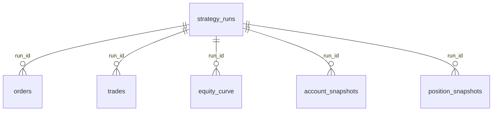

# 数据库小白友好说明：从 MySQL 增删查改到量化框架数据库闭环

本文档专门面向当前项目的学习场景：你已经学过 MySQL 的基础增删查改，也会用 VS Code 的 MySQL 插件建表、查表、插入数据，但对“Python 程序如何自动和数据库交互”还比较陌生。

所以本文不从数据库理论讲起，而是围绕本项目的真实代码解释：

```text
Python 策略 / 回测 / 实盘
        ↓
SQLAlchemy ORM
        ↓
Repository 封装
        ↓
MySQL 表
        ↓
后续查询、复盘、仪表盘
```

---

## 1. 先用最朴素的方式理解数据库

你可以先把 MySQL 理解成一个更严格、更自动化的 Excel。

Excel 里有：

```text
工作簿
工作表
列
行
单元格
```

MySQL 里对应：

```text
数据库 database
数据表 table
字段 column
记录 row
字段值 value
```

比如本项目里有一张表：

```text
klines
```

它可以理解成一张专门保存 K 线的 Excel 表。

每一行是一根 K 线：

| exchange | symbol | timeframe | open_time | open | high | low | close | volume |
|---|---|---|---|---|---|---|---|---|
| binance | ETH/USDT | 15m | 2026-01-01 00:00:00 | 3000 | 3010 | 2990 | 3005 | 1234 |

但 MySQL 比 Excel 多几个关键能力：

```text
1. 可以限制字段类型，例如价格必须是数字；
2. 可以限制某些字段组合不能重复；
3. 可以被 Python 程序自动写入和读取；
4. 可以保存大量历史数据；
5. 可以按条件快速查询；
6. 可以作为后续仪表盘的数据来源。
```

你现在需要补的重点不是“数据库是不是表格”，而是：

```text
程序怎么把运行过程中产生的数据自动写进这些表，
又怎么从这些表读出来继续用于回测、复盘、实盘监控。
```

---

## 2. 这个项目为什么需要数据库

如果没有数据库，框架运行时的数据大多只存在内存里。

例如一次回测结束后，程序里有：

```python
result.orders
result.trades
result.equity_curve
result.final_account
```

但程序一退出，这些数据就没有了。

实盘更明显。实盘时你需要知道：

```text
现在账户多少钱？
现在有没有持仓？
订单是否成交？
今天亏了多少？
某个时间点为什么开仓？
策略运行期间有没有异常？
```

这些都不能只靠打印日志。

所以数据库模块的作用是：

```text
把行情数据、回测结果、实盘状态长期保存下来，方便之后查询、复盘和展示。
```

---

## 3. 当前项目数据库技术栈

本项目当前正式面向的数据库方案是：

```text
MySQL + PyMySQL + SQLAlchemy
```

它们的分工是：

| 技术 | 作用 | 你可以怎么理解 |
|---|---|---|
| MySQL | 真正存数据的数据库 | 存放表和数据的地方 |
| PyMySQL | Python 连接 MySQL 的驱动 | Python 和 MySQL 之间的插头 |
| SQLAlchemy | ORM 和数据库工具层 | 用 Python 类和对象操作数据库 |

整体链路是：

```text
Python 代码
   ↓
SQLAlchemy
   ↓
PyMySQL
   ↓
MySQL
```

你平时在 MySQL 插件里手写：

```sql
SELECT * FROM klines;
```

而框架里更多是通过 Python 写：

```python
select(Kline).where(Kline.symbol == symbol)
```

这两者本质上都是查询数据库，只是写法不同。

---

## 4. 数据库模块文件分工

当前数据库模块在：

```text
crypto_quant/database/
```

主要文件是：

```text
models.py       定义表结构
session.py      管理数据库连接和事务
repository.py   封装数据库增删查改
recorder.py     实盘数据库记录器
__init__.py     对外导出常用类和函数
```

你可以这样理解：

```text
models.py
    相当于 Python 版建表说明。

session.py
    负责连接 MySQL，创建 session，并管理 commit / rollback / close。

repository.py
    把常用数据库操作封装成方法，例如保存K线、查询K线、保存回测结果。

recorder.py
    专门给实盘或 dry_run 用，负责记录账户、持仓、订单快照。
```

最推荐的阅读顺序是：

```text
1. models.py
2. session.py
3. repository.py
4. recorder.py
```

不要一开始就读 `repository.py`，因为它是在操作表。你要先知道表是什么。

---

## 5. ORM 是什么

ORM 的全称是 Object Relational Mapping，中文可以理解成：

```text
对象关系映射
```

说人话就是：

```text
用 Python 类表示 MySQL 表；
用 Python 对象表示 MySQL 表里的一行数据。
```

例如在 `models.py` 里：

```python
class Kline(Base):
    __tablename__ = "klines"
```

这表示：

```text
定义一张表，表名叫 klines。
```

然后：

```python
kline = Kline(
    exchange="binance",
    symbol="ETH/USDT",
    timeframe="15m",
    open_time=...,
    open=...,
    high=...,
    low=...,
    close=...,
    volume=...,
)
```

这个 `kline` 对象就可以理解成：

```text
klines 表里准备插入的一行数据。
```

然后通过：

```python
session.add(kline)
session.commit()
```

这行数据就会真正写入 MySQL。

---

## 6. `models.py`：这个项目有哪些表

当前主要表有 7 张：

```text
strategy_runs
klines
orders
trades
equity_curve
account_snapshots
position_snapshots
```

按用途分成三类：

```text
1. 行情数据表
   klines

2. 回测和运行记录表
   strategy_runs
   orders
   trades
   equity_curve

3. 实盘快照表
   account_snapshots
   position_snapshots
```

---

## 7. `strategy_runs`：一次运行的总档案

ORM 类：

```python
class StrategyRun(Base):
```

表名：

```text
strategy_runs
```

它保存的是“一次策略运行”的总记录。

这里的“一次运行”可以是：

```text
一次单策略回测
一次组合回测
一次 dry_run 模拟实盘
一次真实实盘
```

核心字段：

| 字段 | 含义 |
|---|---|
| id | 数据库自增主键 |
| run_id | 运行 ID，用来关联其他表 |
| name | 运行名称 |
| run_type | 运行类型，例如 backtest、portfolio_backtest、dry_run、live |
| trading_mode | spot 或 future |
| strategy_name | 策略名称 |
| symbols | 交易对列表，保存成 JSON 字符串 |
| timeframe | K线周期 |
| started_at | 开始时间 |
| ended_at | 结束时间 |
| initial_cash | 初始资金 |
| final_equity | 最终权益 |
| status | running、finished、failed 等 |
| config | 运行参数，保存成 JSON 字符串 |

你可以把它理解成：

```text
每次实验或实盘运行的封面。
```

后面的订单、成交、权益曲线都会通过：

```text
run_id
```

和它关联。

逻辑关系是：

```text
strategy_runs 一条记录
    ↓
    多条 orders
    多条 trades
    多条 equity_curve
    多条 account_snapshots
    多条 position_snapshots
```

---

## 8. `klines`：历史 K 线表

ORM 类：

```python
class Kline(Base):
```

表名：

```text
klines
```

用途：

```text
保存历史 K 线数据。
```

字段：

| 字段 | 含义 |
|---|---|
| id | 自增主键 |
| exchange | 交易所，例如 binance |
| symbol | 交易对，例如 ETH/USDT |
| timeframe | K线周期，例如 15m |
| open_time | K线开盘时间 |
| open | 开盘价 |
| high | 最高价 |
| low | 最低价 |
| close | 收盘价 |
| volume | 成交量 |

最重要的是唯一索引：

```python
Index(
    "uq_klines_exchange_symbol_tf_time",
    "exchange",
    "symbol",
    "timeframe",
    "open_time",
    unique=True,
)
```

意思是：

```text
同一个交易所、同一个交易对、同一个周期、同一个时间，只能有一根K线。
```

为什么重要？

因为拉取行情数据时经常会重复拉。

例如你第一次拉：

```text
ETH/USDT 15m 2026-01-01 到 2026-01-31
```

第二次又拉：

```text
ETH/USDT 15m 2026-01-15 到 2026-02-15
```

中间有重叠数据。

如果没有唯一索引，数据库会出现重复 K 线。

有了唯一索引，就可以配合 `upsert`：

```text
如果这根K线不存在，就插入；
如果这根K线已经存在，就更新 open/high/low/close/volume。
```

这就是 `MarketDataRepository.upsert_klines()` 的作用。

---

## 9. `orders`：订单表

ORM 类：

```python
class OrderRecord(Base):
```

表名：

```text
orders
```

订单是：

```text
策略或交易系统发出的委托请求。
```

比如：

```text
买入 0.01 BTC
开空 1 ETH
平掉当前多头仓位
```

核心字段：

| 字段 | 含义 |
|---|---|
| run_id | 属于哪一次运行 |
| strategy_name | 哪个策略产生的订单 |
| exchange | 交易所 |
| exchange_order_id | 交易所返回的订单ID |
| client_order_id | 本地生成的订单ID |
| symbol | 交易对 |
| trading_mode | spot 或 future |
| side | buy 或 sell |
| order_type | market、limit 等 |
| status | open、closed、canceled 等 |
| amount | 委托数量 |
| price | 委托价格 |
| filled | 已成交数量 |
| average | 平均成交价 |
| position_side | 持仓方向，例如 SHORT、BOTH |
| reduce_only | 是否只减仓 |
| raw | 原始订单数据 JSON |

注意：

```text
订单不等于成交。
```

订单是“我想交易”。
成交是“实际成交了”。

一个订单可能：

```text
完全成交
部分成交
没成交
被取消
被拒绝
```

所以需要单独保存订单状态。

---

## 10. `trades`：成交表

ORM 类：

```python
class TradeRecord(Base):
```

表名：

```text
trades
```

成交是：

```text
订单实际在市场中完成的交易结果。
```

核心字段：

| 字段 | 含义 |
|---|---|
| run_id | 属于哪一次运行 |
| strategy_name | 哪个策略产生的成交 |
| exchange_trade_id | 交易所成交ID |
| exchange_order_id | 对应交易所订单ID |
| symbol | 交易对 |
| side | buy 或 sell |
| position_side | 持仓方向 |
| amount | 成交数量 |
| price | 成交价格 |
| fee | 手续费 |
| fee_asset | 手续费资产 |
| realized_pnl | 已实现盈亏 |
| traded_at | 成交时间 |
| raw | 原始成交数据 JSON |

你可以这样区分：

```text
orders 表：记录策略发出的意图。
trades 表：记录市场实际成交的结果。
```

回测里通常订单会很快成交，所以看起来二者接近。

实盘里二者差异会更明显。

---

## 11. `equity_curve`：权益曲线表

ORM 类：

```python
class EquityCurve(Base):
```

表名：

```text
equity_curve
```

用途：

```text
保存账户权益随时间变化的曲线。
```

核心字段：

| 字段 | 含义 |
|---|---|
| run_id | 属于哪一次运行 |
| strategy_name | 策略名称 |
| trading_mode | 交易模式 |
| timestamp | 时间点 |
| cash | 现金 |
| equity | 总权益 |
| available | 可用资金 |
| margin | 已用保证金 |
| maintenance_margin | 维持保证金 |
| realized_pnl | 已实现盈亏 |
| unrealized_pnl | 未实现盈亏 |

以后画这些图主要靠它：

```text
权益曲线
收益曲线
回撤曲线
策略对比图
```

所以这张表是未来 Streamlit 仪表盘的重要数据来源。

---

## 12. `account_snapshots`：账户快照表

ORM 类：

```python
class AccountSnapshot(Base):
```

表名：

```text
account_snapshots
```

用途：

```text
保存实盘或 dry_run 某个时刻的账户状态。
```

它像是给账户定时拍照。

比如每 30 秒记录一次：

```text
当前 cash 是多少
当前 equity 是多少
当前 available 是多少
当前 margin 是多少
当前 unrealized_pnl 是多少
```

核心字段：

| 字段 | 含义 |
|---|---|
| run_id | 属于哪一次实盘运行 |
| timestamp | 快照时间 |
| trading_mode | 交易模式 |
| cash | 现金 |
| equity | 总权益 |
| available | 可用资金 |
| margin | 已用保证金 |
| maintenance_margin | 维持保证金 |
| margin_ratio | 保证金率 |
| realized_pnl | 已实现盈亏 |
| unrealized_pnl | 未实现盈亏 |
| raw | 原始账户数据 JSON |

它和 `equity_curve` 有点像，但用途不同：

```text
equity_curve 更偏回测结果曲线；
account_snapshots 更偏实盘过程中的定时账户照片。
```

---

## 13. `position_snapshots`：持仓快照表

ORM 类：

```python
class PositionSnapshot(Base):
```

表名：

```text
position_snapshots
```

用途：

```text
保存实盘或 dry_run 某个时刻的持仓状态。
```

核心字段：

| 字段 | 含义 |
|---|---|
| run_id | 属于哪一次运行 |
| strategy_name | 策略名称 |
| timestamp | 快照时间 |
| symbol | 交易对 |
| side | 持仓方向 |
| amount | 持仓数量 |
| entry_price | 开仓均价 |
| mark_price | 标记价格 |
| margin | 保证金 |
| liquidation_price | 强平价格 |
| unrealized_pnl | 未实现盈亏 |
| raw | 原始持仓数据 JSON |

它回答的问题是：

```text
某个时间点，我到底持有什么仓？
仓位多少？
开仓价是多少？
浮盈浮亏是多少？
强平价是多少？
```

---

## 14. 这个项目里表之间怎么关联

当前项目主要通过：

```text
run_id
```

把一次运行和其他数据关联起来。

可以理解成：

```text
strategy_runs.run_id
    ↓
orders.run_id
trades.run_id
equity_curve.run_id
account_snapshots.run_id
position_snapshots.run_id
```

也就是说：

```text
先有一次运行 strategy_runs；
然后这次运行产生订单、成交、权益曲线、账户快照、持仓快照。
```

用 Mermaid 表示：



注意：当前 ORM 代码里没有显式写 `ForeignKey`，但业务逻辑上就是通过 `run_id` 关联。

---

## 15. `session.py`：程序怎么连接 MySQL

`session.py` 里有四个重要函数。

---

### 15.1 `create_mysql_engine`

```python
def create_mysql_engine(config: MySQLConfig) -> Engine:
    return create_engine(config.url, echo=config.echo, pool_pre_ping=True, future=True)
```

作用：

```text
根据 MySQLConfig 创建数据库引擎。
```

你可以把 engine 理解成：

```text
Python 程序和 MySQL 之间的连接管理器。
```

`config.url` 类似：

```text
mysql+pymysql://root:密码@127.0.0.1:3306/crypto_quant?charset=utf8mb4
```

其中：

```text
mysql+pymysql 表示使用 PyMySQL 驱动连接 MySQL
root 是用户��
密码 是 MySQL 密码
127.0.0.1 是数据库地址
3306 是端口
crypto_quant 是数据库名
utf8mb4 是字符集
```

---

### 15.2 `create_session_factory`

```python
def create_session_factory(engine: Engine) -> Callable[[], Session]:
    return sessionmaker(bind=engine, autoflush=False, autocommit=False, future=True)
```

作用：

```text
创建 session 工厂。
```

你可以这样理解：

```text
engine 是连接管理器；
Session 是生产数据库会话的工厂；
session 是一次具体的数据库操作会话。
```

类似：

```python
Session = create_session_factory(engine)
session = Session()
```

---

### 15.3 `create_all_tables`

```python
def create_all_tables(engine: Engine) -> None:
    Base.metadata.create_all(engine)
```

作用：

```text
根据 models.py 里的 ORM 类，在 MySQL 中创建对应表。
```

比如你写好了：

```python
class Kline(Base):
```

调用 `create_all_tables(engine)` 后，MySQL 里就会出现：

```text
klines
```

注意：

```text
create_all_tables 适合项目初期建表。
正式项目后期如果表结构经常变化，应该学习 Alembic 做数据库迁移。
```

---

### 15.4 `session_scope`

```python
@contextmanager
def session_scope(session_factory):
    session = session_factory()
    try:
        yield session
        session.commit()
    except Exception:
        session.rollback()
        raise
    finally:
        session.close()
```

这是数据库交互里非常重要的一段。

它的意思是：

```text
打开一个 session；
把 session 交给 with 代码块使用；
如果一切正常，自动 commit；
如果中间报错，自动 rollback；
最后一定 close。
```

使用方式：

```python
with session_scope(Session) as session:
    repo = TradingRepository(session)
    repo.create_run(...)
```

你可以理解成：

```text
with 里面是一次数据库事务。
```

正常执行：

```text
提交到数据库。
```

中途出错：

```text
撤销本次操作。
```

这对实盘很重要，因为你不希望出现：

```text
账户快照写进去了，订单没写进去；
或者订单写一半程序崩了。
```

---

## 16. `repository.py`：真正封装数据库操作的地方

Repository 可以理解成：

```text
数据库操作服务类。
```

这个项目分成两个 repository：

```python
MarketDataRepository
TradingRepository
```

---

## 17. `MarketDataRepository`：行情数据仓库

它负责 K 线数据。

主要方法：

```python
upsert_klines()
get_klines()
get_data_feed()
```

---

### 17.1 `upsert_klines`

作用：

```text
把一批 BarData 写入 klines 表。
```

核心逻辑：

```python
statement = insert(Kline).values(...)
self.session.execute(statement.on_duplicate_key_update(...))
```

意思是：

```text
尝试插入一根 K 线；
如果唯一索引冲突，说明这根 K 线已经存在；
那就更新 open/high/low/close/volume。
```

这就是 upsert：

```text
insert + update
```

中文可以叫：

```text
有则更新，无则插入。
```

这个方法解决的是：

```text
批量拉取历史K线时，避免重复插入。
```

---

### 17.2 `get_klines`

作用：

```text
从 klines 表按条件查询 K 线。
```

可以按这些条件查：

```text
symbol
 timeframe
start
end
exchange
limit
```

它返回的是：

```text
list[Kline]
```

也就是 ORM 对象列表。

---

### 17.3 `get_data_feed`

作用：

```text
从数据库读取 K 线，并转换成框架使用的 DataFeed。
```

它内部先调用：

```python
klines = self.get_klines(...)
```

然后把每条 `Kline` 转成：

```python
BarData(...)
```

最后包装成：

```python
DataFeed([...])
```

这一步非常关键。

它说明数据库不是孤立存在的。

它可以成为回测数据源：

```text
MySQL klines 表
    ↓
MarketDataRepository.get_data_feed()
    ↓
DataFeed
    ↓
BacktestEngine
```

---

## 18. `TradingRepository`：交易数据仓库

它负责运行记录、订单、成交、权益曲线、账户快照、持仓快照。

常用方法可以按功能分组。

---

### 18.1 运行批次

```python
create_run()
finish_run()
get_run()
list_runs()
```

用途：

```text
创建、结束、查询一次策略运行记录。
```

典型流程：

```python
run = repo.create_run(...)
# 中间保存订单、成交、权益曲线
repo.finish_run(run.run_id, final_equity=...)
```

---

### 18.2 查询结果

```python
get_orders()
get_trades()
get_equity_curve()
get_account_snapshots()
get_position_snapshots()
```

这些方法未来会直接服务 Streamlit 仪表盘。

比如：

```python
runs = repo.list_runs(limit=20)
orders = repo.get_orders(run_id)
trades = repo.get_trades(run_id)
equity = repo.get_equity_curve(run_id)
```

---

### 18.3 保存订单和成交

```python
save_order()
save_local_order()
upsert_local_order()
update_order_status()
save_framework_trade()
```

区别大概是：

```text
save_order
    保存交易所返回的订单字典。

save_local_order
    保存框架内部 LocalOrder 对象。

upsert_local_order
    如果订单已存在就更新，否则插入。

update_order_status
    更新订单状态，例如 open -> closed。

save_framework_trade
    保存框架内部 Trade 对象。
```

---

### 18.4 保存权益和快照

```python
save_equity_point()
save_account_snapshot()
save_position_snapshot()
save_live_snapshot()
```

其中：

```python
save_live_snapshot(strategy, run_id)
```

会一次性保存：

```text
账户快照
非空持仓快照
当前订单状态
```

它是实盘记录的核心方法之一。

---

### 18.5 保存回测结果

```python
save_backtest_result()
```

它做的是一整套动作：

```text
1. 创建 strategy_runs；
2. 保存 orders；
3. 保存 trades；
4. 保存 equity_curve；
5. finish_run 更新最终权益和状态。
```

也就是说，回测结果不需要你自己一张表一张表手动插。

你只要调用：

```python
repo.save_backtest_result(result, ...)
```

它就会把一整次回测保存下来。

---

## 19. `recorder.py`：实盘数据库记录器

`LiveDatabaseRecorder` 是给实盘或 dry_run 用的。

它的定位是：

```text
不改变 LiveEngine 主流程，只提供一个独立记录器，让你在实盘运行中主动调用。
```

主要方法：

```python
start_run()
record_snapshot()
record_orders()
finish_run()
```

典型流程：

```python
recorder = LiveDatabaseRecorder(repo)

recorder.start_run(strategy)

# 实盘循环中定时调用
recorder.record_snapshot(strategy)

# 停止时调用
recorder.finish_run(strategy)
```

它内部其实还是调用 `TradingRepository`。

比如：

```python
record_snapshot()
```

会调用：

```python
repository.save_live_snapshot(...)
```

所以层级是：

```text
LiveDatabaseRecorder
    ↓
TradingRepository
    ↓
SQLAlchemy Session
    ↓
MySQL
```

---

## 20. 三条核心数据流

你只要先掌握这三条，就能理解这个数据库模块大半。

---

### 20.1 行情数据闭环

```text
Binance / CSV
    ↓
BarData
    ↓
MarketDataRepository.upsert_klines()
    ↓
MySQL: klines
    ↓
MarketDataRepository.get_data_feed()
    ↓
DataFeed
    ↓
BacktestEngine
```

意义：

```text
以后回测可以不直接读 CSV，而是从 MySQL 读取标准化后的行情数据。
```

---

### 20.2 回测结果保存

```text
BacktestEngine.run()
    ↓
BacktestResult
    ↓
TradingRepository.save_backtest_result()
    ↓
strategy_runs
orders
trades
equity_curve
```

意义：

```text
每次回测都有记录，可以长期对比、复盘和后续展示。
```

---

### 20.3 实盘状态记录

```text
LiveEngine / StrategyBase
    ↓
LiveDatabaseRecorder
    ↓
TradingRepository.save_live_snapshot()
    ↓
account_snapshots
position_snapshots
orders
```

意义：

```text
实盘运行过程可追踪，不再只靠日志。
```

---

## 21. 一个最小连接 MySQL 的理解示例

以后你真正测试数据库时，大概会是这种结构：

```python
from decimal import Decimal

from crypto_quant.config import MySQLConfig
from crypto_quant.database import (
    TradingRepository,
    create_all_tables,
    create_mysql_engine,
    create_session_factory,
    session_scope,
)
from crypto_quant.enums import TradingMode

config = MySQLConfig(
    host="127.0.0.1",
    port=3306,
    username="root",
    password="你的密码",
    database="crypto_quant",
)

engine = create_mysql_engine(config)
create_all_tables(engine)
Session = create_session_factory(engine)

with session_scope(Session) as session:
    repo = TradingRepository(session)
    run = repo.create_run(
        name="database_test",
        run_type="backtest",
        trading_mode=TradingMode.SPOT.value,
        strategy_name="manual_test",
        initial_cash=Decimal("10000"),
    )
    print(run.run_id)
```

这段代码干了什么：

```text
1. 配置 MySQL 连接信息；
2. 创建 engine；
3. 根据 models.py 自动建表；
4. 创建 session 工厂；
5. 打开一个 session；
6. 创建 TradingRepository；
7. 插入一条 strategy_runs 记录；
8. 自动 commit；
9. 自动 close。
```

你可以在 VS Code MySQL 插件里查看：

```sql
SELECT * FROM strategy_runs;
```

就能看到插入的数据。

---

## 22. 你现在最需要掌握的数据库知识

结合这个项目，你的学习重点应该是：

```text
1. MySQL 表设计
2. 主键、唯一索引、普通索引
3. DECIMAL / DATETIME / VARCHAR / TEXT 类型
4. SQLAlchemy ORM
5. Session 和事务
6. Repository 模式
7. upsert 思想
8. Python 对象和数据库记录之间的转换
9. 数据库如何服务回测、实盘和仪表盘
```

暂时不需要急着学：

```text
数据库分库分表
读写分离
高可用集群
复杂权限系统
高级 DBA 运维
```

那些不是你当前阶段的核心。

---

## 23. 推荐学习路线

### 阶段 1：读懂表结构

目标：能看懂 `models.py`。

你需要理解：

```text
Base
Mapped
mapped_column
String
Numeric
DateTime
Text
Boolean
nullable=True
default=...
Index(...)
```

读法：

```text
每看到一个 ORM 类，就问：
这张表存什么？
每个字段是什么意思？
谁会写这张表？
谁会读这张表？
它通过什么字段和其他表关联？
```

---

### 阶段 2：读懂连接和事务

目标：能看懂 `session.py`。

重点：

```text
engine
sessionmaker
Session
commit
rollback
close
session_scope
```

你要重点理解：

```text
session 是一次数据库对话；
commit 是确认保存；
rollback 是出错撤销；
close 是关闭会话。
```

---

### 阶段 3：读懂 Repository

目标：能看懂 `repository.py`。

先读：

```text
MarketDataRepository
```

再读：

```text
TradingRepository
```

不要试图一口气记住所有方法。

先按功能分组：

```text
行情数据
运行批次
订单
成交
权益曲线
账户快照
持仓快照
回测结果保存
```

---

### 阶段 4：自己跑一个最小数据库脚本

目标：让 Python 成功写入 MySQL。

先不要跑完整回测。

只做：

```text
创建数据库 crypto_quant；
create_all_tables；
insert 一条 strategy_runs；
用 MySQL 插件查出来。
```

这一步完成后，你会真正打通：

```text
Python -> SQLAlchemy -> MySQL
```

---

### 阶段 5：保存 K 线再读回 DataFeed

目标：打通行情数据闭环。

做法：

```text
手动创建几根 BarData；
调用 upsert_klines；
查询 klines 表；
调用 get_data_feed；
确认能重新得到 DataFeed。
```

---

### 阶段 6：保存一次回测结果

目标：打通回测结果闭环。

做法：

```text
跑一个简单回测；
调用 save_backtest_result；
查看 strategy_runs、orders、trades、equity_curve。
```

---

### 阶段 7：理解实盘记录器

目标：理解 dry_run / live 怎么记录账户状态。

读：

```text
recorder.py
examples/run_live_database_recorder.py
```

你要理解：

```text
start_run 创建一次实盘运行；
record_snapshot 定时记录账户、持仓、订单；
finish_run 结束运行。
```

---

## 24. 最适合你的阅读顺序

从现在开始，如果你想专攻数据库，建议顺序是：

```text
1. crypto_quant/database/models.py
2. crypto_quant/database/session.py
3. crypto_quant/database/repository.py 里的 MarketDataRepository
4. crypto_quant/database/repository.py 里的 TradingRepository 查询方法
5. crypto_quant/database/repository.py 里的保存方法
6. crypto_quant/database/recorder.py
7. examples/run_database_backtest.py
8. examples/run_live_database_recorder.py
9. 数据模块里的 pipeline.py
```

其中最重要的是前三个：

```text
models.py
session.py
repository.py
```

---

## 25. 读代码时不要被 SQLAlchemy 语法吓住

刚开始你会看到很多陌生写法：

```python
Mapped[int]
mapped_column(...)
Numeric(36, 18)
select(...).where(...)
session.scalars(...).all()
session.refresh(record)
```

你不要一次性硬背。

只要把它们翻译成你熟悉的 MySQL 思维：

```text
Mapped[int]
    这一列在 Python 里是 int 类型。

mapped_column(String(64))
    这一列在 MySQL 里类似 VARCHAR(64)。

Numeric(36, 18)
    高精度小数，适合价格、数量、资金。

select(Kline).where(...)
    SELECT * FROM klines WHERE ...

session.add(record)
    准备 INSERT 一行。

session.commit()
    提交到数据库。

session.refresh(record)
    从数据库刷新对象，比如拿到自增 id。
```

---

## 26. 你最终需要达到的数据库能力

如果你想彻底掌握这个框架，并且后期继续拓展，你数据库能力至少要达到：

```text
1. 能看懂 models.py 的每一张表；
2. 能解释每张表为什么存在；
3. 能知道每张表由哪个 repository 方法写入；
4. 能知道哪些查询会服务回测、实盘和仪表盘；
5. 能自己新增一张表；
6. 能给 repository 新增保存和查询方法；
7. 能用 MySQL 插件检查程序写入的数据是否正确；
8. 能处理重复数据、事务失败、字段为空、时间范围查询；
9. 能设计后续 Streamlit 仪表盘需要的数据查询接口。
```

你不需要一开始就学得很广。

当前最重要的目标是：

```text
读懂这个项目的数据库闭环。
```

---

## 27. 一句话总结

这个项目的数据库模块不是单纯“存几张表”，而是在做三件事：

```text
1. 把清洗后的行情数据保存下来，并能重新变成 DataFeed；
2. 把回测结果保存下来，方便长期对比和复盘；
3. 把实盘运行状态保存下来，方便监控、排错和后续仪表盘展示。
```

你现在要学的核心也不是单纯 SQL，而是：

```text
Python 对象、量化交易流程、SQLAlchemy ORM、MySQL 表之间如何互相转换。
```

只要这条线打通，数据库这块就不再神秘了。
