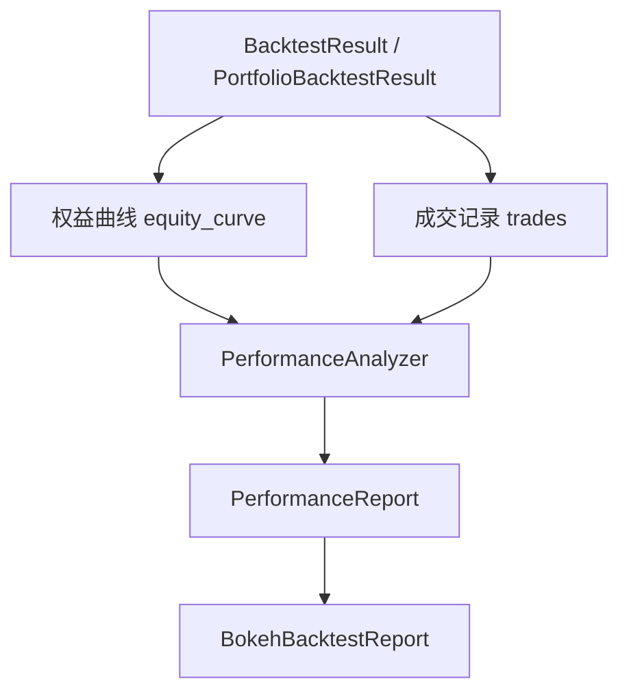
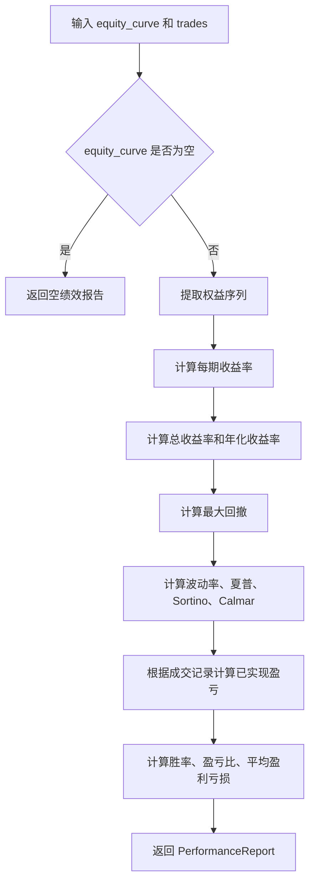

# `crypto_quant/analysis/performance.py` 绩效分析说明文档

本文档详细解释 `crypto_quant/analysis/performance.py` 文件的设计目的、核心类、指标含义、计算逻辑，以及它在整个量化框架中的位置。

`performance.py` 是当前框架的绩效分析模块。它不负责交易，也不负责画图，而是专门负责把回测结果中的权益曲线和成交记录转换成一组可读的绩效指标。

---

## 1. 文件整体定位

文件位置：

```text
crypto_quant/analysis/performance.py
```

它位于分析层。

在整个框架中的位置可以理解为：

```text
DataFeed 历史行情数据
        ↓
BacktestEngine / PortfolioBacktestEngine
        ↓
BacktestResult / PortfolioBacktestResult
        ↓
PerformanceAnalyzer
        ↓
PerformanceReport
        ↓
打印输出 / BokehBacktestReport 图表展示
```

一句话理解：

```text
回测引擎负责生成交易结果；
绩效分析器负责评价这个交易结果好不好。
```

---

## 2. 文件导入说明

源码：

```python
from dataclasses import dataclass
from decimal import Decimal
from math import sqrt

from crypto_quant.strategy.base import Trade
```

含义：

| 导入项 | 作用 |
|---|---|
| `dataclass` | 定义绩效结果对象 `PerformanceReport` |
| `Decimal` | 高精度表示资金、收益率、盈亏金额 |
| `sqrt` | 计算波动率、夏普比率、Sortino 比率时使用平方根 |
| `Trade` | 成交记录，绩效模块会根据成交记录计算已实现盈亏 |

---

## 3. 核心对象关系



其中：

```text
equity_curve 用来计算收益、回撤、波动率、夏普等；
trades 用来计算胜率、盈亏比、总盈利、总亏损、单笔盈亏等。
```

---

## 4. `PerformanceReport`：绩效结果对象

源码：

```python
@dataclass(frozen=True, slots=True)
class PerformanceReport:
    initial_equity: Decimal
    final_equity: Decimal
    total_return: Decimal
    annual_return: Decimal
    volatility: float
    max_drawdown: Decimal
    sharpe_ratio: float
    sortino_ratio: float
    calmar_ratio: float
    trade_count: int
    closed_trade_count: int
    win_rate: Decimal
    profit_factor: Decimal
    gross_profit: Decimal
    gross_loss: Decimal
    average_win: Decimal
    average_loss: Decimal
    max_win: Decimal
    max_loss: Decimal
```

### 4.1 作用

`PerformanceReport` 是一次绩效分析的最终结果。

它把所有指标集中放在一个对象里，方便：

```text
1. 直接 print 输出；
2. 传给 Bokeh 报告模块展示；
3. 后续保存到数据库或导出成表格；
4. 做多个策略结果之间的横向比较。
```

### 4.2 为什么使用 `frozen=True`？

```python
@dataclass(frozen=True, slots=True)
```

`frozen=True` 表示这个结果对象创建后不建议再被修改。

原因是：

```text
绩效报告应该是一次分析的结果快照。
如果后面随便改字段，就容易造成“结果不可信”。
```

`slots=True` 用来减少对象内存占用，并防止随意添加不存在的字段。

---

## 5. 指标字段说明

| 字段 | 类型 | 含义 |
|---|---|---|
| `initial_equity` | `Decimal` | 回测开始时的账户权益 |
| `final_equity` | `Decimal` | 回测结束时的账户权益 |
| `total_return` | `Decimal` | 总收益率 |
| `annual_return` | `Decimal` | 年化收益率 |
| `volatility` | `float` | 年化波动率 |
| `max_drawdown` | `Decimal` | 最大回撤，通常是负数 |
| `sharpe_ratio` | `float` | 夏普比率，衡量单位波动带来的收益 |
| `sortino_ratio` | `float` | Sortino 比率，只惩罚下行波动 |
| `calmar_ratio` | `float` | 年化收益率 / 最大回撤绝对值 |
| `trade_count` | `int` | 成交记录总数 |
| `closed_trade_count` | `int` | 已经形成闭合盈亏的交易次数 |
| `win_rate` | `Decimal` | 胜率 |
| `profit_factor` | `Decimal` | 盈亏比，总盈利 / 总亏损绝对值 |
| `gross_profit` | `Decimal` | 所有盈利交易的盈利总和 |
| `gross_loss` | `Decimal` | 所有亏损交易的亏损总和，通常是负数 |
| `average_win` | `Decimal` | 平均盈利 |
| `average_loss` | `Decimal` | 平均亏损 |
| `max_win` | `Decimal` | 最大单笔盈利 |
| `max_loss` | `Decimal` | 最大单笔亏损 |

---

## 6. `PerformanceAnalyzer`：绩效分析器

源码：

```python
class PerformanceAnalyzer:
    def __init__(self, periods_per_year: int = 365):
        self.periods_per_year = periods_per_year
```

### 6.1 作用

`PerformanceAnalyzer` 是真正执行计算的类。

它输入：

```text
equity_curve: list[tuple[时间, 权益]]
trades: list[Trade]
```

输出：

```text
PerformanceReport
```

### 6.2 `periods_per_year` 是什么？

`periods_per_year` 表示一年按多少个周期计算。

默认值：

```python
periods_per_year = 365
```

这适合把一根 K 线或一个权益点粗略看作一天的情况。

如果你做的是小时级、分钟级回测，可以根据自己的数据频率调整，例如：

```python
PerformanceAnalyzer(periods_per_year=365 * 24)      # 小时级
PerformanceAnalyzer(periods_per_year=365 * 24 * 60) # 分钟级
```

注意：

```text
periods_per_year 会影响年化收益率、年化波动率、夏普比率、Sortino 比率等指标。
```

---

## 7. 核心方法 `analyze()`

源码结构：

```python
def analyze(self, equity_curve, trades) -> PerformanceReport:
    if not equity_curve:
        return self._empty_report()

    equities = [equity for _, equity in equity_curve]
    returns = self.returns(equity_curve)

    initial_equity = equities[0]
    final_equity = equities[-1]
    total_return = final_equity / initial_equity - Decimal("1")
    annual_return = self._annual_return(total_return, len(equities))
    max_drawdown = self._max_drawdown(equities)
    volatility = self._volatility(returns)
    sharpe_ratio = self._sharpe_ratio(returns)
    sortino_ratio = self._sortino_ratio(returns)
    ...
```

整体流程：



---

## 8. 收益率计算

方法：

```python
def returns(self, equity_curve):
    equities = [equity for _, equity in equity_curve]
    return [
        float(equities[i] / equities[i - 1] - Decimal("1"))
        for i in range(1, len(equities))
        if equities[i - 1]
    ]
```

假设权益曲线是：

```text
10000 → 10100 → 10050
```

那么收益率是：

```text
第 1 期收益率 = 10100 / 10000 - 1 = 1%
第 2 期收益率 = 10050 / 10100 - 1 ≈ -0.495%
```

这些收益率后面会用于计算：

```text
波动率
夏普比率
Sortino 比率
```

---

## 9. 回撤计算

方法：

```python
def drawdowns(self, equity_curve):
    peak = equity_curve[0][1]
    result = []
    for timestamp, equity in equity_curve:
        peak = max(peak, equity)
        drawdown = equity / peak - Decimal("1")
        result.append((timestamp, drawdown))
    return result
```

回撤的含义是：

```text
当前权益相对于历史最高权益跌了多少。
```

例如：

```text
权益：10000 → 11000 → 10500
```

当权益为 10500 时，历史最高权益是 11000，所以回撤是：

```text
10500 / 11000 - 1 = -4.545%
```

最大回撤就是整个回测过程中最深的一次回撤。

---

## 10. 已实现盈亏计算

方法：

```python
def realized_pnls(self, trades: list[Trade]) -> list[Decimal]:
```

它会根据成交记录计算已经闭合的交易盈亏。

简单理解：

```text
买入开仓 → 卖出平仓，形成一笔已实现盈亏；
卖出开空 → 买入平空，形成一笔已实现盈亏。
```

例如：

```text
买入 1 BTC，价格 100
卖出 1 BTC，价格 110
```

不考虑手续费时，已实现盈亏是：

```text
(110 - 100) * 1 = 10
```

这个方法返回的是一个列表：

```python
[Decimal("10"), Decimal("-5"), Decimal("20")]
```

后续指标会基于这个列表计算：

```text
胜率
总盈利
总亏损
平均盈利
平均亏损
最大单笔盈利
最大单笔亏损
盈亏比
```

---

## 11. 常用方式

### 11.1 分析单策略回测结果

```python
from crypto_quant.analysis import PerformanceAnalyzer

result = engine.run(strategy, data)
report = PerformanceAnalyzer().analyze(result.equity_curve, result.trades)

print(report)
```

### 11.2 分析多策略组合回测结果

```python
from crypto_quant.analysis import PerformanceAnalyzer

portfolio_result = portfolio_engine.run([strategy_a, strategy_b], data)
report = PerformanceAnalyzer().analyze(
    portfolio_result.equity_curve,
    portfolio_result.trades,
)

print(report)
```

多策略组合回测时，绩效分析器关心的是组合整体的权益曲线和整体成交记录。

---

## 12. 当前简化假设

当前绩效模块已经比最初版本完整很多，但仍然有一些简化：

```text
1. 年化计算依赖 periods_per_year，需要用户根据数据周期合理设置；
2. 夏普比率目前没有单独设置无风险利率，默认可以理解为无风险利率为 0；
3. 已实现盈亏按成交顺序做简化配对，不区分更复杂的 FIFO / LIFO / 按订单归因；
4. 目前没有按品种、按策略、按月份单独拆分统计；
5. 没有把手续费、滑点单独拆成独立统计项。
```

这些并不影响它作为第一版绩效分析模块使用。

后续如果要继续增强，可以扩展：

```text
按日/周/月收益统计
月度收益热力图
多空分开统计
单品种绩效归因
多策略绩效归因
手续费和滑点成本分析
连续盈利/连续亏损统计
```

---

## 13. 一句话总结

```text
performance.py 的作用是：
把回测结果中的权益曲线和成交记录，转换成一组能评价策略表现的数字指标。
```

它回答的问题不是“策略怎么交易”，而是：

```text
这个策略最终赚了多少？
中间最大亏了多少？
收益是否稳定？
交易胜率如何？
盈利交易和亏损交易的比例如何？
```
