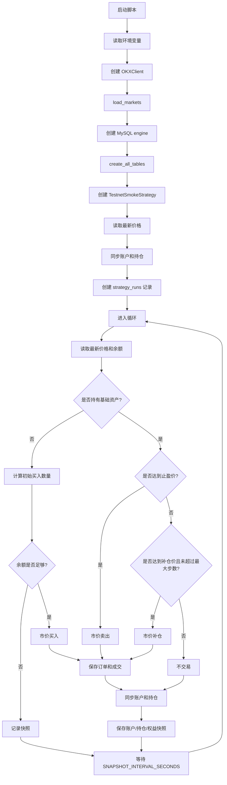

# `run_testnet_smoke_strategy.py` 说明文档

本文档解释 `real/run_testnet_smoke_strategy.py` 的设计目的、运行流程、关键函数、数据库写入方式，以及它和回测脚本之间的关系。

你可以把这个脚本当成从“离线回测”过渡到“测试网长跑 / 未来实盘”的第一座桥。

它不是为了证明策略能赚钱，而是为了验证：

```text
main() 循环里的交易规则
→ 测试网真实下单
→ 订单状态查询
→ 成交记录查询
→ 账户和持仓同步
→ MySQL 入库
→ dashboard 观察
```

注意：当前脚本的交易规则写在 `main()` 的 while 循环中，不是写在 `TestnetSmokeStrategy.on_bar()` 中。

---

## 1. 这个脚本的定位

文件位置：

```text
real/run_testnet_smoke_strategy.py
```

当前脚本运行在：

```text
OKX Spot Testnet
```

也就是 OKX 现货测试网。

它做的事情是：

```text
1. 连接 OKX Spot Testnet；
2. 连接 MySQL；
3. 创建一条 testnet 类型的 strategy_run；
4. 按固定规则在测试网上买入、补仓、止盈卖出；
5. 把订单、成交、账户快照、持仓快照、权益曲线写入数据库；
6. 让 dashboard 能像观察“实盘”一样观察这次测试网运行。
```

它不做的事情是：

```text
1. 不读取历史 K 线做回测；
2. 不使用 BacktestEngine；
3. 不连接 OKX 主网；
4. 不保证策略盈利；
5. 不自动切换到真实实盘；
6. 不负责持续同步 K 线数据。
```

---

## 2. 为什么需要这个脚本

回测脚本解决的问题是：

```text
如果历史行情重演，策略理论上会怎样？
```

测试网脚本解决的问题是：

```text
如果策略真的连接交易所、真的发订单、真的查成交、真的写数据库，整条链路是否能跑通？
```

二者关注点不同。

### 2.1 回测关注什么

回测重点关注：

```text
历史数据
信号生成
成交假设
手续费 / 滑点
权益曲线
最大回撤
夏普比率
胜率
盈亏比
```

回测中的成交是引擎模拟出来的。

例如当前 `BacktestEngine` 里，策略在本根 K 线 `on_bar()` 中下单，新订单会延迟到后续 K 线撮合。

### 2.2 测试网关注什么

测试网重点关注：

```text
API key 是否正确
交易所连接是否稳定
下单参数是否符合交易所规则
订单是否真的创建成功
订单状态是否能查回来
成交明细是否能查回来
账户余额是否能同步
持仓是否能同步
数据库是否能持续写入
策略运行状态是否能被 dashboard 看见
```

测试网中的订单不是本地模拟的，而是发给 OKX Spot Testnet。

所以它更接近真实运行环境。

---

## 3. 从回测到测试网，思维上要改变什么

### 3.1 回测是“历史 K 线驱动”

回测中的核心循环通常是：

```text
for bar in data:
    更新当前 K 线
    撮合旧订单
    检查风险
    strategy.on_bar(bar)
    记录权益
```

策略面对的是 `BarData`。

订单由 `BacktestEngine` 在本地撮合。

### 3.2 测试网是“真实交易所状态驱动”

这个脚本中的核心循环是：

```text
while True:
    拉取最新价格
    拉取账户余额
    同步账户和持仓
    判断是否买入 / 补仓 / 止盈
    向 OKX Testnet 发真实订单
    查询订单状态
    查询成交明细
    写入数据库
    记录账户快照
    sleep 一段时间
```

也就是说，测试网脚本不再只依赖历史 K 线，而是不断读取交易所当前状态。

---

## 4. 脚本整体流程图



---

## 5. 顶部常量和环境变量

脚本开头定义了交易对、资产、策略参数、运行 ID、订单查询重试参数。

### 5.1 项目路径注入

源码：

```python
PROJECT_ROOT = Path(__file__).resolve().parents[1]
if str(PROJECT_ROOT) not in sys.path:
    sys.path.insert(0, str(PROJECT_ROOT))
```

作用：

```text
保证你直接运行 python real/run_testnet_smoke_strategy.py 时，脚本仍然能 import crypto_quant 包。
```

因为脚本在 `real/` 目录下，而项目包在上一层目录中。

---

### 5.2 交易对和资产

源码：

```python
SYMBOL = os.getenv("CRYPTO_QUANT_TESTNET_SYMBOL") or os.getenv("TESTNET_SYMBOL", "BTC/USDT")
BASE_ASSET = os.getenv("CRYPTO_QUANT_TESTNET_BASE_ASSET") or os.getenv("TESTNET_BASE_ASSET", SYMBOL.split("/")[0])
QUOTE_ASSET = os.getenv("CRYPTO_QUANT_TESTNET_QUOTE_ASSET") or os.getenv("TESTNET_QUOTE_ASSET", SYMBOL.split("/")[1])
TIMEFRAME = "5m"
```

含义：

| 变量 | 默认值 | 含义 |
|---|---:|---|
| `SYMBOL` | `BTC/USDT` | 测试网交易对 |
| `BASE_ASSET` | `BTC` | 基础资产，也就是买入后持有的资产 |
| `QUOTE_ASSET` | `USDT` | 计价资产，也就是用于买入的资金 |
| `TIMEFRAME` | `5m` | 记录到 run 配置中的周期标记 |

注意：

```text
TIMEFRAME = "5m" 只是这次运行的标记。
这个脚本本身不是每 5 分钟运行一次。
真实循环间隔由 SNAPSHOT_INTERVAL_SECONDS 控制。
```

---

### 5.3 当前策略参数

源码：

```python
TRADE_NOTIONAL_USDT = Decimal("20")
TRADE_BASE_AMOUNT = Decimal("0.1")
MARTINGALE_MULTIPLIER = Decimal("1")
MARTINGALE_MAX_STEPS = 4
MARTINGALE_DROP_PCT = Decimal("0.003")
MARTINGALE_TAKE_PROFIT_PCT = Decimal("0.002")
SNAPSHOT_INTERVAL_SECONDS = 30
MAX_CYCLES = 0
```

含义：

| 变量 | 当前值 | 含义 |
|---|---:|---|
| `TRADE_NOTIONAL_USDT` | `20` | 只有当 `TRADE_BASE_AMOUNT is None` 时，才按这个 USDT 名义金额计算买入数量 |
| `TRADE_BASE_AMOUNT` | `0.1` | 当前优先使用的基础资产买入数量，也就是默认每次尝试买入 0.1 BTC |
| `MARTINGALE_MULTIPLIER` | `1` | 补仓倍数，当前等于 1，表示不放大仓位 |
| `MARTINGALE_MAX_STEPS` | `4` | 最多补仓步数 |
| `MARTINGALE_DROP_PCT` | `0.003` | 每下跌 0.3% 触发下一次补仓判断 |
| `MARTINGALE_TAKE_PROFIT_PCT` | `0.002` | 相对平均入场价上涨 0.2% 止盈 |
| `SNAPSHOT_INTERVAL_SECONDS` | `30` | 每轮循环之间等待 30 秒 |
| `MAX_CYCLES` | `0` | 0 表示无限循环 |

重要：当前代码里这些参数是 Python 常量，不是环境变量。

如果你想临时修改交易数量、循环次数、补仓阈值，需要改脚本里的常量。

还要注意：当前 `TRADE_BASE_AMOUNT = Decimal("0.1")`，所以脚本会优先按 0.1 个基础资产计算买入数量；`TRADE_NOTIONAL_USDT = Decimal("20")` 当前不会生效。只有以后把 `TRADE_BASE_AMOUNT` 改成 `None`，脚本才会改用 `TRADE_NOTIONAL_USDT` 按 USDT 名义金额计算买入数量。

因此，“测试网”不等于“主网小额”。如果把这段逻辑迁移到真实主网，必须先重新审查交易数量和风控边界。

真正敏感的内容，例如 MySQL 密码、OKX Testnet API key，不应该写进代码，必须继续放在环境变量里。

---

### 5.4 RUN_ID

源码：

```python
RUN_ID = os.getenv("CRYPTO_QUANT_TESTNET_RUN_ID") or os.getenv("TESTNET_RUN_ID") or f"testnet_smoke_{datetime.now():%Y%m%d_%H%M%S}"
```

作用：

```text
给本次测试网运行生成一个唯一 ID。
```

如果你不指定环境变量，脚本会自动生成类似：

```text
testnet_smoke_20260530_180000
```

这个 `run_id` 会写入：

```text
strategy_runs
orders
trades
equity_curve
account_snapshots
position_snapshots
```

这样 dashboard 就能把同一次运行的数据串起来。

---

### 5.5 订单查询重试参数

源码：

```python
ORDER_FETCH_RETRIES = int(os.getenv("CRYPTO_QUANT_TESTNET_ORDER_FETCH_RETRIES") or os.getenv("TESTNET_ORDER_FETCH_RETRIES", "5"))
ORDER_FETCH_RETRY_DELAY_SECONDS = float(os.getenv("CRYPTO_QUANT_TESTNET_ORDER_FETCH_RETRY_DELAY_SECONDS") or os.getenv("TESTNET_ORDER_FETCH_RETRY_DELAY_SECONDS", "2"))
```

作用：

```text
下单后，交易所不一定立刻能通过 fetch_order / fetch_order_trades 查到订单和成交。
所以这里允许重试。
```

默认：

```text
最多重试 5 次
每次间隔 2 秒
```

---

## 6. `TestnetSmokeStrategy` 类

源码：

```python
class TestnetSmokeStrategy(StrategyBase):
    name = "testnet_martingale_strategy"
```

这个类继承了 `StrategyBase`，但没有实现 `on_bar()`。

为什么？

因为这个脚本不是通过 `BacktestEngine` 用 K 线驱动策略，而是在 `main()` 的 while 循环里直接执行测试网逻辑。

它继承 `StrategyBase` 的目的主要是复用框架里的统一结构：

```text
strategy.name
strategy.trading_mode
strategy.account
strategy.positions
strategy.orders
strategy.trades
```

这些对象后面会被 `TradingRepository.save_live_snapshot()` 和 `save_equity_point()` 使用。

所以这里的 `StrategyBase` 更像是一个“实盘状态容器”，不是回测里的信号生成器。

---

## 7. 配置读取函数

## 7.1 `mysql_config_from_env()`

源码：

```python
def mysql_config_from_env() -> MySQLConfig:
    return MySQLConfig(
        host=os.getenv("CRYPTO_QUANT_MYSQL_HOST") or os.getenv("MYSQL_HOST", "127.0.0.1"),
        port=int(os.getenv("CRYPTO_QUANT_MYSQL_PORT") or os.getenv("MYSQL_PORT", "3306")),
        username=os.getenv("CRYPTO_QUANT_MYSQL_USERNAME") or os.getenv("MYSQL_USER", "root"),
        password=os.getenv("CRYPTO_QUANT_MYSQL_PASSWORD") or os.getenv("MYSQL_PASSWORD", ""),
        database=os.getenv("CRYPTO_QUANT_MYSQL_DATABASE") or os.getenv("MYSQL_DATABASE", "crypto_quant"),
    )
```

作用：

```text
从环境变量读取 MySQL 连接配置。
```

推荐使用：

```bash
export CRYPTO_QUANT_MYSQL_HOST="127.0.0.1"
export CRYPTO_QUANT_MYSQL_PORT="3306"
export CRYPTO_QUANT_MYSQL_USERNAME="crypto_quant_user"
export CRYPTO_QUANT_MYSQL_PASSWORD="change_me"
export CRYPTO_QUANT_MYSQL_DATABASE="crypto_quant"
```

注意：MySQL 密码不要写入代码，也不要提交到 GitHub。

---

## 7.2 `okx_config_from_env()`

源码：

```python
def okx_config_from_env() -> OKXConfig:
    proxies = None
    proxy_url = os.getenv("CRYPTO_QUANT_OKX_PROXY_URL") or os.getenv("OKX_PROXY_URL")
    if proxy_url:
        proxies = {"http": proxy_url, "https": proxy_url}
    return OKXConfig(
        api_key=os.getenv("CRYPTO_QUANT_OKX_DEMO_API_KEY") or os.environ["OKX_DEMO_API_KEY"],
        secret=os.getenv("CRYPTO_QUANT_OKX_DEMO_SECRET_KEY") or os.environ["OKX_DEMO_SECRET_KEY"],
        trading_mode=TradingMode.SPOT,
        sandbox=True,
        proxies=proxies,
    )
```

作用：

```text
从环境变量读取 OKX Spot Testnet 的 API key 和 secret。
```

关键点：

```python
sandbox=True
```

表示使用测试网，而不是主网。

推荐使用：

```bash
export CRYPTO_QUANT_OKX_DEMO_API_KEY="你的测试网 key"
export CRYPTO_QUANT_OKX_DEMO_SECRET_KEY="你的测试网 secret"
```

如果没有设置 `CRYPTO_QUANT_*` 变量，脚本会尝试读取旧变量名：

```bash
export OKX_DEMO_API_KEY="你的测试网 key"
export OKX_DEMO_SECRET_KEY="你的测试网 secret"
```

注意：

```text
这里只能放 OKX Spot Testnet key。
不要把真实主网 key 放到这个脚本使用的环境里。
```

---

## 8. Decimal 和时间转换辅助函数

### 8.1 `decimal_from_value()`

源码：

```python
def decimal_from_value(value) -> Decimal:
    return Decimal(str(value or "0"))
```

作用：

```text
把交易所返回的数字统一转成 Decimal。
```

为什么不用 float？

因为交易金额、数量、手续费都属于金融计算，使用 `Decimal` 可以减少浮点误差。

---

### 8.2 `decimal_from_balance()`

源码：

```python
def decimal_from_balance(balance: dict, group: str, asset: str) -> Decimal:
    return Decimal(str(balance.get(group, {}).get(asset, 0)))
```

OKX / ccxt 返回的余额通常类似：

```python
{
    "free": {"BTC": 0.1, "USDT": 1000},
    "total": {"BTC": 0.1, "USDT": 1000},
}
```

这个函数用于提取：

```text
free.BTC
free.USDT
total.USDT
```

---

### 8.3 `datetime_from_milliseconds()`

源码：

```python
def datetime_from_milliseconds(value) -> datetime:
    if value is None:
        return datetime.utcnow()
    return datetime.fromtimestamp(int(value) / 1000, tz=timezone.utc).replace(tzinfo=None)
```

作用：

```text
把交易所返回的毫秒时间戳转换成 Python datetime。
```

数据库中的成交时间 `traded_at` 就依赖它。

---

## 9. 行情价格函数

源码：

```python
def latest_price(client: OKXClient) -> Decimal:
    ticker = client.exchange.fetch_ticker(SYMBOL)
    return decimal_from_value(ticker.get("last") or ticker.get("close"))
```

作用：

```text
从 OKX Spot Testnet 拉取当前最新价格。
```

它使用的是 ticker，不是 K 线。

所以这个脚本的交易判断是基于当前价格快照，而不是基于完整历史 K 线序列。

---

## 10. 成交去重和成交记录转换

### 10.1 `trade_key()`

源码：

```python
def trade_key(trade: dict) -> str:
    trade_id = trade.get("id")
    if trade_id is not None:
        return f"trade:{trade_id}"
    return json.dumps(...)
```

作用：

```text
给交易所返回的 trade 生成一个唯一 key，避免重复入库。
```

优先使用交易所成交 ID。

如果没有成交 ID，就用订单号、时间、方向、数量、价格拼成一个 JSON key。

---

### 10.2 `trade_record_from_ccxt()`

源码：

```python
def trade_record_from_ccxt(
    trade: dict,
    run_id: str,
    strategy_name: str,
    realized_pnl: Decimal | None = None,
) -> TradeRecord:
    fee = trade.get("fee") or {}
    return TradeRecord(...)
```

作用：

```text
把 ccxt / OKX 返回的成交 dict 转换成项目数据库模型 TradeRecord。
```

它会写入：

| 字段 | 来源 |
|---|---|
| `run_id` | 当前运行 ID |
| `strategy_name` | `strategy.name` |
| `exchange` | 固定为 `okx_demo` |
| `exchange_trade_id` | 交易所成交 ID |
| `exchange_order_id` | 交易所订单 ID |
| `trading_mode` | `spot` |
| `symbol` | 成交交易对 |
| `side` | buy / sell |
| `position_side` | spot 使用 `BOTH` |
| `amount` | 成交数量 |
| `price` | 成交价格 |
| `fee` | 手续费 |
| `fee_asset` | 手续费币种 |
| `realized_pnl` | 卖出止盈时计算的实现盈亏 |
| `traded_at` | 成交时间 |
| `raw` | 原始成交 JSON |

---

## 11. 同步账户和持仓：`sync_account_and_position()`

源码：

```python
def sync_account_and_position(
    strategy: StrategyBase,
    client: OKXClient,
    mark_price: Decimal,
    entry_price: Decimal | None,
    raw_balance: dict | None = None,
) -> dict:
```

这是脚本里最重要的函数之一。

它做的事情是：

```text
1. 从 OKX Testnet 读取账户余额；
2. 提取 BASE_ASSET 和 QUOTE_ASSET；
3. 用最新价格估算基础资产市值；
4. 更新 strategy.account；
5. 如果持有基础资产，则更新 strategy.positions；
6. 如果没有持仓，则清空 strategy.positions；
7. 返回原始 balance。
```

### 11.1 读取余额

源码：

```python
balance = raw_balance or client.fetch_balance()
base_free = decimal_from_balance(balance, "free", BASE_ASSET)
quote_free = decimal_from_balance(balance, "free", QUOTE_ASSET)
quote_total = decimal_from_balance(balance, "total", QUOTE_ASSET)
```

含义：

```text
base_free  = 可用 BTC 数量
quote_free = 可用 USDT 数量
quote_total = USDT 总额
```

现货脚本里主要关注：

```text
有没有 BTC
还有多少 USDT 可以继续买
```

---

### 11.2 估算权益和浮盈亏

源码：

```python
position_value = base_free * mark_price
unrealized_pnl = Decimal("0") if entry_price is None else (mark_price - entry_price) * base_free
```

含义：

```text
持仓市值 = BTC 数量 × 最新价格
未实现盈亏 = (最新价格 - 入场均价) × BTC 数量
```

---

### 11.3 更新 Account

源码：

```python
strategy.account = Account(
    cash=quote_total,
    equity=quote_total + position_value,
    available=quote_free,
    unrealized_pnl=unrealized_pnl,
)
```

字段含义：

| 字段 | 含义 |
|---|---|
| `cash` | 当前 USDT 总额 |
| `equity` | USDT 总额 + BTC 按当前价格折算后的市值 |
| `available` | 当前可用 USDT |
| `unrealized_pnl` | 按 entry_price 估算的未实现盈亏 |

注意：这里是现货测试网的简化账户模型。

合约实盘会涉及保证金、杠杆、维持保证金、强平价等更多字段。

---

### 11.4 更新 Position

源码：

```python
if base_free > Decimal("0"):
    strategy.positions = {
        f"{SYMBOL}:{PositionSide.BOTH.value}": Position(
            symbol=SYMBOL,
            side=PositionSide.BOTH,
            amount=base_free,
            entry_price=entry_price or mark_price,
            mark_price=mark_price,
            unrealized_pnl=unrealized_pnl,
        )
    }
else:
    strategy.positions = {}
```

现货没有 long / short 双向持仓，所以统一使用：

```python
PositionSide.BOTH
```

position key 形如：

```text
BTC/USDT:BOTH
```

---

## 12. 订单和成交保存函数

## 12.1 `save_order_once()`

源码：

```python
def save_order_once(repository, seen_order_ids, order, run_id, strategy_name) -> None:
    order_id = str(order.get("id") or order.get("clientOrderId"))
    if not order_id or order_id in seen_order_ids:
        return
    repository.save_order(...)
    seen_order_ids.add(order_id)
```

作用：

```text
把订单保存到数据库 orders 表，并通过 seen_order_ids 防止重复保存。
```

为什么要去重？

因为真实交易所 API 可能在不同阶段返回同一张订单：

```text
create_order 返回一次
fetch_order 又返回一次
后续同步也可能再看到一次
```

所以脚本用 `seen_order_ids` 记录已经保存过的订单 ID。

---

## 12.2 `update_order_from_exchange()`

源码：

```python
def update_order_from_exchange(repository: TradingRepository, order: dict, run_id: str) -> None:
    order_id = str(order.get("id") or order.get("clientOrderId"))
    repository.update_order_status(
        order_id,
        order.get("status", "open"),
        run_id=run_id,
        filled=decimal_from_value(order.get("filled")),
        average=Decimal(str(order["average"])) if order.get("average") is not None else None,
    )
```

作用：

```text
下单后再次从交易所查询订单状态，并更新数据库里的订单状态、成交数量和均价。
```

典型变化：

```text
open → closed
filled: 0 → 实际成交数量
average: None → 实际成交均价
```

---

## 12.3 `save_trades_once()`

源码：

```python
def save_trades_once(repository, seen_trade_ids, trades, run_id, strategy_name, realized_pnl=None) -> int:
    saved_count = 0
    for trade in trades:
        key = trade_key(trade)
        if key in seen_trade_ids:
            continue
        repository.save_trade(...)
        seen_trade_ids.add(key)
        saved_count += 1
    return saved_count
```

作用：

```text
把成交明细保存到 trades 表，并通过 seen_trade_ids 防止重复保存。
```

订单和成交不是一回事：

```text
订单 order = 你向交易所提交的委托
成交 trade = 订单实际匹配产生的成交明细
```

一张订单可能对应 0 笔、1 笔或多笔成交。

---

## 13. 快照保存：`record_snapshot()`

源码：

```python
def record_snapshot(repository: TradingRepository, strategy: StrategyBase, run_id: str) -> None:
    timestamp = datetime.utcnow()
    repository.save_live_snapshot(strategy, run_id, timestamp=timestamp)
    repository.save_equity_point(
        timestamp=timestamp,
        account=strategy.account,
        strategy_name=strategy.name,
        run_id=run_id,
        trading_mode=strategy.trading_mode.value,
    )
```

作用：

```text
把当前账户、持仓和权益点写入数据库。
```

它会写入：

```text
account_snapshots
position_snapshots
equity_curve
```

这是 dashboard 实盘速览页面能持续显示账户状态的关键。

---

## 14. 下单函数：`create_market_order()`

源码：

```python
def create_market_order(client: OKXClient, side: OrderSide, amount: Decimal) -> dict:
    return client.create_order(
        symbol=SYMBOL,
        side=side,
        order_type=OrderType.MARKET,
        amount=float(amount),
    )
```

作用：

```text
向 OKX Spot Testnet 发送市价单。
```

参数：

| 参数 | 含义 |
|---|---|
| `symbol` | 交易对，例如 `BTC/USDT` |
| `side` | `BUY` 或 `SELL` |
| `order_type` | 当前固定为 `MARKET` |
| `amount` | 买入或卖出的基础资产数量 |

注意：

```text
这里是真实测试网下单，不是回测撮合。
```

虽然使用的是测试网资金，但它仍然会真实创建测试网订单。

---

## 15. 买入数量计算：`buy_amount_from_balance()`

源码：

```python
def buy_amount_from_balance(price: Decimal, quote_free: Decimal, step: int) -> Decimal:
    multiplier = MARTINGALE_MULTIPLIER ** step
    if TRADE_BASE_AMOUNT is not None:
        amount = TRADE_BASE_AMOUNT * multiplier
        if quote_free < amount * price:
            return Decimal("0")
        return amount
    notional = TRADE_NOTIONAL_USDT * multiplier
    if quote_free < notional:
        return Decimal("0")
    return notional / price
```

作用：

```text
根据当前价格、可用 USDT、补仓步数，计算本次可以买多少 BTC。
```

当前代码里：

```python
TRADE_BASE_AMOUNT = Decimal("0.1")
```

所以优先走这一段：

```python
amount = TRADE_BASE_AMOUNT * multiplier
```

也就是说当前默认每次买入：

```text
0.1 BTC × MARTINGALE_MULTIPLIER ** step
```

但因为：

```python
MARTINGALE_MULTIPLIER = Decimal("1")
```

所以每一步买入数量都还是 0.1 BTC。

这也意味着当前的 `TRADE_NOTIONAL_USDT = Decimal("20")` 只是备用参数，不参与实际买入数量计算。只有当 `TRADE_BASE_AMOUNT` 被改成 `None` 时，脚本才会走 `notional = TRADE_NOTIONAL_USDT * multiplier` 这条分支。

如果可用 USDT 不够买这么多 BTC，就返回：

```python
Decimal("0")
```

主循环看到买入数量小于等于 0，就不会下单。

---

## 16. 加权入场价：`weighted_entry_price()`

源码：

```python
def weighted_entry_price(current_amount, current_entry, fill_amount, fill_price) -> Decimal:
    if current_amount <= Decimal("0") or current_entry is None:
        return fill_price
    total_amount = current_amount + fill_amount
    if total_amount <= Decimal("0"):
        return fill_price
    return ((current_entry * current_amount) + (fill_price * fill_amount)) / total_amount
```

作用：

```text
补仓后重新计算平均入场价。
```

例子：

```text
原来持有 0.1 BTC，入场价 100000
后来补仓 0.1 BTC，成交价 99000
新的平均入场价 = (100000 × 0.1 + 99000 × 0.1) / 0.2 = 99500
```

这个平均价会影响止盈价：

```text
止盈价 = 平均入场价 × (1 + MARTINGALE_TAKE_PROFIT_PCT)
```

---

## 17. 订单和成交查询重试

### 17.1 `fetch_order_with_retry()`

源码：

```python
def fetch_order_with_retry(client: OKXClient, order_id: str) -> dict:
    last_error: OKXClientError | None = None
    for attempt in range(1, ORDER_FETCH_RETRIES + 1):
        try:
            return client.fetch_order(order_id, SYMBOL)
        except OKXClientError as exc:
            last_error = exc
            if "Order does not exist" not in str(exc) or attempt == ORDER_FETCH_RETRIES:
                raise
            print(...)
            time.sleep(ORDER_FETCH_RETRY_DELAY_SECONDS)
    raise last_error or OKXClientError(...)
```

为什么需要重试？

因为测试网下单后，交易所接口可能短时间内还查不到刚创建的订单。

脚本只对一种情况进行重试：

```text
Order does not exist
```

如果是其他错误，例如网络错误、认证错误、参数错误，脚本会直接抛出异常。

---

### 17.2 `fetch_order_trades_with_retry()`

源码：

```python
def fetch_order_trades_with_retry(client: OKXClient, order_id: str) -> list[dict]:
    for attempt in range(1, ORDER_FETCH_RETRIES + 1):
        trades = client.fetch_order_trades(order_id, SYMBOL)
        if trades or attempt == ORDER_FETCH_RETRIES:
            return trades
        print(...)
        time.sleep(ORDER_FETCH_RETRY_DELAY_SECONDS)
    return []
```

作用：

```text
下单后查询这张订单对应的成交明细。
```

如果短时间内查不到成交，就等待后重试。

---

## 18. `main()` 主函数整体结构

源码从这里开始：

```python
def main() -> None:
```

它是整个测试网脚本的入口。

---

### 18.1 创建 OKXClient

源码：

```python
client = OKXClient(okx_config_from_env())
client.load_markets()
```

含义：

```text
1. 读取 OKX Testnet 配置；
2. 创建交易所客户端；
3. 加载交易对市场规则。
```

`load_markets()` 很重要，因为交易所会返回交易对精度、最小下单量等市场信息。

---

### 18.2 创建数据库连接

源码：

```python
engine = create_mysql_engine(mysql_config_from_env())
create_all_tables(engine)
Session = create_session_factory(engine)
```

含义：

```text
1. 读取 MySQL 配置；
2. 创建 SQLAlchemy engine；
3. 确保项目所需表存在；
4. 创建 session 工厂。
```

`create_all_tables(engine)` 可以重复执行。

它不会清空表，也不会删除已有数据。

---

### 18.3 创建策略状态对象

源码：

```python
strategy = TestnetSmokeStrategy(trading_mode=TradingMode.SPOT)
seen_order_ids: set[str] = set()
seen_trade_ids: set[str] = set()
entry_price: Decimal | None = None
last_buy_price: Decimal | None = None
martingale_step = 0
cycle = 0
```

这些变量含义如下：

| 变量 | 含义 |
|---|---|
| `strategy` | 复用框架 StrategyBase 的状态容器 |
| `seen_order_ids` | 已入库订单 ID 集合，用于订单去重 |
| `seen_trade_ids` | 已入库成交 ID 集合，用于成交去重 |
| `entry_price` | 当前平均入场价 |
| `last_buy_price` | 最近一次买入价格 |
| `martingale_step` | 当前补仓步数 |
| `cycle` | 当前循环次数 |

---

### 18.4 创建 strategy_runs 记录

源码：

```python
run = repository.create_run(
    run_id=RUN_ID,
    name="okx_spot_testnet_martingale_strategy",
    run_type="testnet",
    trading_mode=TradingMode.SPOT.value,
    strategy_name=strategy.name,
    symbols=[SYMBOL],
    timeframe=TIMEFRAME,
    initial_cash=strategy.account.equity,
    config={...},
)
```

作用：

```text
在 strategy_runs 表里创建一条本次测试网运行记录。
```

关键字段：

| 字段 | 当前值 |
|---|---|
| `run_id` | 当前运行 ID |
| `name` | `okx_spot_testnet_martingale_strategy` |
| `run_type` | `testnet` |
| `trading_mode` | `spot` |
| `strategy_name` | `testnet_martingale_strategy` |
| `symbols` | `[SYMBOL]` |
| `timeframe` | `5m` |
| `initial_cash` | 启动时账户权益 |

`config` 会记录脚本来源和策略参数，方便以后复盘。

---

## 19. 主循环逻辑

源码：

```python
while MAX_CYCLES <= 0 or cycle < MAX_CYCLES:
```

含义：

```text
MAX_CYCLES <= 0：无限循环
MAX_CYCLES > 0：最多运行指定轮数
```

当前代码中：

```python
MAX_CYCLES = 0
```

所以默认无限循环。

---

### 19.1 每轮先同步价格、余额和持仓

源码：

```python
cycle += 1
price = latest_price(client)
balance = sync_account_and_position(strategy, client, price, entry_price)
base_free = decimal_from_balance(balance, "free", BASE_ASSET)
quote_free = decimal_from_balance(balance, "free", QUOTE_ASSET)
```

含义：

```text
1. 循环次数 +1；
2. 获取最新价格；
3. 获取账户余额；
4. 更新 strategy.account 和 strategy.positions；
5. 提取当前可用 BTC 和 USDT。
```

主循环后面的所有判断都基于：

```text
base_free  当前是否持有 BTC
quote_free 当前还有多少 USDT 可买
price      当前最新价格
```

---

### 19.2 没有持仓时：初始买入

源码：

```python
if base_free <= Decimal("0"):
    martingale_step = 0
    buy_amount = buy_amount_from_balance(price, quote_free, martingale_step)
    if buy_amount <= Decimal("0"):
        print(...)
        record_snapshot(repository, strategy, run.run_id)
        time.sleep(SNAPSHOT_INTERVAL_SECONDS)
        continue
    order = create_market_order(client, OrderSide.BUY, buy_amount)
    ...
    entry_price = fill_price
    last_buy_price = fill_price
```

逻辑：

```text
如果当前没有 BTC：
    重置补仓步数为 0
    计算初始买入数量
    如果 USDT 不够：
        只记录快照，不下单
    如果 USDT 够：
        发市价买单
        保存订单
        查询订单状态
        更新订单状态
        查询成交明细
        保存成交
        设置 entry_price 和 last_buy_price
```

这一步相当于开启一轮新的持仓周期。

---

### 19.3 有持仓时：计算止盈价和补仓价

源码：

```python
elif base_free > Decimal("0"):
    if entry_price is None:
        entry_price = price
        last_buy_price = price
    take_profit_price = entry_price * (Decimal("1") + MARTINGALE_TAKE_PROFIT_PCT)
    next_buy_price = (last_buy_price or entry_price) * (Decimal("1") - MARTINGALE_DROP_PCT)
```

含义：

```text
如果当前持有 BTC：
    如果没有 entry_price，就用当前价格兜底
    止盈价 = 平均入场价 × 1.002
    下一次补仓价 = 最近买入价 × 0.997
```

因为当前参数是：

```python
MARTINGALE_TAKE_PROFIT_PCT = Decimal("0.002")
MARTINGALE_DROP_PCT = Decimal("0.003")
```

所以：

```text
上涨 0.2% 触发止盈
下跌 0.3% 触发补仓
```

---

### 19.4 达到止盈价：市价卖出

源码：

```python
if price >= take_profit_price:
    sell_amount = base_free
    order = create_market_order(client, OrderSide.SELL, sell_amount)
    ...
    realized_pnl = (exit_price - entry_price) * filled_amount
    ...
    entry_price = None
    last_buy_price = None
    martingale_step = 0
```

逻辑：

```text
如果当前价格 >= 止盈价：
    卖出全部 BTC
    保存订单
    查询订单状态
    更新订单状态
    查询成交明细
    计算 realized_pnl
    保存成交
    清空 entry_price 和 last_buy_price
    重置补仓步数
```

这表示一轮交易结束。

---

### 19.5 达到补仓价：继续买入

源码：

```python
elif martingale_step < MARTINGALE_MAX_STEPS and price <= next_buy_price:
    next_step = martingale_step + 1
    buy_amount = buy_amount_from_balance(price, quote_free, next_step)
    if buy_amount <= Decimal("0"):
        print(...)
    else:
        order = create_market_order(client, OrderSide.BUY, buy_amount)
        ...
        entry_price = weighted_entry_price(base_free, entry_price, fill_amount, fill_price)
        last_buy_price = fill_price
        martingale_step = next_step
```

逻辑：

```text
如果当前价格 <= 下一次补仓价，并且补仓步数没有超过上限：
    计算下一步补仓数量
    如果 USDT 不够：
        不下单，只打印提示
    如果 USDT 够：
        发市价买单
        保存订单和成交
        更新加权入场价
        更新最近买入价
        更新补仓步数
```

当前 `MARTINGALE_MULTIPLIER = 1`，所以补仓不是越跌越加倍，而是每次用相同数量补仓。

---

### 19.6 每轮最后记录快照

源码：

```python
price = latest_price(client)
sync_account_and_position(strategy, client, price, entry_price)
record_snapshot(repository, strategy, run.run_id)
print(...)
time.sleep(SNAPSHOT_INTERVAL_SECONDS)
```

含义：

```text
正常路径下，每轮最后都会：
    再读一次最新价格
    再同步一次账户和持仓
    保存账户快照、持仓快照、权益点
    打印状态
    等待 30 秒
```

有一个例外：如果当前没有持仓，并且 USDT 余额不足以完成初始买入，脚本会提前执行：

```python
record_snapshot(repository, strategy, run.run_id)
time.sleep(SNAPSHOT_INTERVAL_SECONDS)
continue
```

也就是说，余额不足路径会先记录一次快照，然后直接进入下一轮，不会再走循环尾部的二次同步和快照记录。

这就是 dashboard 能看到持续账户状态变化的原因。

---

## 20. 异常和停止处理

### 20.1 Ctrl+C 停止

源码：

```python
except KeyboardInterrupt:
    repository.finish_run(run.run_id, final_equity=strategy.account.equity, status="stopped")
    print(f"stopped testnet smoke run: run_id={run.run_id}")
    return
```

如果你手动按 `Ctrl+C`，脚本会把 `strategy_runs.status` 更新为：

```text
stopped
```

这表示人工停止，不是异常失败。

---

### 20.2 异常失败

源码：

```python
except Exception:
    session.rollback()
    repository.finish_run(run.run_id, final_equity=strategy.account.equity, status="failed")
    raise
```

如果发生未捕获异常，脚本会：

```text
1. rollback 当前数据库事务；
2. 把 run 状态标记为 failed；
3. 重新抛出异常，方便你在终端看到错误堆栈。
```

---

### 20.3 正常完成

源码：

```python
repository.finish_run(run.run_id, final_equity=strategy.account.equity, status="finished")
print(f"finished testnet smoke run: run_id={run.run_id}")
```

只有当 `MAX_CYCLES > 0` 并且循环次数达到上限时，才会走到这里。

因为当前 `MAX_CYCLES = 0`，默认是无限循环，所以通常不会自然 finished。

---

## 21. 数据库写入链路

这个脚本会写入以下表。

### 21.1 `strategy_runs`

启动时写入一条运行记录。

用途：

```text
标记这次测试网运行是谁、什么时候开始、跑什么策略、跑什么交易对、当前状态是什么。
```

关键字段：

```text
run_id
run_type = testnet
status
strategy_name
symbols
trading_mode
initial_cash
final_equity
config
```

---

### 21.2 `orders`

每次下单后写入订单记录。

来源：

```text
create_market_order()
```

随后通过：

```text
fetch_order_with_retry()
update_order_from_exchange()
```

更新订单状态、成交数量、成交均价。

---

### 21.3 `trades`

每次查询到成交明细后写入成交记录。

来源：

```text
fetch_order_trades_with_retry()
```

卖出止盈时，会额外写入 `realized_pnl`。

---

### 21.4 `account_snapshots`

每轮循环都会写入账户快照。

来源：

```text
record_snapshot()
→ repository.save_live_snapshot()
```

用于观察：

```text
现金
权益
可用资金
未实现盈亏
保证金字段
```

---

### 21.5 `position_snapshots`

如果当前有持仓，会写入持仓快照。

来源同样是：

```text
repository.save_live_snapshot()
```

用于观察：

```text
symbol
position_side
amount
entry_price
mark_price
unrealized_pnl
```

---

### 21.6 `equity_curve`

每轮循环都会写入一个权益点。

来源：

```text
repository.save_equity_point()
```

dashboard 可以用它画测试网运行期间的权益曲线。

---

## 22. 和回测结果入库的区别

回测入库通常来自：

```text
BacktestEngine.run()
→ BacktestResult
→ TradingRepository.save_backtest_result()
```

测试网脚本入库来自：

```text
OKX Testnet API
→ create_order / fetch_order / fetch_balance
→ TradingRepository.save_order / save_trade / save_live_snapshot / save_equity_point
```

对比：

| 维度 | 回测 | 测试网脚本 |
|---|---|---|
| 数据来源 | 历史 K 线 | 交易所实时状态 |
| 成交来源 | 本地回测引擎模拟 | OKX Spot Testnet 返回 |
| 时间推进 | DataFeed cursor 一根根推进 | while 循环 + sleep |
| 策略入口 | `strategy.on_bar(bar)` | `main()` 中直接判断价格和余额 |
| 订单状态 | 本地 `LocalOrder` | 交易所订单 dict |
| 成交记录 | 本地 `Trade` | 交易所 trade dict 转 `TradeRecord` |
| 入库方式 | 保存完整回测结果 | 持续增量写订单、成交和快照 |
| 风险 | 历史假设偏差 | API、网络、余额、交易规则、异常退出 |

---

## 23. 为什么这个脚本还不是真正的实盘框架

它已经接近真实运行，但仍然是 smoke / 长跑验证脚本。

原因：

```text
1. 策略逻辑写在 main() 循环里，还没有抽象成正式 LiveEngine；
2. 没有统一的实时行情事件系统；
3. 没有完整的风控层；
4. 没有进程守护和告警；
5. 没有自动恢复上次运行状态；
6. 没有处理所有交易所异常场景；
7. 没有区分测试网和主网部署权限；
8. 没有人工紧急停止流程。
```

所以它适合学习和验证链路，不适合直接改成主网实盘长期运行。

---

## 24. 如果以后要从测试网过渡到真实实盘，需要补什么

从这个脚本继续演进，至少需要补齐：

```text
1. 明确区分 testnet / live 配置，禁止误用主网 key；
2. 把策略参数从代码常量整理成受控配置；
3. 增加最小下单量、精度、余额、最大仓位检查；
4. 增加单日最大亏损、最大回撤、最大连续失败次数限制；
5. 增加异常重连、订单状态补偿、数据库断线恢复；
6. 增加日志文件、进程守护、告警通知；
7. 增加手动停止和紧急撤单流程；
8. 增加启动前检查，确认交易对、账户、余额、环境、数据库状态；
9. 增加只读 dashboard 和交易进程之间的权限隔离；
10. 用更正式的 LiveEngine 或 TraderRunner 管理策略生命周期。
```

---

## 25. 推荐学习顺序

如果你想通过这个脚本学习从回测到测试网，可以按下面顺序读。

### 第一步：先理解回测和测试网的边界

重点读：

```text
第 1 节：这个脚本的定位
第 2 节：为什么需要这个脚本
第 3 节：从回测到测试网，思维上要改变什么
第 22 节：和回测结果入库的区别
```

目标：先理解它不是回测，也不是正式实盘。

---

### 第二步：理解运行入口

重点读源码：

```python
def main() -> None:
```

对应文档：

```text
第 18 节：main() 主函数整体结构
第 19 节：主循环逻辑
```

目标：看懂脚本启动后按什么顺序做事。

---

### 第三步：理解账户和持仓同步

重点读源码：

```python
sync_account_and_position()
```

对应文档：

```text
第 11 节：同步账户和持仓
```

目标：理解测试网不是依赖本地猜测持仓，而是不断从交易所余额同步状态。

---

### 第四步：理解订单和成交

重点读源码：

```python
create_market_order()
fetch_order_with_retry()
fetch_order_trades_with_retry()
save_order_once()
update_order_from_exchange()
save_trades_once()
```

对应文档：

```text
第 12 节：订单和成交保存函数
第 14 节：下单函数
第 17 节：订单和成交查询重试
```

目标：理解真实交易里订单和成交是两层，不是下单就等于成交记录。

---

### 第五步：理解数据库和 dashboard

重点读源码：

```python
repository.create_run()
record_snapshot()
repository.finish_run()
```

对应文档：

```text
第 13 节：快照保存
第 20 节：异常和停止处理
第 21 节：数据库写入链路
```

目标：理解 dashboard 看到的数据从哪里来。

---

## 26. 推荐运行方式

进入项目根目录：

```bash
cd /workspace/group/crypto_quant_framework-main
```

设置环境变量：

```bash
export CRYPTO_QUANT_MYSQL_HOST="127.0.0.1"
export CRYPTO_QUANT_MYSQL_PORT="3306"
export CRYPTO_QUANT_MYSQL_USERNAME="crypto_quant_user"
export CRYPTO_QUANT_MYSQL_PASSWORD="你的 MySQL 密码"
export CRYPTO_QUANT_MYSQL_DATABASE="crypto_quant"

export CRYPTO_QUANT_OKX_DEMO_API_KEY="你的 OKX Spot Testnet Key"
export CRYPTO_QUANT_OKX_DEMO_SECRET_KEY="你的 OKX Spot Testnet Secret"

export CRYPTO_QUANT_TESTNET_SYMBOL="BTC/USDT"
```

如果需要代理：

```bash
export CRYPTO_QUANT_OKX_PROXY_URL="http://127.0.0.1:7890"
```

运行：

```bash
python real/run_testnet_smoke_strategy.py
```

停止：

```text
Ctrl+C
```

停止后 `strategy_runs.status` 会更新为：

```text
stopped
```

---

## 27. 常见问题

### 27.1 为什么我看不到 K 线图？

因为这个脚本不负责同步 K 线。

它写的是：

```text
运行记录
账户快照
持仓快照
订单
成交
权益曲线
```

如果 dashboard 的行情图需要 `klines` 表，就需要单独导入或同步 K 线数据。

---

### 27.2 为什么脚本默认无限循环？

因为当前代码中：

```python
MAX_CYCLES = 0
```

而主循环条件是：

```python
while MAX_CYCLES <= 0 or cycle < MAX_CYCLES:
```

所以 `0` 表示不限制循环次数。

---

### 27.3 为什么下单后还要 fetch_order？

因为 `create_order()` 返回的是创建订单时的响应。

真实成交状态、成交数量、成交均价可能需要再查一次订单详情。

所以脚本会：

```text
create_order
→ save_order_once
→ fetch_order_with_retry
→ update_order_from_exchange
→ fetch_order_trades_with_retry
→ save_trades_once
```

---

### 27.4 为什么要同时保存 order 和 trade？

因为订单和成交不是同一个概念。

```text
order：委托
trade：成交
```

一张订单可能没有成交，也可能分多笔成交。

数据库里分开保存，后续复盘会更清楚。

---

### 27.5 为什么 TestnetSmokeStrategy 没有 on_bar？

因为它不是通过回测引擎按 K 线调用的策略。

它只是复用 `StrategyBase` 的账户、持仓、名称、交易模式这些结构，方便数据库记录器统一保存。

---

### 27.6 这个脚本可以直接改成实盘吗？

不建议。

它适合测试网长跑验证，但真正实盘前至少要补齐：

```text
风控
异常恢复
日志
告警
权限隔离
紧急停止
订单状态补偿
配置审查
```

---

## 28. 安全边界

使用这个脚本时必须遵守：

```text
1. 只使用 OKX Spot Testnet key；
2. 不要把主网 API key 放进当前环境；
3. 不要把 .env 提交到 GitHub；
4. 不要在代码里硬编码 API key、secret、数据库密码；
5. 第一次运行前先确认 MySQL 连接的是测试数据库或你预期的数据库；
6. 第一次运行建议盯着终端和 dashboard 看；
7. 不要把 smoke 策略的盈利或亏损当成正式策略结论；
8. 不要在没有风控和告警的情况下迁移到主网。
```

---

## 29. 一句话总结

`run_testnet_smoke_strategy.py` 的核心价值不是策略本身，而是让你学习并验证下面这条真实交易链路：

```text
本地策略状态
→ OKX Spot Testnet 下单
→ 交易所订单 / 成交回读
→ 本地账户和持仓同步
→ MySQL 入库
→ dashboard 只读观察
```

这正是从回测走向测试网，再走向未来实盘前必须掌握的工程链路。